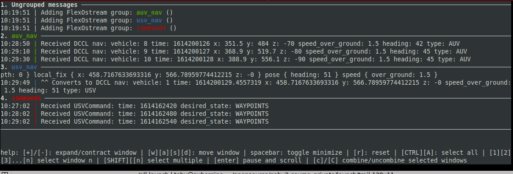
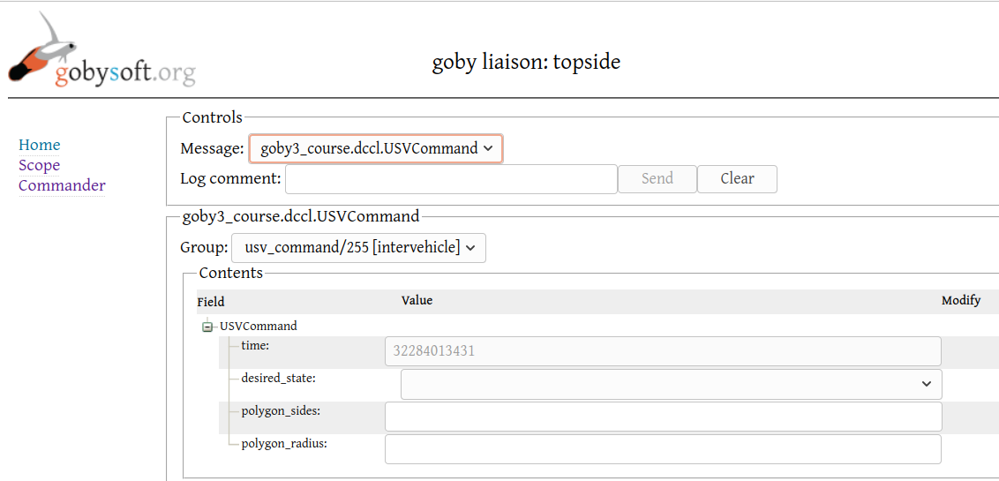
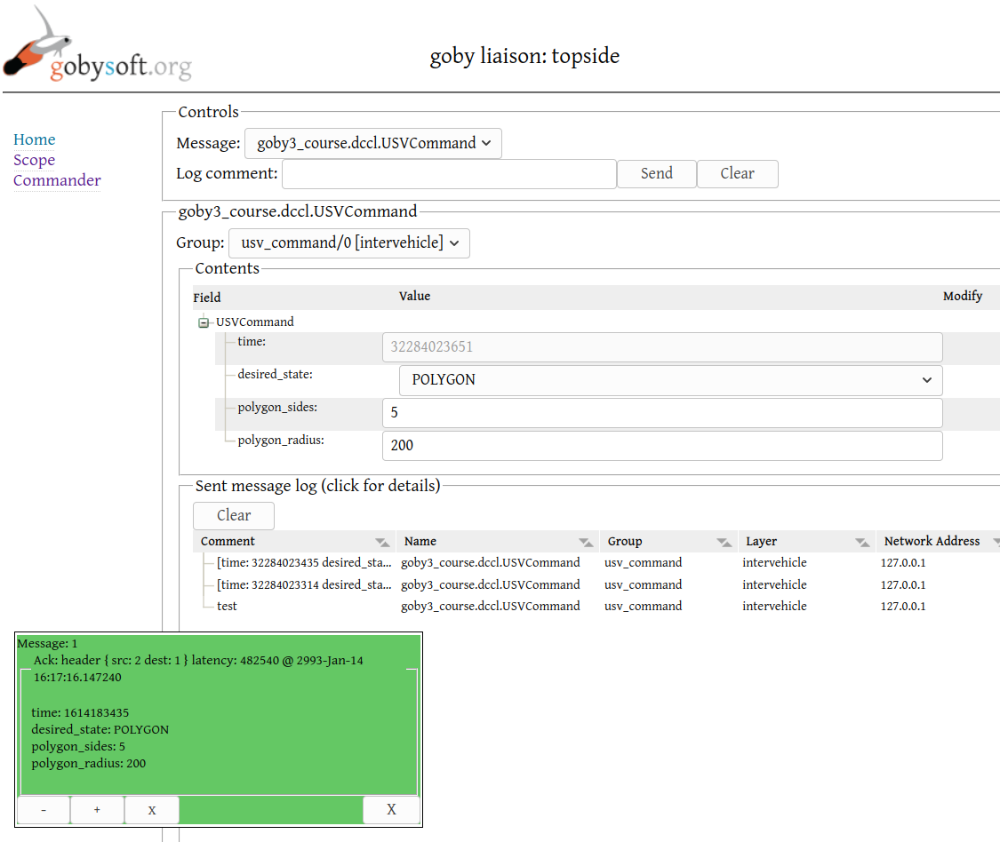
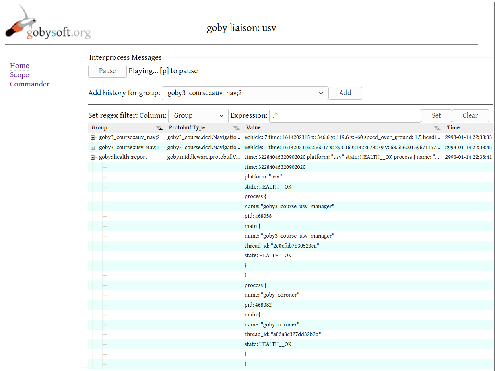
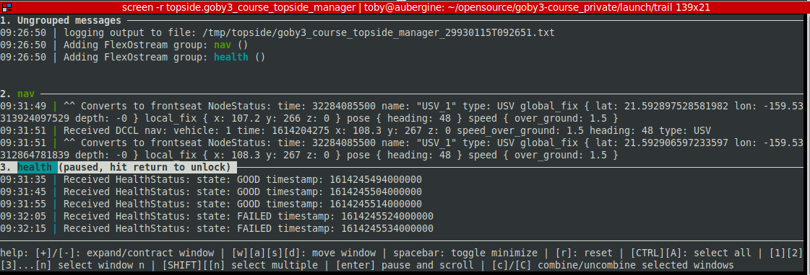

# Day 2: Communications

Before you start, update your branch to 
`post-lecture2` which includes all the code changes I made during the lecture today:

```bash
cd goby3-course
git fetch
git checkout post-lecture2
```

I would advise working on your own branch and committing as you go along. You can fork `goby3-course` to your personal Github account (assuming you're familiar with this), or just commit to a local branch:

```bash
# use post-lecture2 as a starting point
git checkout post-lecture2
# create a new branch called "homework2" to do your work
git checkout -b homework2
# do some work, then
git add {changed files}
git commit
```

## Assignment 1: 
**Goal:** Within the Trail example, create a Command message and publish it from the topside so that the USV can subscribe to it over the intervehicle layer.

**Task:**

Within the Trail example, we are currently only sending the NavigationReport message on the intervehicle layer. While this allows us to see where our vehicles are, we have no way of changing their behavior.

In preparation for tomorrow's lecture on Autonomy, this assignment will see us create a DCCL Command message, publish it on the topside, and subscribe to on the USV.

### Code 


- Create a `goby3_course::dccl::USVCommand` message, defined in DCCL and using the DCCL msg id 126. At a minimum this message should contain:
    - a timestamp
    - a desired Mission state enumeration (with two possible states: WAYPOINTS or POLYGON)
    - (optional, for POLYGON): number of sides
    - (optional, for POLYGON): radius (meters)
- Create a group (perhaps `usv_command` with numeric id `broadcast_group`) for this message.
- Create a testing application (`goby3_course_command_test`) to run on the topside which will publish this message (on the intervehicle layer) on some regular interval (e.g. every 60 seconds). We'll switch this to something more useful in the "bonus task", later.
- Subscribe to this message on the USV (probably in the existing `goby3_course_usv_manager`, or you could create a new application to handle commands). Things to consider:
    - ack_required: true or false?
    - max_queue: ?

### Configuration

With the code done, we need to add our new testing application to the Trail example.

Create:

 - A new "template" file (which will be expanded by our Python configuration preprocessor): `launch/trail/config/templates/goby3_course_command_test.pb.cfg.in`:

        $app_block
        $interprocess_block
  - Within this "template" file:
    - `$app_block` will be expanded to the `app {}` section
    - `$interprocess_block` will be expanded to the `interprocess {}` section


Add a new generation block in the topside's Python configuration preprocessor script: `launch/trail/config/topside.pb.cfg.py`:

```python
# ... existing ...
if common.app == 'gobyd':    
# ... add a new block in this if/elif/else structure ...
elif common.app == 'goby3_course_command_test':
    print(config.template_substitute(templates_dir+'/goby3_course_command_test.pb.cfg.in',
                              app_block=app_common,
                              interprocess_block = interprocess_common))
```

Now if you run the Python configuration preprocessor script for the topside, passing the desired application to the first command line parameter:

```bash
cd goby3-course/launch/trail
config/topside.pb.cfg.py goby3_course_command_test
```

you'll see the configuration we'll pass to our application, which is in Protobuf TextFormat.

You'll want to add `-v` to the USV manager so we see VERBOSE glog output and probably `-n` to see it in a GUI format for each glog stream (also termed "group" in the code, not to be confused with the `goby::middleware::Group`):

```bash
# launch/trail/usv.launch
goby3_course_usv_manager <(config/topside.pb.cfg.py goby3_course_usv_manager) -v -n
```

### Run

- Run the Trail example (`./all.launch`) and, in a separate terminal, run the goby3_course_command_test:

```bash
goby3_course_command_test <(config/topside.pb.cfg.py goby3_course_command_test) -v
```

- Ensure you're receiving the commands by examining the glog output of the subscribing process (`goby3_course_usv_manager` or your new USV command handler).

(optional) if you want things to slow down a bit, you can run at real time speeds by setting (before launching `all.launch`):

```python
# launch/trail/config/common/sim.py
warp=1
```


Tomorrow, we will work on the last step of connecting this to the autonomy system (`pHelmIvP` in this case).

### Bonus Task 

Add this publication to `goby_liaison` so you can publish your message from the Commander tab (instead of your testing application):

```
# launch/trail/config/templates/liaison.pb.cfg.in
# ...

pb_commander_config {
  load_protobuf {
    name: "goby3_course.dccl.USVCommand"
    publish_to {
      group: "usv_command"
      group_numeric: 0
      layer: LAYER_INTERVEHICLE
    }
  }
}
```

Now you can load this command and send it from <http://localhost:50000/?_=/commander>

Ensure that after you send it (using the web form) that you can still see your command show up on the USV side.

## Assignment 2: 

**Goal:** Add a health monitoring process to the USV based on our `intervehicle1/publisher` application, and extend it to use the `goby_coroner` output to determine whether the USV is in "GOOD" or "FAILED" health.

**Task:**


We are going to use the existing `goby_coroner` tool to tell us whether our applications are all running (at a minimum) and then we'll assume that if all our code is running that the USV is in "GOOD" health, or if not, it's "FAILED":

Taking a look at the interface file for `goby_coroner`:

```yaml
# goby3/build/share/goby/interfaces/goby_coroner_interface.yml
application: goby_coroner
interprocess:
  publishes:
    - group: goby::health::report
      scheme: PROTOBUF
      type: goby::middleware::protobuf::VehicleHealth
      thread: goby::apps::zeromq::Coroner
# ...
```
we see that it publishes a `VehicleHealth` Protobuf message to the `goby::middleware::groups::health_report` ("goby::health::report") group. The group and message are defined in:

```cpp
#include <goby/middleware/coroner/groups.h>

// generated from goby/middleware/protobuf/coroner.proto
#include <goby/middleware/protobuf/coroner.pb.h>
```

### Code 

Using the code in `src/bin/intervehicle1/publisher` as a starting point, make a new application called `goby3_course_usv_health_monitor`.

Within the `goby3_course_usv_health_monitor`, subscribe to the `VehicleHealth` message from `goby_coroner`. Based on this information, publish the HealthStatus message (which we developed in the lecture) on **intervehicle**.

Update the `goby3_course_topside_manager` to subscribe to this health message, and report the USV's health via `glog`. 

### Configuration

Once you have the code done, you'll need to insert your configuration and add to the appropriate launch files. 

Create:

 - `launch/trail/config/templates/goby3_course_usv_health_monitor.pb.cfg.in`, remembering that:
    - `$app_block` will be expanded to the `app {}` section
    - `$interprocess_block` will be expanded to the `interprocess {}` section
- `launch/trail/config/templates/goby_coroner.pb.cfg.in`:
    - same as above for `$app_block` and `$interprocess_block`
    - we need to put in the clients that we want `goby_coroner` to watch:
        
          expected_name: ["goby_frontseat_interface", "goby_liaison", "goby3_course_usv_manager", "goby_liaison"]
    
    - Remember you can see the valid configuration for any Goby application using `--example_config` (or `-e` for short), e.g.: `goby_coroner -e`

Add a new generation block in the Python preprocessor: `launch/trail/config/usv.pb.cfg.py`:

```python
# ... 
if common.app == 'gobyd':    
# ...
elif common.app == 'goby3_course_usv_health_monitor':
    print(config.template_substitute(templates_dir+'/goby3_course_usv_health_monitor.pb.cfg.in',
                              app_block=app_common,
                              interprocess_block = interprocess_common))
elif common.app == 'goby_coroner':
    print(config.template_substitute(templates_dir+'/goby_coroner.pb.cfg.in',
                              app_block=app_common,
                              interprocess_block = interprocess_common))
```

And finally add the new binaries to the `usv.launch` file:

```bash
# launch/trail/usv.launch
goby3_course_usv_health_monitor <(config/usv.pb.cfg.py goby3_course_usv_health_monitor)
goby_coroner <(config/usv.pb.cfg.py goby_coroner)
```

Also, for anything you want to monitor `glog` VERBOSE output on, add a `-v` to the launch line:

```bash
# launch/trail/topside.launch
goby3_course_topside_manager <(config/topside.pb.cfg.py goby3_course_topside_manager) -v
```

(optional) and as, above, if the sim is too fast, slow it down:

```python
# launch/trail/config/common/sim.py
warp=1
```

### Run

Run using '-r' to `goby_launch` so we can see the status of all the applications:
```bash
cd launch/trail
# instead of ./all.launch which runs "goby_launch -s -P -k30 -ptrail -d500"
goby_launch -r -P -k30 -ptrail -d500 all.launch
```

You may find the `goby_liaison` scope useful for inspecting **interprocess** publications:

- topside: <http://localhost:50000/?_=/scope>
- usv: <http://localhost:50001/?_=/scope>
- auv0: <http://localhost:50002/?_=/scope>
- auv1: <http://localhost:50003/?_=/scope>
- auvN: port 50002 + N

Check out our health report by attaching to topside's manager screen:

```bash
screen -r topside.goby3_course_topside_manager
```

Finally, try manually terminating a process on the USV to ensure that your health reports as "FAILED":

```bash
goby_terminate --target_name "goby_liaison" --interprocess 'platform: "usv"'
```


### Bonus Task

We really don't care that much about the `HealthStatus` message when things are "GOOD", but we would like to know when they aren't.

Let's split our `HealthStatus` publication into two groups:

```cpp
// GOOD
constexpr goby::middleware::Group health_status_good {"goby3_course::health_status_good", 1};
// FAILED
constexpr goby::middleware::Group health_status_failed {"goby3_course::health_status_failed", 2};
// we could add similar groups for degraded, failing, etc.
```

Using the `set_group_func` callback in `goby::middleware::Publisher` on the publication side, set the `state` field of `HealthStatus` based on the published group ("GOOD" if publishing to `health_status_good`, or "FAILED" if publishing to `health_status_failed`). Thus, in this case, we're using the `state` field to encode our numeric group information (since as you recall from the lecture, Goby does not add this information anywhere else: there are no headers for Goby **intervehicle**).

Then, publish GOOD messages to `health_status_good` with a low base priority value (e.g. 50) and those that are FAILED to `health_status_failed` with a high base priority value (e.g. 500). Remember these priority values are relative to other messages, and the only other message we're currently publishing from the USV is the `NavigationReport` at the default priority value of 100.

Update the topside to subscribe to both groups (you'll need to set the `group_func` callback in `goby::middleware::Subscriber` to correctly return the appropriate group based on the `state` field of the message). You don't need to set the priority values again here at the subscriber (but if you do they will be averaged with the publisher's values, leading to the same result).

Currently the topside/USV link has more throughput than we're using so you won't really see a difference. To notice the priority change, let's crank down the throughput by changing the MAC cycle:

```
# launch/trail/config/templates/_link_satellite.pb.cfg.in
# ...
    mac {
        type: MAC_FIXED_DECENTRALIZED
        slot { src: 1 slot_seconds: 10 max_frame_bytes: 26 }
        slot { src: 2 slot_seconds: 10 max_frame_bytes: 26 }
    }
```

Now we're only sending 26 bytes (two NavigationReports) every 10 seconds, so we should see our `health_status_good` messages take priority behind the `NavigationReport`s but then `health_status_failed` should come through right away (which you can generate by terminating `goby_liaison` as we did before).

Watch the vehicles on the GEOV display. What do you notice about the AUV NavigationReport messages? Why is this happening and what do you think can be done about this? If possible, improve this situation (without increasing the throughput).


## Wrap up

Good work - now we are set up to command our USV to perform another autonomy mission (which we'll look at during the lecture tomorrow), and we can report (at a basic level) the health of the vehicle.

From here, hopefully you can see a path forward to building a full system and filling out all the details that are required to function in a real deployment.


# Solutions (Toby)

My solutions are pushed to the `post-homework2` branch of goby3-course. Please reference the code together with this text.

## Assignment 1: 

Created `src/lib/messages/command_dccl.proto`, and added to `CMakeLists.txt`:

```cmake
# src/lib/messages/CMakeLists.txt
protobuf_generate_cpp( 
  # ...
  goby3-course/messages/command_dccl.proto
)
```

Added to `groups.h`:

```cpp
// src/lib/groups.h
//...
constexpr goby::middleware::Group usv_command{"goby3_course::usv_command",
                                              goby::middleware::Group::broadcast_group};
```

Copied `pattern/single_thread` to `src/bin/command_test` and renamed application Class to `CommandTest`. Added `add_subdirectory(command_test)` to parent `CMakeLists.txt`. Named binary `goby3_course_command_test` in `command_test/CMakeLists.txt`. 


Created publication of USVCommand in `goby3_course_command_test`'s app.cpp using the `intervehicle1/publisher` as a starting point.

Then, added a subscription to command message in `goby3_course_usv_manager` setting:

- ack_required: **true** (we want our commands to resend until ack'd or until their expire)
- max_queue: **1**

Ran the example and saw that we the command gets to the USV (see the red commands window):



### Bonus Task

Now, I copied the suggested configuration for `goby_liaison`, and reran `./all.launch`.

When I open liaison (<http://localhost:50000/?_=/commander>), I can now fill in the message:



Once I fill out the message and send it, I get the acknowledgment of the sent message:



## Assignment 2: 

I did this a bit out of order. First I added the configurations for `goby_coroner` to `launch/trail/config/templates` and `usv.launch`. Then I ran `./all.launch` and open Goby Liaison to the USV and to ensure I could see the `health_report` message coming through:



After I got that working I created the `goby3_course_usv_health_monitor` code, which I put in `src/bin/health_monitor`. Using the `intervehicle1` code as a starting point, I subscribed to the `health_report` from `goby_coroner` and determined that if `HEALTH__OK`, we'd say `HealthStatus::GOOD`. In a real system we'd want to aggregate data from more sources than just `goby_coroner` before making that determination, but for this course, that will do.

From here, I published the `HealthStatus` message on the **intervehicle** layer. I added a `subscribe_usv_health()` method to the topside Manager to subscribe to this message. I also added some glog "groups" (streams) to more clearly see what is going on.

After terminated one of the processes as suggested, we can see that my health report switches to failed:




### Bonus Task

As suggested, I defined two new groups: one (`goby3_course::groups::health_status_good`) to be used for good health messages, and one for failed health messages (`goby3_course::groups::health_status_failed`). For simplicity, I put all the non-good messages in the failed health messages group.

I added a "set group function" on the publisher side that sets the `state` enumeration to GOOD if we publish to `health_status_good` and FAILED if we publish to `health_status_failed`. This will use that enumeration as the field that tracks the group (numeric) value. On the subscribe side, we write a similar "get group function" that retrieves the group from this enumeration in a reciprocal manner.

I ran the example to ensure it still functions as expected. Then, I reduced the data throughput to 26 bytes every 20 seconds. At this point, we see the "GOOD" health messages take precedence only every other cycle or so (since the `NavigationReports` have a higher base value) , but if we terminate the `goby_liaison` we see the "FAILED" message generate and come through each cycle.

Of course, with this low throughput we can't get all the messages through so eventually the AUV `NavigationReports` start to lag behind. We can fix this by setting the topside's `auv_nav` subscription to `newest_first`. We could also shrink the DCCL message bounds a bit to reduce the message sizes, decrease the `HealthStatus` priority, or add a blackout time to the `HealthStatus` (GOOD queue only, probably).


After testing this, I increased the bandwidth again on the `_link_satellite.pb.cfg.in` to 

```
         slot { src: 1 slot_seconds: 5 max_frame_bytes: 64 }
         slot { src: 2 slot_seconds: 5 max_frame_bytes: 64 }
```