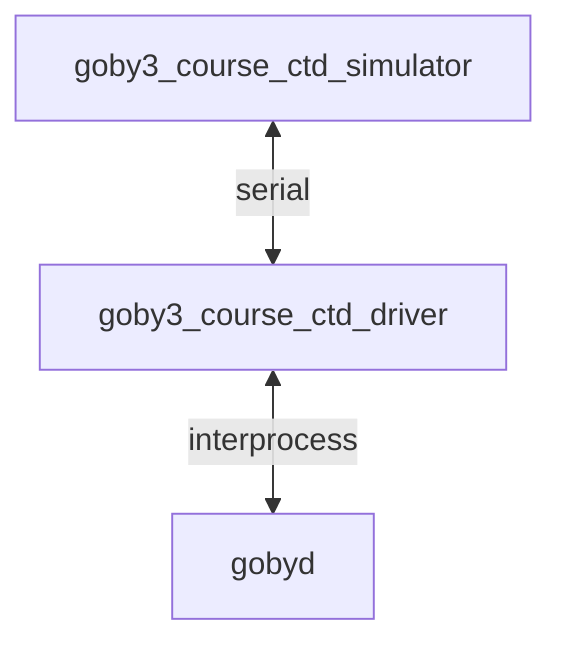
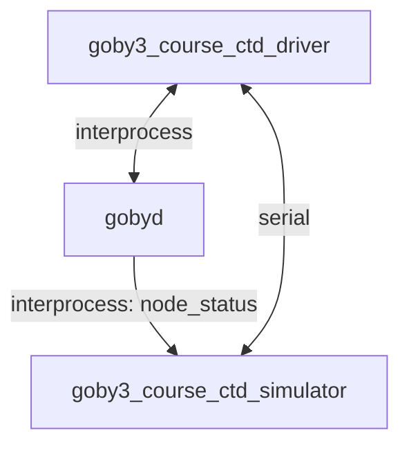

# Day 4: Sensors

Before you start, update your branch to 
`post-lecture4` which includes all the code changes I made during the lecture today:

```bash
cd goby3-course
git fetch
git checkout post-lecture4
```

## Assignment 1: 
**Goal:** Finalize the sensor simulator and sensor driver to parse the CTD data.

**Task:**

In `goby3-course/homework/day4-sensors/ctd_data.csv` you will find an average profile from a cruise off Hawaii. We will use these data to feed our simulator.

Also, remember the interface definition for our "real" CTD:
```
RS-232, 9600 baud
> means message from the control computer to the CTD
< means message from the CTD to the control computer
*CS is the standard NMEA-0183 checksum

Wake up the CTD
> $ZCCMD,WAKE*CS\r\n
Wake received, CTD out of low power mode and ready to commence logging
< $ZCACK,WAKE*CS\r\n

Start logging
> $ZCCMD,START*CS\r\n
Logging started
< $ZCACK,START*CS\r\n

Data (streams at 1 Hz)
< $ZCDAT,<salinity>,<temp, deg C>,<depth, meters>*CS
< $ZCDAT,31.5,10.4,150*CS\r\n
< $ZCDAT,31.5,10.3,151*CS\r\n
< $ZCDAT,31.4,10.2,152*CS\r\n

Stop logging
> $ZCCMD,STOP*CS\r\n
Logging stopped
< $ZCACK,STOP*CS\r\n

Enter low power mode
> $ZCCMD,SLEEP*CS\r\n
< $ZCACK,SLEEP*CS\r\n
```

Here's what we had during the lecture:


Now we need to simulate the data, we need to know where the vehicle is. For this, the simulator can connect as a client on the interprocess layer as well.



The key goal to remember is that we want to keep the serial interface as identical as possible to our real sensor, and we use the connection to `gobyd` only for data that are required in simulation. 

- Update the `goby3_course_ctd_simulator`:
  - to begin streaming data (`$ZCDAT`) at 1 Hz once a `$ZCCMD,START` message is received. Use the values in the .csv file (perhaps with linear interpolation: use `goby::util::linear_interpolate()` if you'd like) for temperature and salinity and (*bonus task*) add a random pertubation to each value based on a normal distribution (`std::normal_distribution` in `#include <random>`):
     - pressure: read depth by subscribing to the `goby::middleware::frontseat::node_status` group (protobuf type: `goby::middleware::frontseat::protobuf::NodeStatus`). For the the purpose of this simulator you can assume depth (in meters) is equal to pressure (in dBars). In order to do this, you'll need to change the `app.cpp` for the simulator to be a `zeromq::MultiThreadApplication` instead of the `middleware::MultiThreadStandaloneApplication`, so that it can connect to the gobyd. 
     - temperature: mean: 0, variance: 0.02 deg C
     - salinity: mean: 0, variance: 0.01
  - to stop streaming data when a `$ZCCMD,STOP` message is received.


- Update the `goby3_course_ctd_driver`:
  - to read and parse the `$ZCDAT` data into a new Protobuf message (e.g. CTDSample). Compute the empirical sound speed (you can use `goby::util::seawater::mackenzie_soundspeed()` in `goby/util/seawater/soundspeed.h`) and add it to this message. Publish this message on a new group on the interprocess layer.

  
## Assignment 2: 

**Goal:** Publish the CTD data to the USV, where it will be aggregated and logged using the `goby_logger` application. Plot some of the logged data.

**Task:**

- Subscribe to the CTDSample message you published in Assignment 1 in `goby3_course_auv_manager`, and store the latest sample as a class variable. Update the `goby3_course::dccl::NavigationReport` message (`src/lib/messages/nav_dccl.proto`) to include sound speed in the message (as an optional field, since the USV won't be adding this to its message). When you publish `goby3_course::groups::auv_nav`, include the latest sample's sound speed within the NavigationReport message.
- Change the AUV depths so they are spaced out over the full 200 meter depth profile:
```
# launch/trail/config/auv.pb.cfg.py
# change 
deploy_depth=10+10*auv_index
# to
deploy_depth=200/number_of_auvs*(auv_index+1)
```
- (optional) Switch back to the original pHelmIvP mission by uncommenting the `pHelmIvP` line in `usv.launch` and commenting out the `goby3_course_helm` line:
```
# launch/trail/usv.launch
#goby3_course_helm <(config/usv.pb.cfg.py goby3_course_helm) -vv -n
# ...
[kill=SIGTERM] pHelmIvP /tmp/usv.moos
```
and change the mission to start back on waypoints:
```
// launch/trail/config/templates/usv.bhv.in
initialize   DEPLOY_STATE = WAYPOINTS
```


- Add `goby_logger` to the `usv.launch` for the Trail example (as well as to the `launch/trail/config/usv.pb.cfg.py` configuration generator along with a template file in `launch/trail/config/templates`). The configuration template you can use is:

```
# launch/trail/config/templates/goby_logger.pb.cfg.in
$app_block
$interprocess_block

log_dir: "$goby_logger_dir"
load_shared_library: "$goby3_course_messages_lib"
```

Within `usv.pb.cfg.py` you can use `debug_log_file_dir` for `goby_logger_dir` which would put the log files in `goby3_course/logs/usv`.

Run the entire mission (`./all.launch`) and ensure you're logging data to `goby3_course/logs/usv/usv*.goby`. Once the USV has made a complete circuit around its waypoints, you can stop the mission and process the log data.

The log file will be `usv_{timestamp}.goby` (e.g. `usv_29930516T104627.goby`) in the `logs/usv` directory. 

The first option is to turn it into a text file:

```
goby_log_tool --format=DEBUG_TEXT --input_file usv_29930516T104627.goby
```

This writes `usv_29930516T104627.txt`. You can take a look through this file (it's pretty large), or you can grep out something of interest:

```
grep '2 | goby3_course::auv_nav' usv_29930516T104627.txt
```

(where 2 is the numeric scheme id for DCCL).

Better yet is to use HDF5, which is a scientific data format that can be read by a large number of tools and programming languages (MATLAB, Octave, etc.):


```
goby_log_tool --format=HDF5 --input_file usv_29930516T104627.goby
```

which writes `usv_29930516T104627.h5`. You can use `h5dump` to browse it manually but that's only so helpful:

```
h5dump usv_29930516T104627.h5
```

Let's open octave, and load our HDF5 file
```
> octave
load ~/goby3-course/logs/usv/usv_29930516T104627.h5
```

The values are loaded as a struct where `{group}.{type}.{field}` accesses a field, for example `goby3_course__auv_nav_2.goby3_course_dccl_NavigationReport.time`.

For example, plot the USV position in X/Y space:

```matlab
usv_nav = goby3_course__usv_nav_1.goby3_course_dccl_NavigationReport;
plot(usv_nav.x, usv_nav.y);
axis equal;
```

and plot the AUV depth, remember that these are different messages interleaved from different vehicles:

```matlab
auv_nav = goby3_course__auv_nav_2.goby3_course_dccl_NavigationReport;
plot(auv_nav.z);
```

Finally plot the sound speed profile "collected" by our AUVs:

```matlab
plot(auv_nav.soundspeed, auv_nav.z, 'o');
```

## Wrap up

And that's the week! Thanks for joining us, and I hope you learned some useful things. 