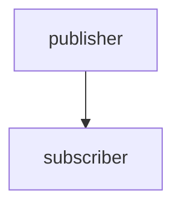
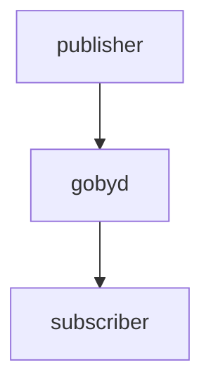
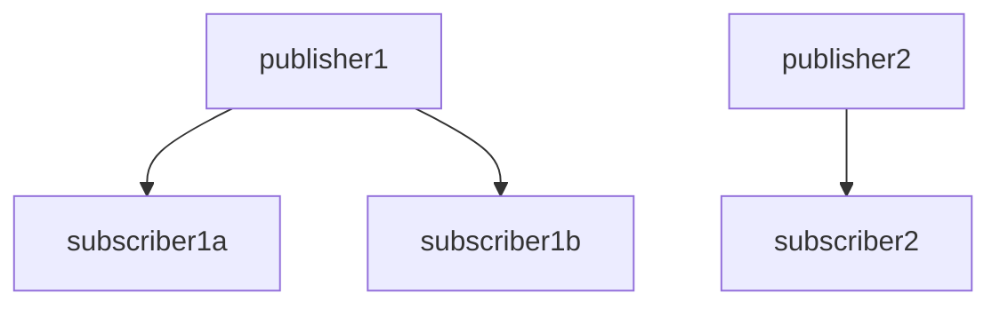
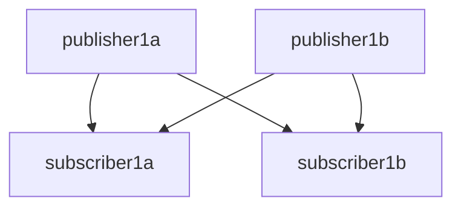

# Day 2: Communications

## Hands on building a Goby application from scratch

### Minimal example that builds

In the `goby3-course` repository, I have created two application patterns (or "templates" but I avoid that term in this context because of the potential confusion with C++ templates) that you can copy to create new Goby applications quickly:

```bash
goby3-course/src/bin/patterns/multi_thread
goby3-course/src/bin/patterns/single_thread
```

Use of these pattern files is completely optional, and as you gain further understanding you will likely wish to generate your applications from scratch.

We will now walk through building up the `single_thread` pattern. At a minimum, when using the Protobuf Configurator (as we will in this course), a Goby application will have three files:

```bash
app.cpp         # actual code
config.proto    # configuration proto message
CMakeLists.txt  # build instructions
```

`app.cpp` can be split across several files (`*.h` and `*.cpp` as needed) for logical and structural clarity as needed as the program grows (and does not need to be called `app.cpp` at all).

First, we will build up the app.cpp file. Let's do this in `src/bin/myapp`.

All ZeroMQ Goby applications inherit from either `goby::zeromq::SingleThreadApplication` or `goby::zeromq::MultiThreadApplication`, depending on whether you want to be able to have an InterThreadTransporter for thread-to-thread comms.

So, let's declare a subclass:

```cpp
// app.cpp
#include <goby/zeromq/application/single_thread.h>

class MyApp : public goby::zeromq::SingleThreadApplication<...>
{

};
```

As we see already, we need a template parameter `Config` for our application. All Goby applications must have a configuration object, which is filled from the command line parameters and/or a configuration file. This configuration object is populated by a Configurator class, which contains instructions on how to parse the command line syntax into this object.

For this course we will use the default Configurator, `goby::middleware::ProtobufConfigurator`. This class uses a Google Protocol Buffers ("Protobuf") message to define the valid configuration, then parses the command line and/or configuration file using the TextFormat specification for Protobuf.

Thus, all we need to do to configure our application is define a Protobuf message that specifies the valid configuration parameters for our application. This is done in config.proto, which we will now create:

```protobuf
// config.proto
syntax="proto2";
package config; // becomes "namespace config {}"

message MyApp
{
   
}
```

This message must contain at least an `app` block. It also must contain an `interprocess` block if we want to be able to communicate with `gobyd`:

```protobuf
// config.proto
import "goby/middleware/protobuf/app_config.proto";
import "goby/zeromq/protobuf/interprocess_config.proto";

message MyApp
{
    optional goby.middleware.protobuf.AppConfig app = 1;
    optional goby.zeromq.protobuf.InterProcessPortalConfig interprocess = 2;
}
```

All other parameters are up to the application you're creating. We can accept an integer called `value_a`, for example:

```protobuf
// config.proto
message MyApp
{
    // ...
    optional int32 value_a = 3;
}
```

If you're not familiar with Protobuf, it's worth reading through the getting started guide: <https://developers.google.com/protocol-buffers/docs/cpptutorial>. Note that we are using "proto2" throughout this course.

Now that we have a configuration message, we can use the C++ version of it in our `app.cpp`:

```cpp
// app.cpp
#include "config.pb.h"

class MyApp : public goby::zeromq::SingleThreadApplication<config::MyApp>
{};
```

Now, we need to declare a main function, because every C++ application must have one. When using the Goby application classes, this is a simple matter of calling `goby::run`:

```cpp
// app.cpp
int main(int argc, char* argv[])
{
    return goby::run<MyApp>(goby::middleware::ProtobufConfigurator(argc, argv));
}
```

Note that we pass the command line arguments to `ProtobufConfigurator`, which then generates the appropriate configuration for our class. Inside our `MyApp` class, we can access this configuration by calling the class method `cfg()`.

Now we need to build our code. This is done by adding a CMakeLists.txt file, which is read by CMake to generate files for either Make or Ninja to use to actually build the code.

We will copy this one, as this course isn't about learning CMake:

```cmake
# CMakeLists.txt
# change for your new application - this is name the binary will be caleed
set(APP goby3_course_my_app)

# turn the config.proto into C++ code: config.pb.cc and config.pb.h
protobuf_generate_cpp(PROTO_SRCS PROTO_HDRS ${CMAKE_CURRENT_BINARY_DIR} config.proto)

# create an executable (binary)
add_executable(${APP}
  app.cpp
  ${PROTO_SRCS} ${PROTO_HDRS})

# link it to the appropriate goby libraries and course messages library
target_link_libraries(${APP}
  goby
  goby_zeromq
  goby3_course_messages)

# generate the interfaces file using goby_clang_tool for later visualization
if(export_goby_interfaces)
  generate_interfaces(${APP})
endif()
```

Finally, we need to inform the parent directory's `CMakeLists.txt` that we have added a new directory to the build tree:

```cmake
# src/bin/CMakeLists.txt
add_subdirectory(myapp)
```

Now we are ready to build:
```bash
cd goby3-course
./build.sh
```

If successful, you will have a new binary in `goby3-course/build/bin`:

```bash
 > ls ~/goby3-course/build/bin/goby3_course_my_app 
/home/toby/goby3-course/build/bin/goby3_course_my_app
```

### Synchronous loop() method

Some applications will find it convenient to have an event that is triggered on a regular interval of time. For this purpose, the Goby Application classes have a virtual `loop()` method. If you choose to override this method, you can pass the desired frequency that this method is called into the base class constructor.

The example, if we want `loop()` called at 10 Hz, we would write:

```cpp
// app.cpp
#include <goby/util/debug_logger.h> // for glog
using goby::glog;

public:
    MyApp() : goby::zeromq::SingleThreadApplication<config::MyApp>(
      10 * boost::units::si::hertz)
    {}
private:
    void loop() override 
    {   
        glog.is_verbose() && glog << "This is called 10 times per second" << std::endl;
    }
```

Note that the `loop()` method is run in the same thread as the subscription callbacks (which we will get to shortly), so if these block, the `loop()` method will be delayed.

We can test this by starting a `gobyd` (since our app won't construct if it cannot connect to one) and running with `-v` so that we see `VERBOSE` glog output:

```bash
gobyd
// new terminal
goby3_course_my_app -v
```

yields:

```
goby3_course_my_app [2021-Feb-19 20:35:58.500129]: This is called 10 times per second
goby3_course_my_app [2021-Feb-19 20:35:58.600132]: This is called 10 times per second
goby3_course_my_app [2021-Feb-19 20:35:58.700122]: This is called 10 times per second
```


### Configuration values

The contents of your configuration message are available via a call to `cfg()`:

```cpp
// app.cpp
    MyApp() : goby::zeromq::SingleThreadApplication<config::MyApp>(10 * boost::units::si::hertz)
    {
        glog.is_verbose() && glog << "My configuration value a is: " << cfg().value_a()
                                  << std::endl;
    }
```

Now if we rebuild and run our application, passing `--value_a` on the command line:

```bash
goby3_course_my_app --value_a 3 -v
```
results in
```
goby3_course_my_app [2021-Feb-19 20:35:58.460566]: My configuration value a is: 3
```

If you ever need to remember the syntax for flags on the command line, you can run:
```
goby3_course_my_app --help
```

Configuration values can be passed in a file that is given as the first argument (e.g. `goby3_course_my_app my_app.pb.cfg`), where the syntax of `my_app.pb.cfg` is the Protobuf TextFormat language. This is used by most real applications as it becomes unwieldy to pass large amounts of configuration via command line flags. All valid configuration values that could be put in this file are provided when you run:

```
goby3_course_my_app --example_config
```

(Remember that the values in both cases are what we provided in `config.proto`). If you provide both a configuration file and command line flags, they are merged, with the command line flags taking precedence.

We have now built up the code that is essentially the same as what is provided in the `single_thread` pattern directory:

```
goby3-course/src/bin/patterns/single_thread
```

From the rest of this course, we will copy that as a starting point for our Goby applications.

Now we are ready to start exploring the most significant benefits of using a Goby application: publishing and subscribing to data.

## Understanding Nested Publish/Subscribe: Interprocess

Recall from Day 1 the three-layer nested hierarchy:

- **interthread**: Thread to thread using shared pointers
- **interprocess**: Process to process using a interprocess transport (we will use ZeroMQ for this course)
- **intervehicle**: Vehicle to vehicle (or other platform) using acoustic comms, satellite, wifi, etc.

We will start in the middle of this hierarchy (at **interprocess**) as this is the most familiar to users of ROS, MOOS, LCM, etc.

At it simplest, interprocess communications using a publish/subscribe model requires:

- A single publisher
- A single subscriber



This is the topology we will explore for the next part of today's lecture.

In the Goby3 reference implementation of interprocess, based on ZeroMQ, the interprocess communication is mediated by a ZeroMQ XPUB/XSUB "proxy" (or broker), which is contained within `gobyd`:



For many of the graphs, we will omit `gobyd` but it is always part of the actual communications path.

For more realistic systems, we will have multiple subscribers, and multiple publishers:



Less frequently, we may even have two publishers of the same data type:



All of these topologies are supported in Goby.

## Hands-on with one publisher / one subscriber in Goby3

### Interprocess

Let's create two new applications by copying the `single_thread` pattern to:

```bash
src/bin/interprocess1/publisher
src/bin/interprocess1/subscriber
```

We'll need to add the appropriate CMakeLists.txt to `interprocess1`:

```cmake
# src/bin/interprocess1/CMakeLists.txt
add_subdirectory(publisher)
add_subdirectory(subscriber)
```

And add the `interprocess1` folder to the `src/bin/CMakeLists.txt`:

```cmake
# src/bin/CMakeLists.txt
# ...
add_subdirectory(interprocess1)
```

Now, let's rename the binary that's built in the `publisher` directory to `goby3_course_interprocess1_publisher`:

```cmake
# src/bin/interprocess1/publisher/CMakeLists.txt
set(APP goby3_course_interprocess1_publisher)
# ...
```

Let's also rename the Goby application class in `app.cpp` to `Publisher`:

```
# src/bin/interprocess1/publisher/app.cpp
# (use CTRL+F2 in Code to change all strings at once)
class SingleThreadApplication -> class Publisher
```

Similarly, we need to match this in `config.proto`:

```protobuf
# src/bin/interprocess1/publisher/config.proto
message Publisher
```

Finally, we do the equivalent for the subscriber's files. Let's make sure we got that right by rebuilding the repository.

#### Qualifying a publication in Goby

To publish in Goby, we need four pieces of information:

- The *layer* we want to publish on (interprocess for now)
- The *group* we want to use (similar idea to LCM *channel*, ROS *topic* or MOOS *variable*).
- The marshalling *scheme* are using (we'll use Protobuf throughout this course).
- The data *type* we are planning to publish. For the Protobuf scheme, this is the Protobuf Message type (or rather the C++ class equivalent).

Now that we're decided to publish on interprocess, and using the Protobuf scheme, we've narrowed down the information we need to publish to just the *group* and the Protobuf *type*.

A given data type is likely to be used within several different groups. Or, a given group can be used for multiple data types. For example, I could have two GPS sensor drivers that both publish the hypothetical GPSPosition *type*, but we could publish them to two different groups (e.g. `groups::gps1` and `groups::gps2`) so that a data consumer could subscribe to one or the other (or both), as desired. In the case of multiple types per group, we might have a GPSDiagnostics data type that we publish on `groups::gps1` along with the GPSPosition.

The important thing to know is that subscriptions will only match publications when the layer, group, scheme, and type **all** match. 

One slight exception to this is that publications are sent on the given *layer* and all inner layers. So the subscriber must subscribe to the given layer or any inner *layer* to receive the data. This is a convenience, and works given the assumption that we made that throughput is greater on each inner layer.

More concretely, if I have a multithreaded process that publishers a message on **interprocess**, this message is also automatically published in all inner layers (**interthread**, in this case), so that is available to all the other threads to subscribe to within the process.

So, we need to create the group and type we're going to use for this example publication. Groups can be stored in any accessible header, and for larger projects may be split across several headers for clarity. For this course we will use `src/lib/groups.h` for all of our groups.

#### Anatomy of a goby::middleware::Group

The *group* in Goby is an instantiation of the `goby::middleware::Group` class, which can be thought of roughly as a string / integer (`uint8_t`) union. For use on higher bandwidth layers (for this course: **interthread** and **interprocess**), the string part is used. In this case, if an integer is also specified, the two are used together, so you can create multiple different groups by changing the integer parts. For low bandwidth layers (**intervehicle**), only the integer is used and the string is ignored. This reduces greatly the amount of data to be sent, as a `uint8_t` is well bounded and takes one byte, whereas a string could be any arbitrary size. 

To summarize with an example:

```cpp
using goby::middleware::Group;

// valid for interthread / interprocess only (default integer argument is Group::invalid_mumeric_group)
constexpr Group foo1{"foo"};
// valid for intervehicle and inner (interprocess / interthread). foo2 is never equivalent to foo1 as foo2's string value is "foo;2"
constexpr Group foo2{"foo", 2};
// also valid for intervehicle and inner, but would be less informational for the layers that support strings. String value is "3"
constexpr Group bar{3};
// for intervehicle, this is the same as Group "bar". For interprocess / interthread is different. Generally you want to avoid this situation.
constexpr Group bar2{"bar", 3};
// 0 is the special case "broadcast_group" which is used to indicate that no grouping is required for this data type. This will become more clear when we discuss intervehicle publish/subscribe.
constexpr Group bar_groupless{"bar", Group::broadcast_group};
```

For this example, let's say we want to send the vehicle's health.

So let's create a group for our new publisher/subscriber pair, and call it "health_status":

```cpp
// src/lib/groups.h
namespace goby3_course {
namespace groups {
// ...  
constexpr goby::middleware::Group health_status{"goby3_course::health_status"};
}
}
```

The convention I've been using is to put Groups in a namespace called `groups` and then use a string that matches the Group variable name, but removing the "groups::" part, as this is unnecessarily redundant. You're welcome to come up with your own convention, if you prefer, but the string name should probably approximately match the variable name.

Why `constexpr`? This allows us the compiler to generate complete publish/subscribe graphs as it knows the groups at compile time. This technique of static analysis allows for more rapid debugging of systems even before launching them. We'll explore this more later, as well. (Goby supports runtime Groups as well, but should only be used if necessary as we lose the benefits of static analysis).

#### Create a Protobuf message

Now that we have a *group*, we just need a *type* to publish. Since we're using Protobuf here, we'll create a new message in the `src/lib/messages` directory which is set up to hold and compile our Protobufs:

```protobuf
// health_status.proto
syntax="proto2";
package goby3_course.protobuf;
message HealthStatus
{
  enum HealthState
  {
    GOOD = 1;
    DEGRADED = 2;
    FAILING = 3;
    FAILED = 4;
  }
  required HealthState state = 1;
}
```

Here we'll just sent an enumeration indicating our overall health state. In a real system you'd fill this out with information like subsystem health, details about battery level, specific failure data, etc.

We also need to tell CMake we want to compile the new message:

```cmake 
# src/lib/messages/CMakeLists.txt
protobuf_generate_cpp(PROTO_SRCS PROTO_HDRS ${project_INC_DIR}/goby3-course/messages
# ...
  health_status.proto
)
```

Now that we've got our group (`goby3_course::groups::health_status`) and our type (`goby3_course::protobuf::HealthStatus`), we can starting publishing.

