# Day 2: Communications

## Understanding Nested Publish/Subscribe

Recall from Day 1 the three-layer nested hierarchy:

- **interthread**: Thread to thread using shared pointers
- **interprocess**: Process to process using a interprocess transport (we will use ZeroMQ for this course)
- **intervehicle**: Vehicle to vehicle (or other platform) using acoustic comms, satellite, wifi, etc.

We will start in the middle of this hierarchy (at **interprocess**) as this is the most familiar to users of ROS, MOOS, LCM, etc. Then we'll work our way in to **interthread**. Finally, we'll explore **intervehicle**, which is the most complex but also the most potentially valuable for the work we're doing. 

At it simplest, interprocess communications using a publish/subscribe model requires:

- A single publisher
- A single subscriber

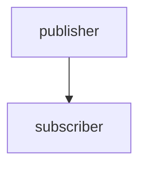

This is the topology we will explore for the next part of today's lecture.

In the Goby3 reference implementation of interprocess, based on ZeroMQ, the interprocess communication is mediated by a ZeroMQ XPUB/XSUB "proxy" (or broker), which is contained within `gobyd`:

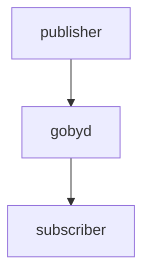

For many of the graphs, we will omit `gobyd` but it is always part of the actual communications path.

For more realistic systems, we will have multiple subscribers, and multiple publishers:

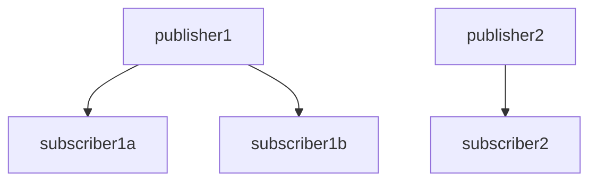

Less frequently, we may even have two publishers of the same data type:

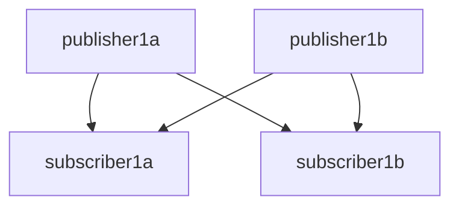

All of these topologies are supported in Goby.


## Hands-on with one publisher / one subscriber in Goby3

### Interprocess

Let's create two new applications by copying the `single_thread` pattern to:

```bash
cd goby3-course/src/bin/patterns
mkdir ../interprocess1
cp -r single_thread ../interprocess1/publisher
cp -r single_thread ../interprocess1/subscriber
```

We'll need to add the appropriate CMakeLists.txt to `interprocess1`:

```cmake
# src/bin/interprocess1/CMakeLists.txt
add_subdirectory(publisher)
add_subdirectory(subscriber)
```

And add the `interprocess1` folder to the `src/bin/CMakeLists.txt`:

```cmake
# src/bin/CMakeLists.txt
# ...
add_subdirectory(interprocess1)
```

Now, let's rename the binary that's built in the `publisher` directory to `goby3_course_interprocess1_publisher`:

```cmake
# src/bin/interprocess1/publisher/CMakeLists.txt
set(APP goby3_course_interprocess1_publisher)
# ...
```

Let's also rename the Goby application class in `app.cpp` to `Publisher`:

```
# src/bin/interprocess1/publisher/app.cpp
# (use CTRL+F2 in Code to change all strings at once)
class SingleThreadApplication -> class Publisher
```

Similarly, we need to match this in `config.proto`:

```protobuf
# src/bin/interprocess1/publisher/config.proto
message Publisher
```

Finally, we do the equivalent for the subscriber's files. Let's make sure we got that right by rebuilding the repository.

#### Qualifying a publication in Goby

To publish in Goby, we need four pieces of information:

- The *layer* we want to publish on (interprocess for now)
- The *group* we want to use (similar idea to LCM *channel*, ROS *topic* or MOOS *variable*).
- The marshalling *scheme* are using (we'll use Protobuf throughout this course).
- The data *type* we are planning to publish. For the Protobuf scheme, this is the Protobuf Message type (or rather the C++ class equivalent).

Now that we're decided to publish on interprocess, and using the Protobuf scheme, we've narrowed down the information we need to publish to just the *group* and the Protobuf *type*.

A given data type is likely to be used within several different groups. Or, a given group can be used for multiple data types. For example, I could have two GPS sensor drivers that both publish the hypothetical GPSPosition *type*, but we could publish them to two different groups (e.g. `groups::gps1` and `groups::gps2`) so that a data consumer could subscribe to one or the other (or both), as desired. In the case of multiple types per group, we might have a GPSDiagnostics data type that we publish on `groups::gps1` along with the GPSPosition.

The important thing to know is that subscriptions will only match publications when the layer, group, scheme, and type **all** match. 

One slight exception to this is that publications are sent on the given *layer* and all inner layers. So the subscriber must subscribe to the given layer or any inner *layer* to receive the data. This is a convenience, and works given the assumption that we made that throughput is greater on each inner layer.

More concretely, if I have a multithreaded process that publishers a message on **interprocess**, this message is also automatically published in all inner layers (**interthread**, in this case), so that is available to all the other threads to subscribe to within the process.

So, we need to create the group and type we're going to use for this example publication. Groups can be stored in any accessible header, and for larger projects may be split across several headers for clarity. For this course we will use `src/lib/groups.h` for all of our groups.

#### Anatomy of a goby::middleware::Group

The *group* in Goby is an instantiation of the `goby::middleware::Group` class, which can be thought of roughly as a string / integer (`uint8_t`) union. For use on higher bandwidth layers (for this course: **interthread** and **interprocess**), the string part is used. In this case, if an integer is also specified, the two are used together, so you can create multiple different groups by changing the integer parts. For low bandwidth layers (**intervehicle**), only the integer is used and the string is ignored. This reduces greatly the amount of data to be sent, as a `uint8_t` is well bounded and takes one byte, whereas a string could be any arbitrary size. 

To summarize with an example:

```cpp
using goby::middleware::Group;

// valid for interthread / interprocess only (default integer argument is Group::invalid_mumeric_group)
constexpr Group foo1{"foo"};
// valid for intervehicle and inner (interprocess / interthread). foo2 is never equivalent to foo1 as foo2's string value is "foo;2"
constexpr Group foo2{"foo", 2};
// also valid for intervehicle and inner, but would be less informational for the layers that support strings. String value is "3"
constexpr Group bar{3};
// for intervehicle, this is the same as Group "bar". For interprocess / interthread is different. Generally you want to avoid this situation.
constexpr Group bar2{"bar", 3};
// 0 is the special case "broadcast_group" which is used to indicate that no grouping is required for this data type. This will become more clear when we discuss intervehicle publish/subscribe.
constexpr Group bar_groupless{"bar", Group::broadcast_group};
```

For this example, let's say we want to send the vehicle's health.

So let's create a group for our new publisher/subscriber pair, and call it "health_status":

```cpp
// src/lib/groups.h
namespace goby3_course {
namespace groups {
// ...  
constexpr goby::middleware::Group health_status{"goby3_course::health_status"};
}
}
```

The convention I've been using is to put Groups in a namespace called `groups` and then use a string that matches the Group variable name, but removing the "groups::" part, as this is unnecessarily redundant. You're welcome to come up with your own convention, if you prefer, but the string name should probably approximately match the variable name.

Why `constexpr`? This allows us the compiler to generate complete publish/subscribe graphs as it knows the groups at compile time. This technique of static analysis allows for more rapid debugging of systems even before launching them. We'll explore this more later, as well. (Goby supports runtime Groups as well, but should only be used if necessary as we lose the benefits of static analysis).

#### Create a Protobuf message

Now that we have a *group*, we just need a *type* to publish. Since we're using Protobuf here, we'll create a new message in the `src/lib/messages` directory which is set up to hold and compile our Protobufs:

```protobuf
// health_status.proto
syntax="proto2";
package goby3_course.protobuf;
message HealthStatus
{
  enum HealthState
  {
    GOOD = 1;
    DEGRADED = 2;
    FAILING = 3;
    FAILED = 4;
  }
  required HealthState state = 1;
}
```

Here we'll just sent an enumeration indicating our overall health state. In a real system you'd fill this out with information like subsystem health, details about battery level, specific failure data, etc.

We also need to tell CMake we want to compile the new message:

```cmake 
# src/lib/messages/CMakeLists.txt
protobuf_generate_cpp(PROTO_SRCS PROTO_HDRS ${project_INC_DIR}
# ...
  goby3-course/messages/health_status.proto
)
```

Now that we've got our group (`goby3_course::groups::health_status`) and our type (`goby3_course::protobuf::HealthStatus`), we can starting publishing.

Let's go back over to the `app.cpp` file in the `publisher` folder we create a few moments ago. Let's assume we want to report our latest health status every second.

We can change the frequency at which `loop()` is called by changing the first argument to `SingleThreadApplication` (typedef'd to `ApplicationBase`):

```cpp
    Publisher() : ApplicationBase(1.0 * si::hertz) {}
```

Now, within our `loop()` method, we can instantiate and populate our health status message:

```cpp
#include "goby3-course/messages/health_status.pb.h"
//...

void goby3_course::apps::Publisher::loop()
{
    goby3_course::protobuf::HealthStatus health_status_msg;
    
    // in a real system we need to determine this from a variety of sources...
    health_status_msg.set_state(goby3_course::protobuf::HealthStatus::GOOD);
    glog.is_verbose() && glog << "Publishing HealthStatus: " << health_status_msg.ShortDebugString() << std::endl;
}
```

Now we can publish this message. To do so we need to first access the transporter (portal or forwarder) for the layer we want to publish on. For `SingleThreadApplication` (and the other Goby application classes), this is accessible by calling the base class method `interprocess()` (or `interthread()`, `intervehicle()` for the other layers).

If we look at the definition of `interprocess()`, we see this is a `goby::zeromq::InterProcessPortal`, which makes sense as we're publishing on the main thread of the process. Let's now look at the anatomy of the publish call:

```cpp
void goby3_course::apps::Publisher::loop()
{
  // void 
  //    <const goby::middleware::Group &group, 
  //     typename Data, 
  //     int scheme = transporter_scheme<Data, Transporter>()
  //    >
  //    publish(const Data &data, 
  //            const goby::middleware::Publisher<Data> &publisher)
  // interprocess().publish<...>(...)
}
```

We have a group (`goby3_course::groups::health_status`), our Data (type: `goby3_course::protobuf::HealthStatus`, instantiation: `health_status_msg`), and our scheme (`goby::middleware::MarshallingScheme::PROTOBUF`). We can ignore the optional parameter `publisher` for now, and we'll get to this when we look at the **intervehicle** layer.

The full, explicitly defined publish call looks like:

```cpp
void goby3_course::apps::Publisher::loop()
{
  // ...
    interprocess()
        .publish<goby3_course::groups::health_status, goby3_course::protobuf::HealthStatus,
                 goby::middleware::MarshallingScheme::PROTOBUF>(health_status_msg);
}
```

This is quite a mouthful, so we can usually take advantage of template deduction to remove much of it. The `Data` template parameter can easily be inferred from the type of `health_status_msg`. Additionally, the schemes implementations define an overload of the free function `goby::middleware::scheme<Data>` to return the scheme enumeration based on the data type. In this case, we can also omit the `scheme` template parameter, and this will also be deduced from the `health_status_msg` type. Doing this, we end up with the much more readable version:

```cpp
void goby3_course::apps::Publisher::loop()
{
  // ...
    interprocess()
        .publish<goby3_course::groups::health_status>(health_status_msg);
}
```

This can be read as "on the interprocess layer, publish to the group `goby3_course::groups::health_status` the data contained in `health_status_msg`".

Now, let's subscribe to these data. Opening the `app.cpp` in the companion `subscriber` folder we created, we can first remove the `loop()` method since we won't be using it, leaving us with:

```cpp
//...
#include "goby3-course/messages/health_status.pb.h"

namespace goby3_course
{
namespace apps
{
class Subscriber : public ApplicationBase
{
  public:
    Subscriber() {}
};
} // namespace apps
} // namespace goby3_course

int main(int argc, char* argv[])
{
    return goby::run<goby3_course::apps::Subscriber>(
        goby::middleware::ProtobufConfigurator<goby3_course::config::Subscriber>(argc, argv));
}
```

Many times we want to subscribe to our data sources from the beginning of the execution of the program. In this case we can do so from the constructor `Subscriber()`.

The `subscribe()` call is anatomically similar to the publish call:

```cpp
// void 
//   <const goby::middleware::Group &group, 
//    typename Data,
//    int scheme = transporter_scheme <Data, Transporter> (),
//    enum class goby::middleware::Necessity::necessity = necessity = goby::middleware::Necessity::OPTIONAL
//   >
//   subscribe(std::function<void (const Data &)> f, 
//             const goby::middleware::Subscriber<Data> &subscriber)
```

The template parameters are identical to `publish()` but with the addition of a `necessity` parameter. This is a work-in-progress feature that you can ignore for now, but will eventually allow compile-time detection of missing `required` data streams. 

The first runtime parameter is a `std::function`, which is a callback that is called when a message of the subscribed type (on the subscribed layer, and the subscribed group) is received. This callback is called immediately upon receipt of that message except when `loop()` or another subscription callback is being called. 

The second parameter, `subscriber` is the companion to the `publisher` argument, and we'll ignore that until we get to **intervehicle**. 

`std::function`s can be constructed from a variety of function-like objects, my preference is to use lambda expressions so that is what we will use in this course. You are welcome to use the other options as your needs required (std::bind, etc.). A lambda expression is a mini standalone function that can be passed around like any other object. In the case of our subscription for `HealthStatus`, we can write a subscription callback lambda like so:

```cpp
goby3_course::apps::Subscriber::Subscriber()
{
    auto on_health_status = [](const goby3_course::protobuf::HealthStatus& health_status_msg) {
        glog.is_verbose() &&
            glog << "Received HealthStatus: " << health_status_msg.ShortDebugString() << std::endl;
        // do whatever you need to with the message in real code ...
    };
}
```

Now that we have that lambda, we can call subscribe. Like publish, the full, explicitly defined call is rather verbose:

```cpp
goby3_course::apps::Subscriber::Subscriber()
{
    auto on_health_status = 
      [](const goby3_course::protobuf::HealthStatus& health_status_msg) {
      //...
    };
    interprocess()
        .subscribe<goby3_course::groups::health_status, goby3_course::protobuf::HealthStatus,
                   goby::middleware::MarshallingScheme::PROTOBUF>(on_health_status);
}
```

Again, use template deduction (and in this case a specific simplified overload of `subscriber()` that deduces the subscribed data type from the argument of the subscription callback function), we can write:

```cpp
interprocess()
  .subscribe<goby3_course::groups::health_status>(on_health_status);
```

Now let's try this out. We can open three terminal windows and run the following (one command in each window):
```
gobyd
goby3_course_interprocess1_publisher -v
goby3_course_interprocess1_subscriber -v
```

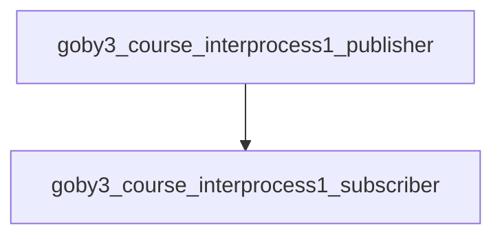

As you can see, each time our publisher application publishes our HealthStatus message, our subscriber application receives it.

#### Time in Goby (optional section: move to Day 3 or Day 4)

We can improve this message by adding a timestamp to it, and at the same time look at how time is handled in Goby.

Time in C++11 and newer is handled by the `std::chrono` library. Unfortunately, date handling isn't provided until C++20, and we're targeting C++14 in Goby3. Additionally, we need a serialized representation of a point in time or duration for use in Protobuf messages, etc. So, we these three related but slightly diverging concepts, we arrive at these needs and the Goby3 choice of solution:

  - point in time (e.g. right now) or duration (`duration`, or difference between two `time_point`s, e.g. 2 hours, 5 minutes) -> `std::chrono`.
  - date representation -> `boost::posix_time::ptime`
  - serializable representation:
    - For points in time: seconds (double) or microseconds (int64_t or uint64_t) since the UNIX epoch (1 January, 1970, midnight UTC) -> `boost::units::quantity<...time>`, typedef'd to `goby::time::MicroTime` (for `int64_t` microseconds) and `goby::time::SITime` (for `double` seconds)
    - For durations: seconds (double) or microseconds (int64_t)  -> `goby::time::MicroTime`, `goby::time::SITime`

All of these representations can be seamlessly converted between using the `goby::time::convert()` and `goby::time::convert_duration()` family of functions provided in `goby/time/convert.h`. You may notice that there's no difference in the serializable time representations for points of time and durations, which is the main reason that `convert()` and `convert_duration()` exist. In this case, the context or message field name will indicate type of time is being used (e.g. `message_timestamp` indicates a point of time, versus `deploy_duration` would be a duration).

The DCCL library has an integration with the `boost::units` library, which makes it a useful way to safely set and retrieve dimensioned fields of DCCL or "vanilla" Protobuf messages, using the additional `_with_units()` methods that DCCL adds to Protobuf. We'll be using DCCL a good deal more when we get to the **intervehicle** section, but for now, we'll look just at the units part.

Let's add a timestamp to our HealthStatus message:

```protobuf
// health_status.proto
import "dccl/option_extensions.proto";
//...
message HealthStatus
{
// ...
    option (dccl.msg).unit_system = "si";
    required HealthState state = 1;
    required uint64 timestamp = 2
        [(dccl.field).units = { prefix: "micro" base_dimensions: "T" }];
}
```

Without going into great detail (see libdccl.org for more detail), this indicates we are using the SI system for unit definitions, and tagging the `timestamp` field as having the dimensions of time (T), which is seconds in SI, and the `prefix`  parameter makes this microseconds. By convention we treat this as "microseconds since the UNIX epoch."

Now, back in our publisher code, we can add the current timestamp to this message. Writing this out fully, we get:

```cpp
#include <goby/time/system_clock.h>
#include <goby/time/convert.h>
// ...
void goby3_course::apps::Publisher::loop()
{
    goby3_course::protobuf::HealthStatus health_status_msg;
    // ...
    goby::time::SystemClock::time_point now = goby::time::SystemClock::now();
    auto now_microseconds_since_unix = goby::time::convert<goby::time::MicroTime>(now);
    health_status_msg.set_timestamp_with_units(now_microseconds_since_unix);
}
```

`goby::time::SystemClock` is a thin wrapper around `std::chrono::system_clock` that provides the ability to run the "real clock" at some factor of the real time for simulation purposes (referred to as "warping"). This is helpful and this I would suggest always using this for Goby applications. That said, `std::chrono` types will work fine with Goby as well, if you're willing to forgo the faster-than-realtime functionality.

This is a lot to type every time we want to set our timestamps, so `SystemClock` has a template overload for `now()` that can take any type that is convertible by the `convert()` function family. Using that, we end up with the equivalent, much cleaner:

```cpp
health_status_msg.set_timestamp_with_units(goby::time::SystemClock::now<goby::time::MicroTime>());
```

For the subscriber, we may wish to read that timestamp and extract the date. To do so, we can use the `boost::posix_time::ptime` class (which Goby will replace in the future with std::chrono in C++20):

```cpp
#include <boost/date_time/posix_time/ptime.hpp>

#include <goby/time/convert.h>
//...

auto on_health_status = [](const goby3_course::protobuf::HealthStatus& health_status_msg) {
        auto timestamp =
            goby::time::convert<boost::posix_time::ptime>(health_status_msg.timestamp_with_units());
        glog.is_verbose() && glog << "Timestamp as date: "
                                  << boost::posix_time::to_simple_string(timestamp) << std::endl;
};
```

Now when we rerun our code, we will see the current time as microseconds since UNIX included in the message.

As one final example, we can calculate the approximate message latency:

```cpp
auto microseconds_latency =
    std::chrono::microseconds(goby::time::SystemClock::now() -
                              goby::time::convert<goby::time::SystemClock::time_point>(
                                  health_status_msg.timestamp_with_units()));
glog.is_verbose() && glog << "Latency (microsec): " << microseconds_latency.count()
                          << std::endl;
```

### Interthread

Let's convert our simple publisher/subscriber into a standalone process that has two threads that communicate to each other instead.

We'll use the existing subscriber app as a starting point, so let's copy the `interprocess1/subscriber` folder to `interthread1`:

```bash
cd goby3-course/src/bin/interprocess1
cp -r subscriber ../interthread1
```

We'll add this to the `src/bin/CMakeLists.txt`:

```cmake
# src/bin/CMakeLists.txt
# ...
add_subdirectory(interthread1)
```

And within `app.cpp` and `config.proto` change:

```
Subscriber->InterThread1
```

And finally the CMakeLists.txt:

```cmake
# src/bin/interthread1/CMakeLists.txt
set(APP goby3_course_interthread1)
```

Goby3 multi-threaded applications are very similar to the single thread application, with the key difference that there is an InterThreadTransporter inside of the InterProcessPortal. 

We'll convert our single threaded application by changing:
```cpp
// app.cpp
#include <goby/zeromq/application/multi_thread.h>
//...
using ApplicationBase = goby::zeromq::MultiThreadApplication<goby3_course::config::InterThread1>;
```

The threads that MultiThreadApplication knows how to launch inherit from the `goby::middleware::Thread` class. We'll use the `goby::middleware::SimpleThread` implementation which implements the three-layer hierarchy of intervehicle->interprocess->interthread we're using this week.

This class interface is very similar to the Application ones: there's a `loop()` method that can optionally be called on a preset interval, and there are `interthread()`, `interprocess()` and `intervehicle()` methods that return references to the appropriate transporter. They take a configuration type, but rather than using a Configurator, the configuration object is passed to the constructor of the Thread subclass when it is launched. This configuration object type can be the same or different from the parent application; here we'll use the same `goby3_course::config::InterThread1` protobuf message for the threads.

Let's create two new threads and move our publisher/subscriber code over:

```cpp=

using ThreadBase = goby::middleware::SimpleThread

namespace goby3_course
{
namespace apps
{
class Publisher : public ThreadBase
{
  public:
    Publisher(const goby3_course::config::InterThread1& config)
        : ThreadBase(config, 1.0 * si::hertz)
    {
    }

  private:
    void loop() override;
};

class Subscriber : public ThreadBase
{
  public:
    Subscriber(const goby3_course::config::InterThread1& config);
};

class InterThread1 : public ApplicationBase
{
  public:
    InterThread1();
};

}
}

goby3_course::apps::InterThread1::InterThread1() {}

void goby3_course::apps::Publisher::loop()
{
    // same publish code as the interprocess1 example, except interprocess->interthread
    interthread().publish<goby3_course::groups::health_status>(health_status_msg);
}

goby3_course::apps::Subscriber::Subscriber(const goby3_course::config::InterThread1& config)
    : ThreadBase(config)
{
  // same subscribe code as the interprocess1 example, except interprocess->interthread
  interthread().subscribe<goby3_course::groups::health_status>(on_health_status);

}
```

Now all that remains to do is to launch the threads. We can do this from the main thread constructor:

```cpp
goby3_course::apps::InterThread1::InterThread1()
{
    launch_thread<Subscriber>(cfg());
    launch_thread<Publisher>(cfg());
}
```

Threads are automatically joined upon cleanly quitting (e.g, from `goby_terminate`), or you can join them manually by calling `join_thread<ThreadType>()`. 

Now we can run this example:

```bash
gobyd
goby3_course_interthread1 -v
```

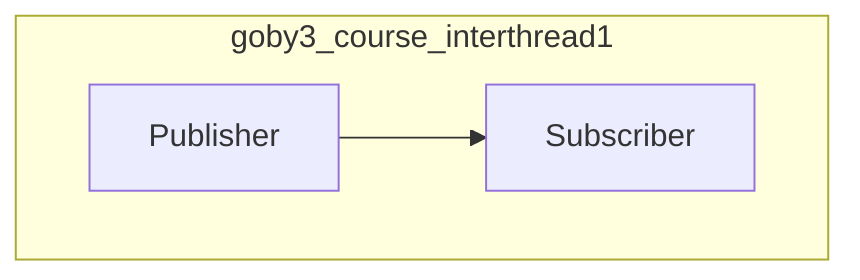


We still need a `gobyd` as the MultiThreadApplication has an InterProcessPortal (even though we're not currently using it). If you want a standalone application that just has interthread comms, you can use goby::middleware::MultiThreadStandaloneApplication).

If we want to improve the efficiency, we can use `std::shared_ptr<HealthStatus>` instead of the regular instantiation, which avoids a copy upon publish. All the Goby transporters have an overload for `publish` and `subscribe` that use `std::shared_ptr` instead. This change looks like:

```cpp
void goby3_course::apps::Publisher::loop()
{
    auto health_status_msg_ptr = std::make_shared<goby3_course::protobuf::HealthStatus>();

    // and then "health_status_msg." becomes "health_status_msg_ptr->"
    // ... 
    interthread().publish<goby3_course::groups::health_status>(health_status_msg_ptr);
}

goby3_course::apps::Subscriber::Subscriber(const goby3_course::config::InterThread1& config)
    : ThreadBase(config)
{
    auto on_health_status =
        [](std::shared_ptr<const goby3_course::protobuf::HealthStatus> health_status_msg_ptr) {
        // and then "health_status_msg." becomes "health_status_msg_ptr->"
        // ... 
        };
    interthread().subscribe<goby3_course::groups::health_status>(on_health_status);
}
```

For our small message this effiency gain is inconsequential, but if you are publishing very large messages on interthread, it will be worth knowing about.

One last thing to mention: we used a Protobuf type here to publish on `interthread`, but the message is never actually serialized (marshalled) or parsed, just a pointer is passed around. This means you can use any C++ type you want (e.g. std::vector, user defined structs/classes, boost classes, etc.) for interthread publication/subscription.

### Cross layer: Interthread & Interprocess

As I mentioned earlier, when you publish a message, it is published on the layer requested *and all inner layers*. So, if we publish our message on `interprocess()` it will be available both to **interprocess** and **interthread** (within the publishing application). Let's try that.

We change our publication in our multi-threaded application to:
```cpp
// interthread1/app.cpp
void goby3_course::apps::Publisher::loop()
{
  // ...
    interprocess().publish<goby3_course::groups::health_status>(health_status_msg_ptr);
}
```

Now if we run our interprocess subscriber from earlier, and the interthread1 multi-threaded application, we'll see this in action:

```bash
gobyd
goby3_course_interthread1 -v
goby3_course_interprocess1_subscriber -v
```

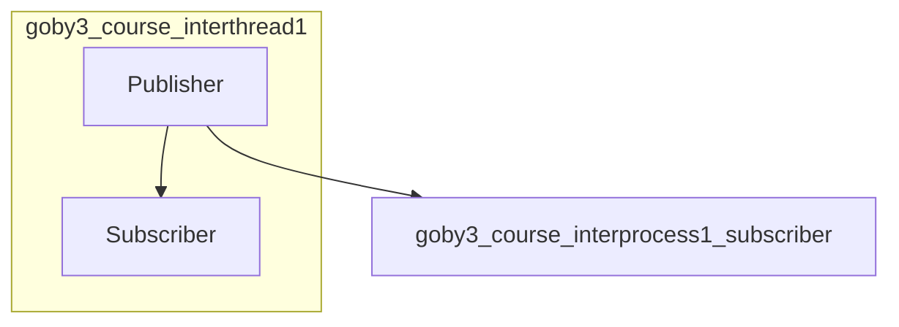


When you run this you'll see both subscribers (the interthread subscriber in `goby3_course_interthread1` and the interprocess subscriber in `goby3_course_interprocess1_subscriber`) receiving our `HealthStatus` publication.

### Intervehicle

Let's work up to the outermost layer in our three-layer system: **intervehicle**. This layer is designed to facilitate communications between vehicles, over what I will dub "slow links," which includes acoustic communications, satellite links, and the like. This layer is implemented on code that goes back to Goby v2 and even before. 

In Goby3 intervehicle is implemented using these components, which we'll get exposed to one at a time:

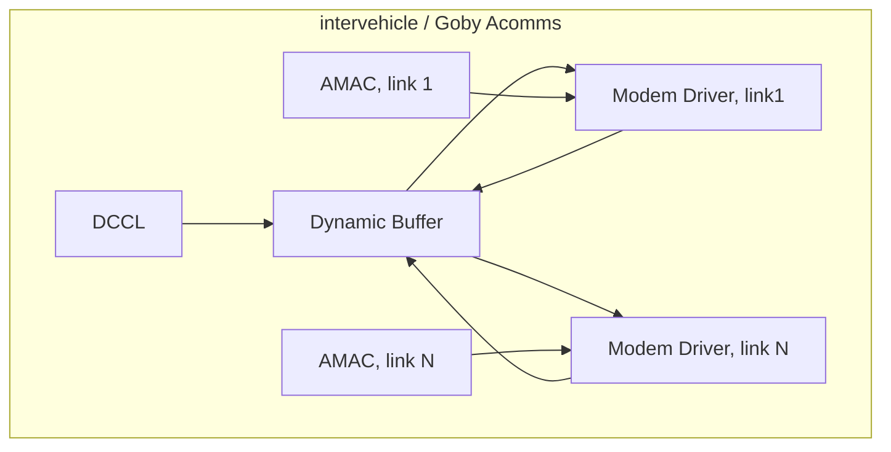

At its simplest, the **intervehicle** layer works much the same as the two inner layers we have already examined. This is where we'll start, but eventually we'll build up some more tools to allow us to handle the often high packet error rates and low throughputs we see on these links.

Let's start by taking our **interprocess** example from earlier, but split the publisher and subscriber across two vehicles. We can copy the interprocess1 folder and rename it to intervehicle1:

```bash
cd goby3-course/src/bin
cp -r interprocess1 intervehicle1
```

As before, we add the new directory to the parent CMakeLists.txt:

```cmake
# src/bin/CMakeLists.txt
# ...
add_subdirectory(intervehicle1)
```

And change the generated application names:

```cmake
# src/bin/intervehicle1/publisher/CMakeLists.txt
set(APP goby3_course_intervehicle1_publisher)
```

```cmake
# src/bin/intervehicle1/subscriber/CMakeLists.txt
set(APP goby3_course_intervehicle1_subscriber)
```

The **intervehicle** layer has the most restrictions due to the low throughput available (and often fixed packet sizes on the underlying links). While on **interthread** you can publish any type, and on **interprocess** any serializable type with an implemented marshalling *scheme*, **intervehicle** is currently restricted to DCCL types only.

#### DCCL

The Dynamic Compact Control Language (DCCL), according to libdccl.org:

> is a language for marshalling (or roughly analogously: source encoding or compressing) object-based messages for extremely low throughput network links. Originally designed for commanding and retrieving data from autonomous underwater vehicles over acoustic modem links, DCCL has found additional uses in the robotics community (such as for sending messages over satellite or degraded land-based links). It is suitable for use when having a very small encoded message size is of much more importance than the speed of encoding and decoding these messages.
    
> DCCL provides two main components: 1) an interface descriptor language (IDL) for defining messages based as an extension to Google Protocol Buffers (GPB); and 2) a set of built-in encoders and decoders ("codecs") that operate on the messages defined in the DCCL IDL. In addition to the built-in codecs, further field codecs can be defined as extensions to the DCCL library to optimally encode specific sources of data. 

Originally part of Goby, DCCL was spun off as a separate library to allow broader use, and take advantage of the standalone nature of the DCCL components. DCCL definitions were first written in XML (v1), and later in Protobuf (v2+). Thus, the modern DCCL (v3) can also be thought of us an alternative encoding for Protobuf that uses additional metadata to more create more compact messages.

Given a plain Protobuf message, e.g.:

```protobuf
syntax="proto2";
message NavigationReport {
  required double x = 1;
  required double y = 2;
  required double z = 3;
  enum VehicleClass { AUV = 1; USV = 2; SHIP = 3; }
  optional VehicleClass veh_class = 4;
  optional bool battery_ok = 5;
}
```

we can add DCCL extensions to bound the fields:

```protobuf
// src/lib/messages/dccl_example.proto
syntax="proto2";
import "dccl/option_extensions.proto";
 
message NavigationReport {
  option (dccl.msg) = { codec_version: 3
                        id: 124
                        max_bytes: 32 };
  required double x = 1 [(dccl.field) = { min: -10000 max: 10000 precision: 1 }];
  required double y = 2 [(dccl.field) = { min: -10000 max: 10000 precision: 1 }];
  required double z = 3 [(dccl.field) = { min: -5000 max: 0 precision: 0 }];
  enum VehicleClass { AUV = 1; USV = 2; SHIP = 3; }
  optional VehicleClass veh_class = 4;
  optional bool battery_ok = 5;
}
```

Now, the `x` and `y` fields are constrained to +/-10000.0 with tenths precision (the `precision` field is the number of decimal digits of precision, or rounded to `10^-precision`, and negative precision values are now allowed). Enumerations and bools are inherently bounded without additional metadata.

DCCL also adds a message id (`option (dccl.msg).id`) which is used as a header on the encoded message to distinguish which message to use to decode. That is, in the above example, `NavigationReport` == 124. Each message used in DCCL must have a unique ID. If you run a private network, you can set the IDs however you want. If you want to publicly share DCCL, you can request an ID range assignment from the global table (https://github.com/GobySoft/goby/wiki/DcclIdTable) by posting an issue against DCCL explaining your use case.

The other message level DCCL metadata fields included above are `codec_version` which is always 3 in DCCLv3 (the current stable version), and `max_bytes` which is an upper bound that you want to enforce on the message size. The message can (and likely will) be smaller than `max_bytes`, but if it exceeds it, DCCL will give an error and you will have to either redesign the message or increase the `max_bytes`. The reason for this is to allow you to target a particular minimum MTU (maximum transmission unit) for a given acoustic modem or other physical link. By design, neither DCCL nor Goby packetizes (fragments) messages.

Once you have a DCCL message you can use the command line tool to inspect it:

```bash
cd goby3-course/src/lib/messages
dccl --analyze --proto_file dccl_example.proto
```

From the output you can see the overall message size (8 bytes), and field sizes:

```
||||||| Dynamic Compact Control Language (DCCL) Codec |||||||
1 messages loaded.
Field sizes are in bits unless otherwise noted.
=================== 124: NavigationReport ===================
Actual maximum size of message: 8 bytes / 64 bits
        dccl.id head...........................8
        user head..............................0
        body..................................53
        padding to full byte...................3
Allowed maximum size of message: 32 bytes / 256 bits
--------------------------- Header ---------------------------
dccl.id head...................................8 {dccl.default.id}
---------------------------- Body ----------------------------
NavigationReport..............................53 {dccl.default3}
        1. x..................................18 {dccl.default3}
        2. y..................................18 {dccl.default3}
        3. z..................................13 {dccl.default3}
        4. veh_class...........................2 {dccl.default3}
        5. battery_ok..........................2 {dccl.default3}
```

Now we can extend our `HealthStatus` Protobuf message from earlier to become a DCCL message (we'll use message ID 125 which is part of the range reserved for private use (124-255, inclusive)):

```protobuf
syntax = "proto2";
import "dccl/option_extensions.proto";
package goby3_course.protobuf;
message HealthStatus
{
    option (dccl.msg) = {
        codec_version: 3
        id: 125
        max_bytes: 32
        unit_system: "si"
    };
    enum HealthState
    {
        GOOD = 1;
        DEGRADED = 2;
        FAILING = 3;
        FAILED = 4;
    }
    required HealthState state = 1;
    required uint64 timestamp = 2 [(dccl.field) = {
        codec: "dccl.time2"
        units { prefix: "micro" base_dimensions: "T" }
    }];
}
```

The timestamp is encoded using the special codec (enCOder/DECoder) "dccl.time2" which efficiently encodes a time point to the nearest second (by default, can be modified by `precision`) using the assumption that the message will received within 12 hours (by default). Now if we analyze the message
```
dccl -a -f health_status.proto
```
we find that the message is 4 bytes, the state field takes 2 bits (which makes sense as we have 4 states and 2^2 = 4), and the timestamp takes 17 bits (dccl.time2 needs to encode up to one day's worth of seconds and ceil(log2(24 hours/day\*60 minutes/hour\*60 seconds/minute)) = 17).

#### Revisiting goby::middleware::Group for intervehicle pub/sub

As we briefly discussed earlier, the goby::middleware::Group has an optional integer component. Much for the same reason that DCCL messages have a numeric ID (so we can avoid sending the string name), Groups have a numeric value when used for intervehicle publishing and subscribing.

The simplest numeric value to use is Group::broadcast_group (which corresponds to the value of 0). This value essentially bypasses the Group functionality entirely for the **intervehicle** layer, and relies only on the type (i.e. DCCL ID) to distinguish different messages. Many times this is sufficient, given that we often only send a handful of messages on the "slow links" and there is no need to distinguish between different groups of messages with the same type (DCCL ID).

The Goby middleware does not add any additional data to the "raw" DCCL message - no header, etc. This is intentional so that the application designer has complete control over the amount of data being sent over the slow link(s) in use.

Let's update our existing `health_status` group to be used as a broadcast group on the **intervehicle** layer:

```cpp
// src/lib/groups.h
constexpr goby::middleware::Group health_status{"goby3_course::health_status",
              goby::middleware::Group::broadcast_group};
```

Now we are all set to begin using the intervehicle layer with our simple one publisher/one subscriber health status example.

#### Setting up gobyd's InterVehiclePortal

`gobyd` can work as a message broker for `interprocess` comms with minimal configuration (or in the simplest case, none). However, for the **intervehicle** layer, we need to configure some more information.

At this point we will switch to using configuration files for our applications, rather than command line flags. For this course, I have been putting these files in goby3-course/launch. 

Let's move over there now and create a new directory for this example, with two vehicles (veh1 and veh2):

```bash
cd goby3-course/launch
mkdir -p intervehicle1/veh1_config
mkdir -p intervehicle1/veh2_config
```

For our slow link, we'll use the `UDPMulticastDriver`. This driver sends messages over Ethernet using Internet Protocol (IP) with a UDP multicast group and is very handy for simulation and prototype work before we need to integrate more accurate or complex comms (e.g. acoustic modems). This driver and its point-to-point companion `UDPDriver` can also be used in certain production situations (e.g. wifi, high-throughput satellite).

Given this, we have the following `gobyd` configuration for veh1:

```
# launch/intervehicle1/veh1_config/gobyd.pb.cfg
interprocess {
    platform: "veh1"
}


intervehicle {
    link {
        modem_id: 1
        subnet_mask: 65280 # FF00
        driver {
            driver_type: DRIVER_UDP_MULTICAST
            [goby.acomms.udp_multicast.protobuf.config] {  
                multicast_address: "239.142.0.2"
                multicast_port: 54500
                max_frame_size: 1400
            }           
        }
        mac {
            type: MAC_FIXED_DECENTRALIZED
            slot { src: 1 slot_seconds: 10 max_frame_bytes: 128 }
            slot { src: 2 slot_seconds: 10 max_frame_bytes: 128 }
        }        
    }
}
```

We'll unpack these details more a bit later but for now, it's sufficient to notice that each modem on a vehicle has a "modem ID" which functions similarly to an IP address, and uniquely identifies that vehicle on that link. Each link is distinguished by the subnet_mask logically AND the modem_id. In Goby3, `subnet_mask` and `modem_id` values are 16-bit unsigned (`uint16_t`). In this simple case, we have only one link, and we've assigned veh1 the ID of 1, and veh2 the ID of 2 (ID 0 is reserved for broadcast, and thus cannot be assigned to a vehicle). The other thing to note is the Medium Access Control (MAC) cycle. In this case, veh1 sends a message of up to 128 bytes, waits 10 seconds, then veh2 sends a message, and the cycle repeats. Clearly most UDP links can support much more throughput than this, so this is closer to an acoustic modem cycle.

Now let's configure veh2's `gobyd`, which only differs slight from veh1:

```bash
> diff -u veh1_config/gobyd.pb.cfg veh2_config/gobyd.pb.cfg
--- veh1_config/gobyd.pb.cfg	2021-02-22 16:32:11.886685265 -0500
+++ veh2_config/gobyd.pb.cfg	2021-02-22 16:32:24.100440670 -0500
@@ -1,11 +1,11 @@
 interprocess {
-    platform: "veh1"
+    platform: "veh2"
 }
 
 
 intervehicle {
     link {
-        modem_id: 1
+        modem_id: 2
         subnet_mask: 65280 # FF00
         driver {
             driver_type: DRIVER_UDP_MULTICAST
```

#### Changing our publish/subscribe layers to intervehicle

Let's go back to the `app.cpp` files for the **intervehicle** code that we copied from the **interprocess** example. We'll now be able to update these for **intervehicle** comms.

First we change the publication layer:

```cpp
// src/bin/intervehicle1/publisher/app.cpp

void goby3_course::apps::Publisher::loop()
{
// ... 
    intervehicle().publish<goby3_course::groups::health_status>(health_status_msg);
}
```

Then we need to change the subscriber's layer:

```cpp
// src/bin/intervehicle1/subscriber/app.cpp

goby3_course::apps::Subscriber::Subscriber()
{
// ... 
    intervehicle().subscribe<goby3_course::groups::health_status>(on_health_status);
}
```

Now, we're almost ready to try this, but we have one more thing to do first.

#### Subscription forwarding

If all vehicles indiscriminately sent all data published on **intervehicle** across the slow links, we would quickly overload them with data that may not even be subscribed to on the receiving end.

Thus, we take advantage of the technique of *subscription forwarding* to avoid this situation. In this case, data that is published on the  **intervehicle** layer does not get send until a subscription for it is received. This requires an additional message for each subscription and unsubscription, but this is offset by the substantially lower cost of only sending publications that actually have an active subscriber or subscribers.

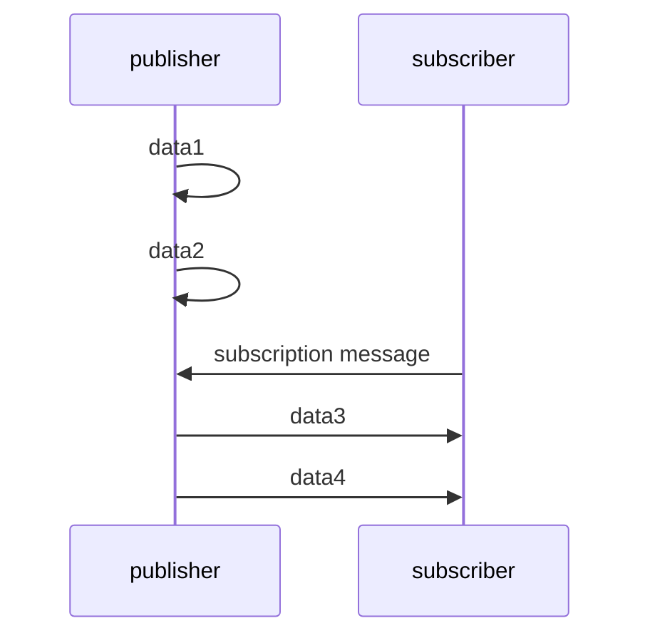

Now, we run into the problem of figuring out where to send the subscription messages. One choice would be to flood all links to try to find potential subscribers. This quickly becomes unworkable though, as we spend substantial bandwidth sending subscription messages.

Thus, with reluctance, we make this the problem of the application writer, who has specific knowledge of the system at hand. 

So, in short, we must specify potential publishers for each subscription.

This is done through the `goby::middleware::Subscriber` object that we ignored earlier, and can be passed as a second parameter to the `subscribe()` method.

The `Subscriber` takes configuration in the form of the `TransporterConfig` Protobuf message. This has a field `intervehicle` which contains all the configuration of intervehicle-specific comms. For now, we can hard-code the potential publisher to vehicle 1. 

```cpp
goby3_course::apps::Subscriber::Subscriber()
{
    goby::middleware::protobuf::TransporterConfig subscriber_cfg;
    subscriber_cfg.mutable_intervehicle()->add_publisher_id(1);
    goby::middleware::Subscriber<goby3_course::protobuf::HealthStatus> health_status_subscriber(
        subscriber_cfg);

    intervehicle()
        .subscribe<goby3_course::groups::health_status, goby3_course::protobuf::HealthStatus>(
            on_health_status, health_status_subscriber);

}
```

We also have to switch away from the simpler template-deduction variant of `subscribe()` to explicitly qualify the subscribed type.

With this change, we are now ready to test out our code. We'll make two launch files to make this easier:

```
# launch/intervehicle1/veh1.launch
gobyd veh1_config/gobyd.pb.cfg
goby3_course_intervehicle1_publisher --interprocess 'platform: "veh1"' -v 
```

```
gobyd veh2_config/gobyd.pb.cfg
goby3_course_intervehicle1_subscriber --interprocess 'platform: "veh2"' -v 
```
Then we can launch them:

```bash
goby_launch veh1.launch
goby_launch veh2.launch
```

We can see what is going on with our processes by attaching the screen sessions:

```bash
screen -r veh1.goby3_course_intervehicle1_publisher
screen -r veh2.goby3_course_intervehicle1_subscriber
```


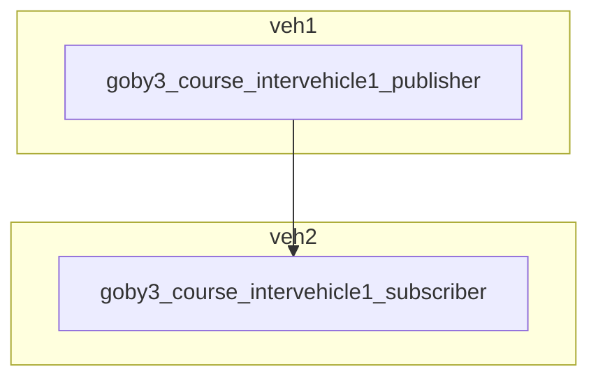

As a reminder of the fact that publications are published on the given layer and all inner layers, the **intervehicle** publications are also available on **interprocess** on veh1 (and **interthread** when using `MultiThreadApplication`). Given that we can run our interprocess subscriber from earlier and see the same data, now coming from the `goby3_course_intervehicle1_publisher`:

```bash
goby3_course_interprocess1_subscriber --interprocess 'platform: "veh1"' -v
```

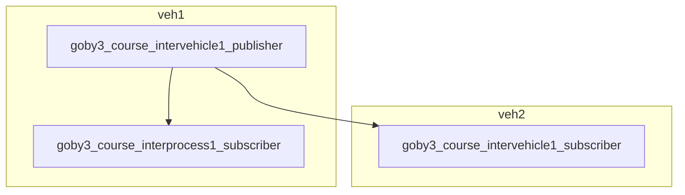

You will notice at the intervehicle subscriber that we get a large batch of messages at once - this is that every 20 second transmission as controlled by the MAC cycle. The default buffering is often not what we want so we will discuss that in the next section.

#### Dynamic Buffer

The Goby3 dynamic buffer is a priority queue that blends both a base priority value (like a standard priority queue) with a time-sensitive value (based on a deadline time-to-live). Each type within the dynamic buffer can be assigned a different base priority value (`value_base`) and time-to-live (`ttl`), and when the modem driver (typically in concert with the MAC) requests data, the highest priority messages are sent.

Assume we have three message types (1, 2, 3):

- Message type 1 has a base priority value of 1 (dimensionless, values are relative to each queues) and a time-to-live of 1000 seconds. This might represent something that goes stale relatively quickly, but not especially valuable (e.g. vehicle status)
- Message type 2 has a higher base priority value of 2, but a longer time-to-live of 2000 seconds. This might represent data that is overall more important, but less critical to report immediately (e.g. sensor data)
- Message type 3 has the same priority (1) as Message type 1, but a longer time to live (3000 seconds). This is even less time sensitive, so it might represent engineering debug values of some sort.

Given these message types, and assume our vehicle can transmit one message every 100 second, we get the following priority values, and messages sent:


Thus, the behavior of the Goby dynamic buffer is to interleave messages based on their overall priority and time-to-live (which determines the slope of the priority curve). Every time a message is sent from a given message queue, its priority is reset to zero.

Within the context of the **intervehicle** publish/subscribe, the buffer configuration values can be either set by the publisher or the subscriber(s), or by both, in which case the values are merged (averaged in the case of `ttl` and `value_base`).


The buffer configuration is given in `src/acomms/protobuf/buffer.proto`:

```protobuf
message DynamicBufferConfig
{   
  optional bool ack_required = 2 [default = false];
    // lowest value takes precedence
    optional double blackout_time = 3 [
        default = 0,
        (dccl.field) =
            {min: 0 max: 3600 precision: 0 units {base_dimensions: "T"}}
    ];
    // larger value takes precedence
    optional uint32 max_queue = 4
        [default = 1000, (dccl.field) = {min: 1 max: 1000}];
    // true takes precedence over false
    optional bool newest_first = 5 [default = true];
    // use average of values
    optional double ttl = 6 [
        default = 1800,
        (dccl.field) =
            {min: 1 max: 86400 precision: 0 units {base_dimensions: "T"}}
    ];
    // use average of values
    optional double value_base = 7
        [default = 100, (dccl.field) = {min: 1 max: 1000 precision: 0}];
}
```

- `ack_required`:  determines whether this message should be automatically retried if the first transmission fails (up until `ttl`). This is typically set to true for commands and other stateful messages, and false for status-type messages where it is better to replace the message with the latest if it gets lost. (default: false, no acks required)
- `blackout_time`: minimum time after sending a message of this type that another will not be sent (default: 0, i.e. no blackout time).
- `max_queue`: number of messages of this type that can be queued (default: 1000).
- `newest_first`: if true, this is a FILO queue, false is a FIFO queue. This affects which messages are discarded if `max_queue` is exceeded as well. If false, the newest messages are discarded on a buffer overflow; if true, the oldest messages are discarded. (default: true)
- `ttl`: time-to-live in seconds (default: 1800s = 30m)
- `value_base`: base priority value (default: 100)

Since we only have one message in our simple example, changing the `value_base` will have no effect. Let's start then by setting the ttl very low, and see what happens. We'll set this on the subscriber side as this often makes more sense than the publisher setting it:
```cpp
// src/bin/intervehicle1/subscriber/app.cpp
goby3_course::apps::Subscriber::Subscriber()
{
// ...
    auto& buffer_cfg = *subscriber_cfg.mutable_intervehicle()->mutable_buffer();
    buffer_cfg.set_ttl_with_units(5*boost::units::si::seconds);
}
```

Now when we rerun our code

```bash 
goby_launch veh1.launch
goby_launch veh2.launch
screen -r veh2.goby3_course_intervehicle1_subscriber
```

we see that only the messages generated within the latest five seconds make it through to the subscriber, as the older messages expired before they had a chance to send.

#### Publisher ACK/Expire Callbacks

Now, perhaps our publisher would like to know when messages expire before they are received by anyone? To do this, we take advantage of an additional feature of the `Publisher` class: the ability to attach callbacks for:

- Acknowledgment of received data (for queues with `ack_required: true`)
- Expiration of data

Using this is very similar to using subscription callbacks, but on the publisher side:

```cpp
// src/bin/intervehicle1/publisher/app.cpp
void goby3_course::apps::Publisher::loop()
{
  // ...
  // expire: std::function<void(const Data&, const intervehicle::protobuf::ExpireData&)>;
    auto on_health_status_expire =
        [](const goby3_course::protobuf::HealthStatus& orig,
           const goby::middleware::intervehicle::protobuf::ExpireData& expire_data) {
            glog.is_warn() && glog << "Our data expired: " << orig.ShortDebugString() << " Why? " << expire_data.ShortDebugString()
                                   << std::endl;
        };

    goby::middleware::protobuf::TransporterConfig publisher_cfg;
    publisher_cfg.mutable_intervehicle()->mutable_buffer()->set_ack_required(true));

    goby::middleware::Publisher<goby3_course::protobuf::HealthStatus> health_status_publisher(
        publisher_cfg, {/* ack data callback */}, on_health_status_expire);
            intervehicle().publish<goby3_course::groups::health_status>(health_status_msg, health_status_publisher);

}
```

These callbacks are only used with `ack_required: true` (on either the subscriber or publisher side).

Now, if we rerun this:

```bash 
goby_launch veh1.launch
goby_launch veh2.launch
screen -r veh1.goby3_course_intervehicle1_publisher
```

 we can see when our data expire:

```
goby3_course_intervehicle1_publisher [2021-Feb-23 22:10:20.101351]: (Warning): Our data expired: state: GOOD timestamp: 1614118215000000 Why? header { src: 0 dest: 2 } latency: 5098786 reason: EXPIRED_TIME_TO_LIVE_EXCEEDED
```

Finally, we may want to also know when our data are received correctly, which is what the ack callback is for

```cpp
// src/bin/intervehicle1/publisher/app.cpp
void goby3_course::apps::Publisher::loop()
{
  // ...
  // ack: std::function<void(const Data&, const intervehicle::protobuf::AckData&)>;
    auto on_health_status_ack =
        [](const goby3_course::protobuf::HealthStatus& orig,
           const goby::middleware::intervehicle::protobuf::AckData& ack_data) {
            glog.is_verbose() && glog << "Our message was acknowledged: " <<  orig.ShortDebugString() << "; " << ack_data.ShortDebugString()
                                   << std::endl;
        };

//...

    goby::middleware::Publisher<goby3_course::protobuf::HealthStatus> health_status_publisher(
        publisher_cfg, on_health_status_ack, on_health_status_expire);
}
```

We can rerun this and see now that we get a set of acknowledgments each time our data arrive on the subscriber:

```
goby3_course_intervehicle1_publisher [2021-Feb-23 22:10:00.102136]: Our message was acknowledged: state: GOOD timestamp: 1614118199000000; header { src: 2 dest: 1 } latency: 1099272
```

#### Subscription forwarding message callbacks (Optional - skip if time is short)


Since subscription forwarding messages are just a different type of publication, we can also attach callbacks (to the Subscriber) to know when when our subscriptions arrived:

```cpp
// src/bin/intervehicle1/subscriber/app.cpp
    auto on_subscribed = [](const goby::middleware::intervehicle::protobuf::Subscription& sub,
                            const goby::middleware::intervehicle::protobuf::AckData& ack) {
        glog.is_verbose() && glog << "Received acknowledgment: " << ack.ShortDebugString()
                                  << " for subscription: " << sub.ShortDebugString()
                                  << std::endl;
    };
    // ...
    goby::middleware::Subscriber<goby3_course::protobuf::HealthStatus> health_status_subscriber(
        subscriber_cfg, on_subscribed);

```

Now when we rerun, we know when our forwarded subscription was received:

```
goby3_course_intervehicle1_subscriber [2021-Feb-23 22:09:30.104224]: Received acknowledgment: header { src: 1 dest: 2 } latency: 8980350 for subscription: header { src: 0 dest: 1 } action: SUBSCRIBE dccl_id: 125 group: 0 intervehicle { buffer { ttl: 5 } } metadata { }
```

#### Modem Drivers

At this time, there are eight drivers in the open-source distribution of Goby3:

- WHOI Micro-Modem (v1, v2)
- Iridium 9523 and similar (RUDICS/SBD)
- Iridium RUDICS and DirectIP shore-side connections
- Benthos ATM900 Modems
- delResearch Popoto Modem
- UDP Point-to-point
- UDP Multicast
- ABC Driver (demo for writing new drivers)

Some of these have seen more testing than others. This, along with the continual change from vendors, means that it would be a valuable service to the Goby community if anyone wishes to "adopt" a driver and keep it up to date.

Also, new drivers are very welcome and can be submitted as a pull request to the Goby3 project: https://github.com/GobySoft/goby3/pulls

Let's now look at converting our prior "intervehicle1" example to run over the WHOI Micro-Modem.

We can start by copying our existing `gobyd` configurations:

```bash
cd launch/intervehicle1
cp veh1_config/gobyd.pb.cfg veh1_config/gobyd-mm.pb.cfg
cp veh2_config/gobyd.pb.cfg veh2_config/gobyd-mm.pb.cfg
```

Now we'll edit these to change the driver settings (and increased the verbosity so we can see what's going on):

```
// veh1_config/gobyd-mm.pb.cfg
app
{
    glog_config
    {
        tty_verbosity: DEBUG2
        show_gui: true
    }
}

intervehicle {
    link {
//...
        driver {
            driver_type: DRIVER_WHOI_MICROMODEM
            serial_port: "/dev/ttyUSB0"
            serial_baud: 19200
            [goby.acomms.micromodem.protobuf.config] {  
                reset_nvram: true
            }           
        }
        mac {
            type: MAC_FIXED_DECENTRALIZED
            slot { src: 1 slot_seconds: 10 rate: 1 }
            slot { src: 2 slot_seconds: 10 rate: 1 }
        }        
    }
}
```

and the same for veh2 except for the serial port:
```
// veh2_config/gobyd-mm.pb.cfg
intervehicle {
    link {
//...
        driver {
//...
            serial_port: "/dev/ttyUSB1"
        }
    }
}
```

Then, create some new launch files:

```bash
cp veh1.launch veh1-mm.launch
cp veh2.launch veh2-mm.launch
```

and edit
```
// veh1-mm.launch
gobyd veh1_config/gobyd-mm.pb.cfg
// veh2-mm.launch
gobyd veh2_config/gobyd-mm.pb.cfg
```

Now if we launch:

```bash
goby_launch veh1-mm.launch
goby_launch veh2-mm.launch
screen -r veh2.goby3_course_intervehicle1_subscriber
```

we'll see our messages getting through, as before.

If we open up the gobyd windows we can see a good deal more debugging information:

```
screen -r veh1.gobyd
screen -r veh2.gobyd
```

Working our way around the NCurses GUI (from bottom right to top left) we see:

- serial: Raw serial feed (from Serial I/O thread - we'll look more into this on day 4)
- modemdriver::in/modemdriver::out: Annotated serial feed (in the case of the Micro-Modem driver)
- driver_thread::id1: the Goby3 intervehicle "wrapper" thread for this link
- amac::1: "Acoustic" Medium Access Control cycles
- priority::1: The Dynamic Buffer priority "contest"
- Ungrouped messages: everything else / miscellaneous.

## Returning to the Trail example

Now we have the background to dig further in the Trail example that I showed on Day 1.

The current **intervehicle** communications topology is given by:

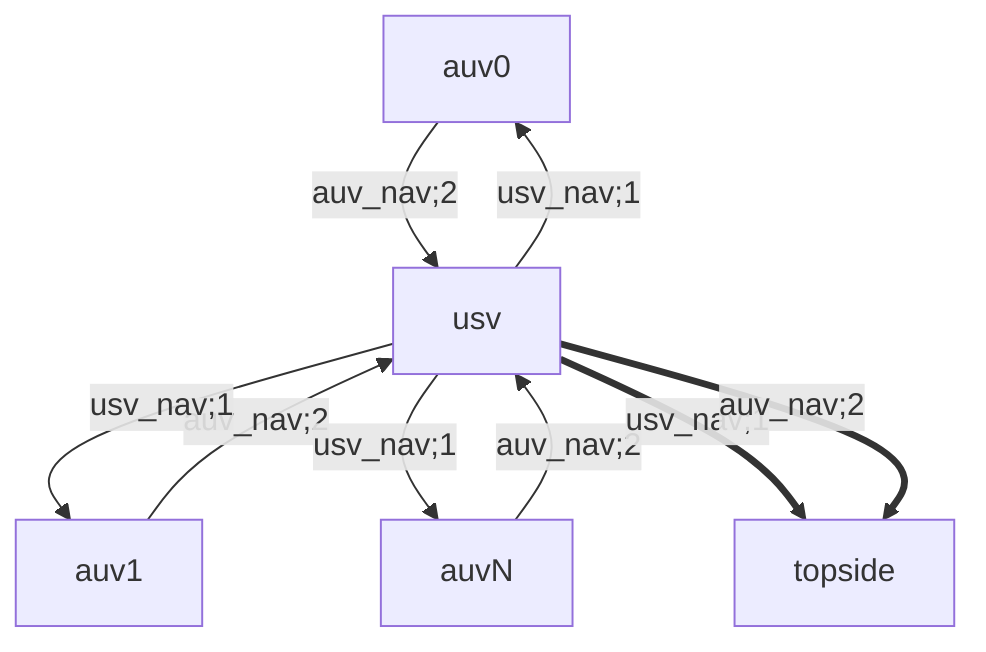

where `NavigationReport` (with namespaces: `goby3_course::dccl::NavigationReport`) is the DCCL message type used for all messages, and `auv_nav;2` and `usv_nav;1` are the groups (with the string value on the left hand side, and the integer value after the semicolon on the right hand side).

The bold link (usv to topside) represents a satellite comms link and the normal link (auvs to usv) represents an acoustic comms link, both simulated using the UDPMulticastDriver, but with MAC schemes representative of the respective throughputs.

Digging down a bit further into the applications, we have three applications that perform the intervehicle publish/subscribe for each vehicle class (including topside):

1. goby3_course_auv_manager
1. goby3_course_usv_manager
1. goby3_course_topside_manager


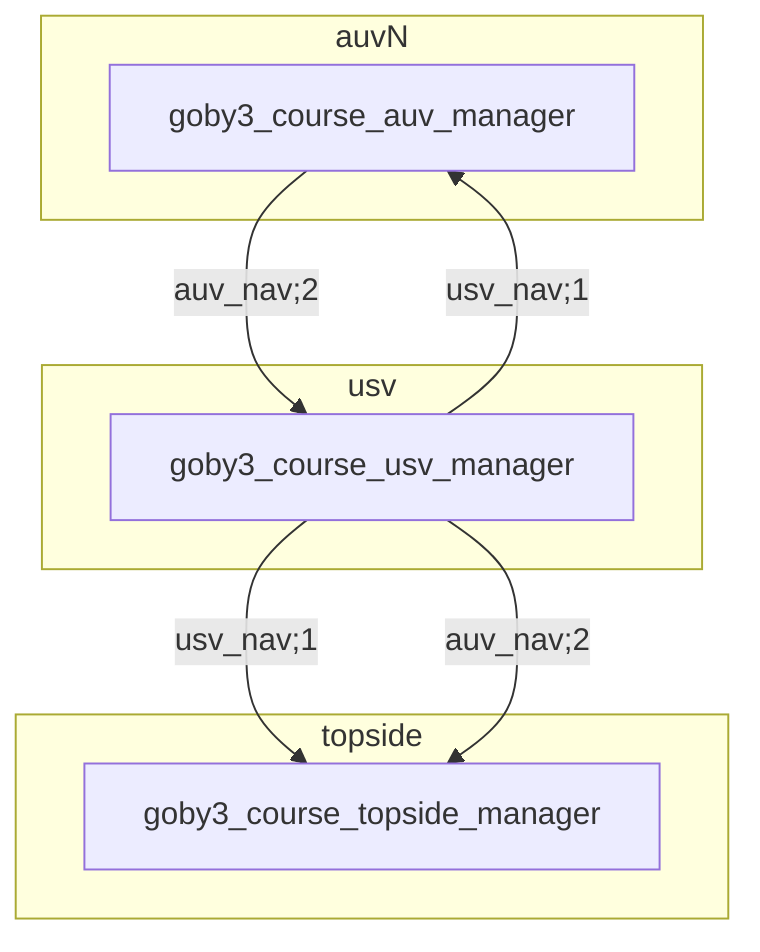

The USV navigation is subscribed to by the topside (for display and tracking) and also by the AUVs so they can trail the USV.

The AUV navigation is subscribed to by the USV so that it can republish it over the satellite link for the topside's consumption (and display). 

Let's take a look at each of these manager applications in turn and see how this is implemented.

### goby3_course_auv_manager

The AUV manager application is in `src/bin/manager/auv`, and is a `SingleThreadApplication` much like the ones we have been looking at earlier.

On startup (in the constructor), it subscribes to the USV navigation (on **intervehicle**), and its own navigation coming from the `goby_frontseat_interface` (on **interprocess**) so that it can convert it to a DCCL message to publish on **intervehicle**. We'll look at `goby_frontseat_interface` more tomorrow, but for now all we need to know is that it publishes the vehicle's navigation estimate from the on-board control computer ("frontseat").

A few things to note in the `subscribe_our_nav()` method:

- NodeStatus is the Protobuf message sent by `goby_frontseat_interface`. It is defined in `goby3/src/middleware/frontseat_data.proto`.
- We use the `nav_convert` function to copy part of this message into the `goby3_course::dccl::NavigationReport` DCCL message that we're using in this course for intervehicle comms. This message is defined in `goby3-course/src/lib/messages/nav_dccl.proto`.
- Finally, we publish to the auv_nav group, which is numeric group ID 2 (as seen in `src/lib/groups.h`).
- `goby3_course::nav_publisher()` returns a `Publisher` suitable for the navigation messages. It sets the appropriate group (2) within the message. We haven't explored the set_group and group callbacks to `Publisher` and `Subscriber` yet, but you will in the homework.

Now, looking at the `subscribe_usv_nav()` method:

- We choose our potential publisher by the `usv_modem_id` configuration value (`defined in config.proto`)
- We designate the subscription as "broadcast", meaning that the USV can send one message for all subscribed nodes on the link (all the AUVs) rather than directing (unicasting) a message for each subscribed AUV. This means some AUVs may miss a particular USV navigation update, but they will hopefully get the next one. 
- We state that we only need a queue of 1 for the USV's NavigationReport and we want the newest value first. There's no value in multiple old navigation messages in this case; we just want to trail the USV based on its latest known position. 
- Upon receipt (subscription callback `handle_usv_nav`), we republish the message internally (on **interprocess**), which gets picked up by the `goby_moos_gateway` process to pass over to pHelmIvP, which then can update the Trail Behavior appropriately. We'll look at this tomorrow.

### goby3_course_usv_manager

The USV manager application, not surprisingly, is in `src/bin/manager/usv`.

In many ways this is a mirror image of the AUV manager, subscribing to the AUV navigation messages (one subscription for each vehicle), and converting and publishing the USV navigation.

Nothing is conceptual new here.

### goby3_course_topside_manager

Finally, the topside manager is in `src/bin/manager/topside`. Here the topside subscribes to both the USV navigation and the AUV navigation (as collected and republished by the USV). Note that we set the `max_queue` to 10 on the topside, our expected maximum number of AUVs. This allows the USV to collect up to one message from each AUV before the queue overflows. We could set this higher if we want, but it's not necessary for our current network topology.

Upon receipt of a message from either class of vehicle, the topside converts them back to the `NodeStatus` message and publishes them on **interprocess** to be picked up by the two viewer applications (`goby_geov_interface` and `goby_opencpn_interface`).

The full publish/subscribe topology is provided by the `goby_clang_tool` in `build/share/interfaces/figures/trail_interfaces.pdf`, assuming we compile with 

```bash
GOBY3_COURSE_CMAKE_FLAGS="-Dexport_goby_interfaces=ON"
```

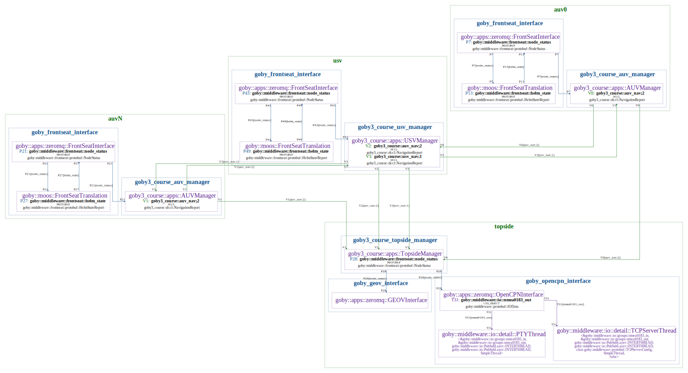


## Extras (Optional, based on time)

### goby_clang_tool

The `goby_clang_tool` has two actions it can perform:

- *generate* an interface file for an application
- *visualize* a deployment using multiple applications' interface files.

#### Generate

During the *generate* action, the `goby_clang_tool` is a tool that uses the Clang compiler's libtooling library to process the C++ code and extract the `publish` and `subscribe` calls from the code. From here, it can produce an "interface" file for that application, which provides a complete list of all the publications and subscriptions for that application.

In this course, we build these interface files (which are defined in YAML) to `build/share/interfaces`. Let's take a look at the one for `goby3_course_auv_manager`:

```yaml
# build/share/interfaces/goby3_course_auv_manager_interface.yml
application: goby3_course_auv_manager
intervehicle:
  publishes:
    - group: goby3_course::auv_nav;2
      scheme: DCCL
      type: goby3_course::dccl::NavigationReport
      thread: goby3_course::apps::AUVManager
  subscribes:
    - group: goby3_course::usv_nav;1
      scheme: DCCL
      type: goby3_course::dccl::NavigationReport
      necessity: optional
      thread: goby3_course::apps::AUVManager
interprocess:
  publishes:
    - group: goby3_course::usv_nav;1
      scheme: PROTOBUF
      type: goby3_course::dccl::NavigationReport
      thread: goby3_course::apps::AUVManager
# ... omitting coroner & terminate groups
    - group: goby3_course::auv_nav;2
      scheme: DCCL
      type: goby3_course::dccl::NavigationReport
      thread: goby3_course::apps::AUVManager
      inner: true
    - group: goby3_course::auv_nav;2
      scheme: PROTOBUF
      type: goby3_course::dccl::NavigationReport
      thread: goby3_course::apps::AUVManager
      inner: true
  subscribes:
    - group: goby::middleware::frontseat::node_status
      scheme: PROTOBUF
      type: goby::middleware::frontseat::protobuf::NodeStatus
      necessity: optional
      thread: goby3_course::apps::AUVManager
# ... omitting coroner & terminate groups
interthread:
# not meaningful in a SingleThreadApplication
```

Here we see a useful summary of all of the publications and subscriptions for this application, based on the Clang compiler's understanding of our code. Thus, if we change anything, all we need to do is recompile to regenerate this file. 

This kind of tool can be used to avoid "documentation rot" (where documentation lags implementation and thus becomes less than helpful), as well as static analysis (compile time verifications).

Using CMake, we can use the `generate_interfaces(${APP})` function to call `goby_clang_tool` using the generate action to create the interfaces file on the provided target `${APP}`. This function (and others) are defined in the `cmake/GobyClangTool.cmake` file.

#### Visualize

Once we have a collection of interface files for our applications, we can set up a "deployment", which is just a list of which applications we intend to run when we deploy this code. The deployment is defined in YAML (but by us, not the compiler, as it has no idea where we want to run this code), and for the Trail example resides in `launch/trail/trail_deployment.yml`:

```yaml
# launch/trail/trail_deployment.yml
deployment: trail_deployment
platforms:
  - name: topside
    interfaces:
      - goby3_course_topside_manager_interface.yml
      - @GOBY_INTERFACES_DIR@/goby_opencpn_interface_interface.yml
      - @GOBY_INTERFACES_DIR@/goby_geov_interface_interface.yml
  - name: usv
    interfaces:
      - goby3_course_usv_manager_interface.yml
      - @GOBY_INTERFACES_DIR@/goby_frontseat_interface_interface.yml
  - name: auv0
    interfaces:
      - goby3_course_auv_manager_interface.yml
      - @GOBY_INTERFACES_DIR@/goby_frontseat_interface_interface.yml
  - name: auvN
    interfaces:
      - goby3_course_auv_manager_interface.yml
      - @GOBY_INTERFACES_DIR@/goby_frontseat_interface_interface.yml
```

This file provides the paths to the appropriate interface files. Using CMake, we can call the following to run `goby_clang_tool` in visualize mode (as well as the Graphviz `dot` tool)

```cmake
generate_interfaces_figure(launch/trail/trail_deployment.yml ${YML_OUT_DIR} trail_interfaces.pdf "--no-disconnected")
```

CMake preprocesses the deployment file to replace `@GOBY_INTERFACES_DIR@` with the actual path to the interface files in Goby3. Then `goby_clang_tool` uses this deployment file, along with the referenced interface files, to produce a Graphviz "dot" file. These "dot" files are then processed by Graphviz to generate a PDF or other supported output file that visualizes the connections (i.e. matching publish/subscribe calls).

#### Current limitations

The tool currently has no way of knowing about the network topology, so any matching publish/subscribe pairs are connected on the visualization, even if the two nodes won't be on the same physical link (e.g. topside and AUVs in our Trail example). As such you will see a direct **intervehicle** link from `goby3_course_auv_manager` to `goby3_course_topside_manager` that doesn't actually exist based on how we've created our network.

This will be solved in the future by augmenting the deployment file to include this information.

