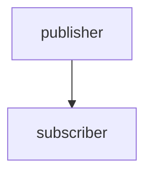
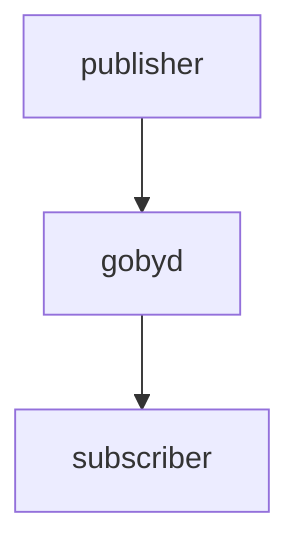
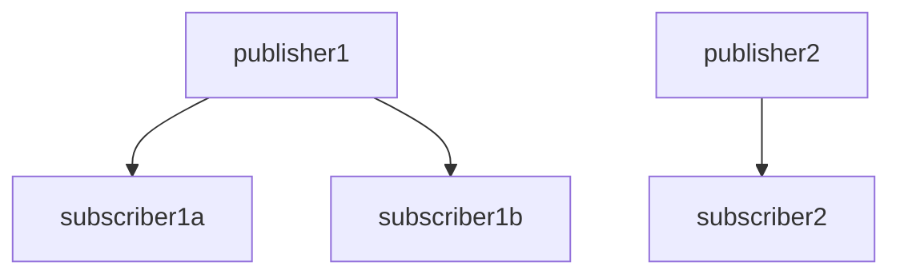
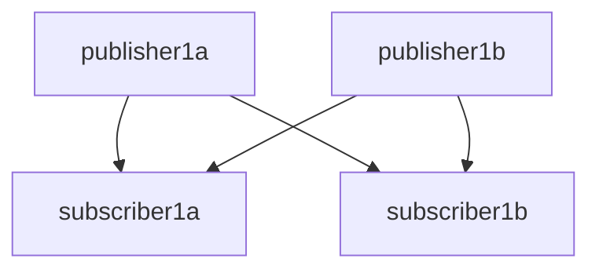

# Day 2: Communications

## Hands on building a Goby application from scratch

In the `goby3-course` repository, I have created two application patterns (or "templates" but I avoid that in this context because of the potential confusion with C++ templates) that you can copy to create new Goby applications quickly:

```bash
goby3-course/src/bin/patterns/multi_thread
goby3-course/src/bin/patterns/single_thread
```

Use of these pattern files is completely optional, and as you gain further understanding you will likely wish to generate your applications from scratch.

We will now walk through building up the `single_thread` pattern. At a minimum, when using the Protobuf Configurator (as we will in this course), a Goby application will have three files:

```bash
app.cpp         # actual code
config.proto    # configuration proto message
CMakeLists.txt  # build instructions
```

`app.cpp` can be split across several files (`*.h` and `*.cpp` as needed) for logical and structural clarity as needed as the program grows (and does not need to be called `app.cpp` at all).

First, we will build up the app.cpp file. Let's do this in `src/bin/myapp`.

All ZeroMQ Goby applications inherit from either `goby::zeromq::SingleThreadApplication` or `goby::zeromq::MultiThreadApplication`, depending on whether you want to be able to have an InterThreadTransporter for thread-to-thread comms.

So, let's declare a subclass:

```cpp
// app.cpp
#include <goby/zeromq/application/single_thread.h>

class MyApp : public goby::zeromq::SingleThreadApplication<...>
{

};
```

As we see already, we need a template parameter `Config` for our application. All Goby applications must have a configuration object, which is filled from the command line parameters and/or a configuration file. This configuration object is populated by a Configurator class, which contains instructions on how to parse the command line syntax into this object.

For this course we will use the default Configurator, `goby::middleware::ProtobufConfigurator`. This class uses a Google Protocol Buffers ("Protobuf") message to define the valid configuration, then parses the command line and/or configuration file using the TextFormat specification for Protobuf.

Thus, all we need to do to configure our application is define a Protobuf message that specifies the valid configuration parameters for our application. This is done in config.proto, which we will now create:

```protobuf
// config.proto
syntax="proto2";
package config; // becomes "namespace config {}"

message MyApp
{
   
}
```

This message must contain at least an `app` block. It also must contain an `interprocess` block if we want to be able to communicate with `gobyd`:

```protobuf
// config.proto
import "goby/middleware/protobuf/app_config.proto";
import "goby/zeromq/protobuf/interprocess_config.proto";

message MyApp
{
    optional goby.middleware.protobuf.AppConfig app = 1;
    optional goby.zeromq.protobuf.InterProcessPortalConfig interprocess = 2;
}
```

All other parameters are up to the application you're creating. We can accept an integer called `value_a`, for example:

```protobuf
// config.proto
message MyApp
{
    // ...
    optional int32 value_a = 3;
}
```

If you're not familiar with Protobuf, it's worth reading through the getting started guide: <https://developers.google.com/protocol-buffers/docs/cpptutorial>. Note that we are using "proto2" throughout this course.

Now that we have a configuration message, we can use the C++ version of it in our `app.cpp`:

```cpp
// app.cpp
#include "config.pb.h"

class MyApp : public goby::zeromq::SingleThreadApplication<config::MyApp>
{};
```

Now, we need to declare a main function, because every C++ application must have one. When using the Goby application classes, this is a simple matter of calling `goby::run`:

```cpp
// app.cpp
int main(int argc, char* argv[])
{
    return goby::run<MyApp>(goby::middleware::ProtobufConfigurator(argc, argv));
}
```

Note that we pass the command line arguments to `ProtobufConfigurator`, which then generates the appropriate configuration for our class. Inside our `MyApp` class, we can access this configuration by calling the class method `cfg()`.

Now we need to build our code. This is done by adding a CMakeLists.txt file, which is read by CMake to generate files for either Make or Ninja to use to actually build the code.

We will copy this one, as this course isn't about learning CMake:

```cmake
# CMakeLists.txt
# change for your new application - this is name the binary will be caleed
set(APP goby3_course_my_app)

# turn the config.proto into C++ code: config.pb.cc and config.pb.h
protobuf_generate_cpp(PROTO_SRCS PROTO_HDRS ${CMAKE_CURRENT_BINARY_DIR} config.proto)

# create an executable (binary)
add_executable(${APP}
  app.cpp
  ${PROTO_SRCS} ${PROTO_HDRS})

# link it to the appropriate goby libraries and course messages library
target_link_libraries(${APP}
  goby
  goby_zeromq
  goby3_course_messages)

# generate the interfaces file using goby_clang_tool for later visualization
if(export_goby_interfaces)
  generate_interfaces(${APP})
endif()
```

Finally, we need to inform the parent directory's `CMakeLists.txt` that we have added a new directory to the build tree:

```cmake
# src/bin/CMakeLists.txt
add_subdirectory(myapp)
```

Now we are ready to build:
```bash
cd goby3-course
./build.sh
```

If successful, you will have a new binary in `goby3-course/build/bin`:

```bash
 > ls ~/goby3-course/build/bin/goby3_course_my_app 
/home/toby/goby3-course/build/bin/goby3_course_my_app
```


## Understanding Nested Publish/Subscribe

Recall from Day 1 the three-layer nested hierarchy:

- interthread: Thread to thread using shared pointers
- interprocess: Process to process using a interprocess transport (we will use ZeroMQ for this course)
- intervehicle: Vehicle to vehicle (or other platform) using acoustic comms, satellite, wifi, etc.

### Interprocess

We will start in the middle of this hiearachy as this is the most familiar to users of ROS, MOOS, LCM, etc.

At it simplest, interprocess communications using a publish/subscribe model requires:

- A single publisher
- A single subscriber



This is the topology we will explore for the first part of today's lecture.

In the Goby3 reference implementation of interprocess, based on ZeroMQ, the interprocess communication is mediated by a ZeroMQ XPUB/XSUB "proxy" (or broker), which is contained within `gobyd`:



For many of the graphs, we will omit `gobyd` but it is always part of the actual communications path.

For more realistic systems, we will have multiple subscribers, and multiple publishers:



Less frequently, we may even have two publishers of the same data type:



All of these topologies are supported in Goby.

#### Hands-on with one publisher / one subscriber in Goby3

