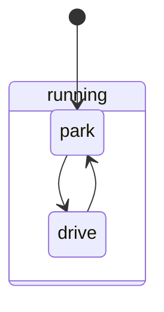
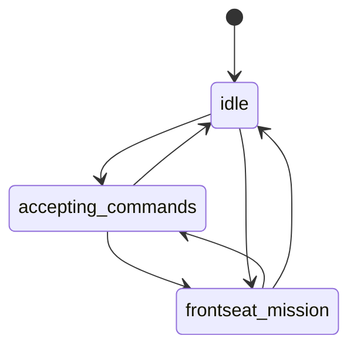
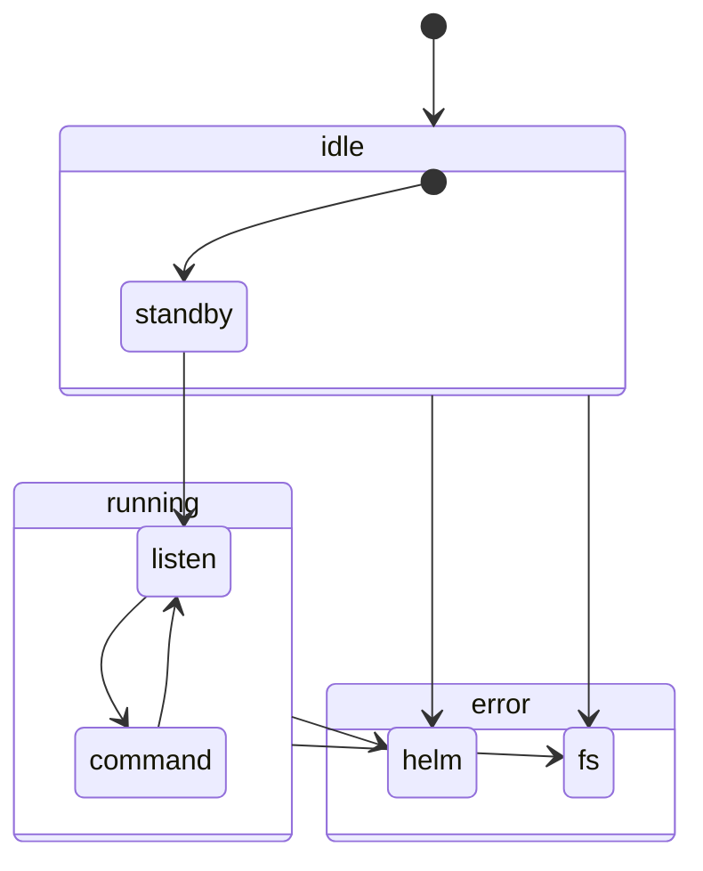
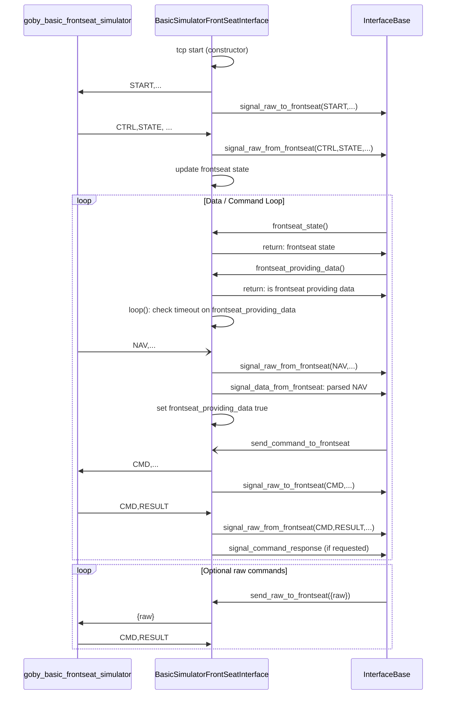
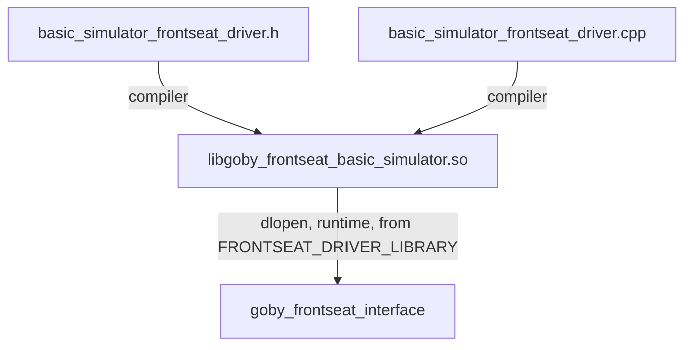
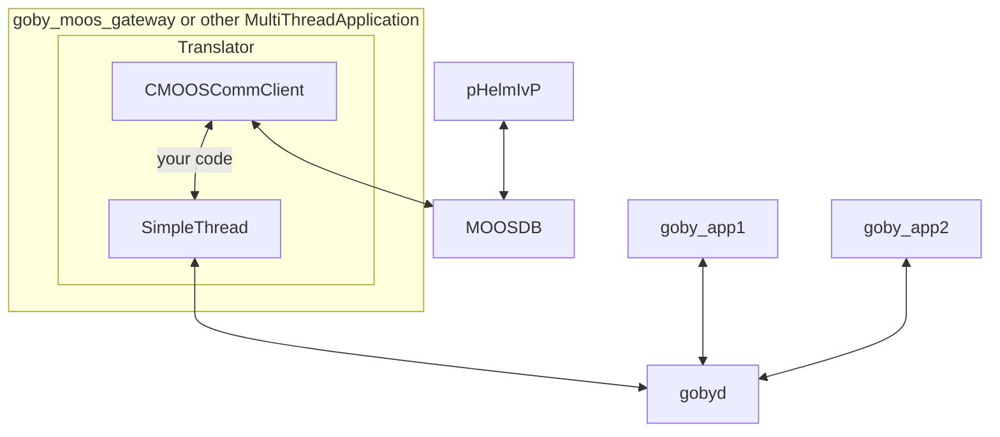
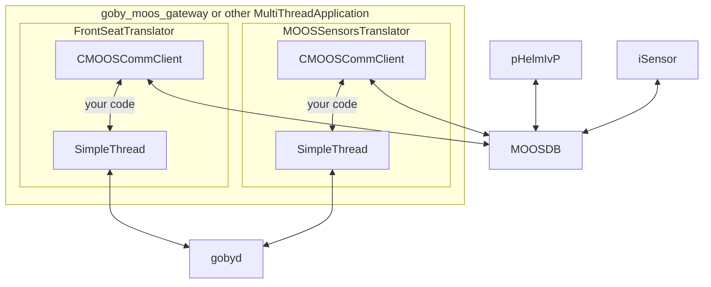
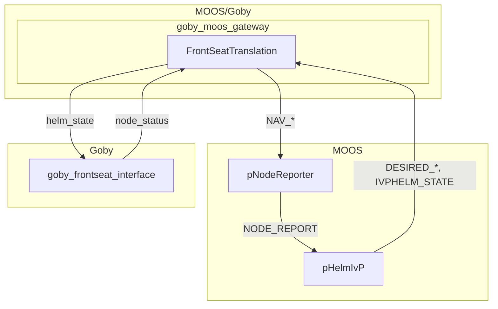
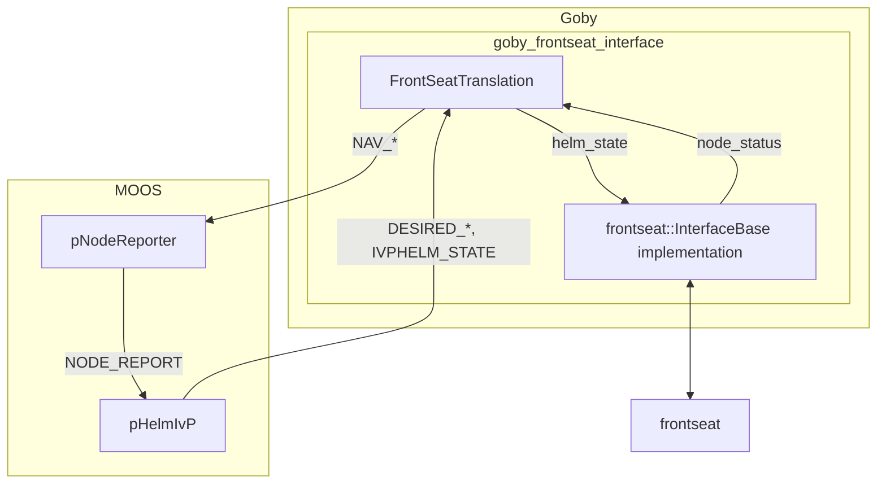
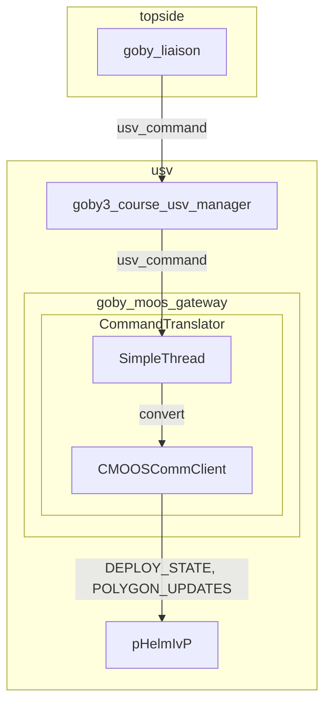

# Day 3: Autonomy

Before we begin:

- Revisit any substantial issues related to the communications homework.
- I have pushed my solutions to the branch `post-homework2`

While Goby is primarily a communications project, we want to be able to build autonomous systems with it. This is the second point of the robotics triad as I showed on the first day of the course.

(Switch to slides).

## Frontseat/Backseat State machines

The state of the `goby_frontseat_interface` is effectively governed by the inferred state of the Helm (initially `pHelmIvP` from the MOOS-IvP project, but you could change this to your "helm" which we'll do in the homework), and the state of the frontseat system. Each driver must implement its interpretation of the frontseat states based on the manufacturer's interface.

Helm:


- park: Helm is running but not actively producing desired setpoints
- drive: Helm is in control

FrontSeat:


- idle: frontseat is on but not in a mission
- frontseat_mission: frontseat is running under manufacturer control (payload may be able to listen in on data feeds)
- accepting_commands: payload (Helm) is in control

goby_frontseat_interface:


- idle:standby: waiting on data from frontseat
- running:listen: not commanding frontseat (either frontseat is in control via frontseat_mission or helm is in park)
- running:command: payload is commanding frontseat (this is the typical operating state)
- error:helm: Helm has an error
- error:fs: Frontseat has an error.

## Hands-on with goby_frontseat_interface

Let's turn the time warp off to see what's happening at a more reasonable pace.

```python
# launch/trail/config/common/sim.py
warp=1
```

Then launch it

```bash
cd launch trail
./all.launch
```

### Publish / subscribe interface

If we open the `goby_liaison` scope on the USV <http://localhost:50001/?_=/scope>, we can see all the frontseat messages (`goby::middleware::frontseat::*` groups).

Let's look at these one at a time:

- `data_from_frontseat`: This is a message that encompasses all the data coming from the frontseat. As we're running the `basic_simulator` plugin, this just includes the node_status field (navigation), which is the minimum amount of data the frontseat needs to provide.
- `desired_course`: The desired heading and speed for the surface vehicle (from pHelmIvP). This is converted into a full `command_request` which we'll look at in a bit.
- `helm_state`: The state of the Helm (DRIVE or PARK).
- `node_status`: The `node_status` field (when set) of `data_from_frontseat`is also published on this variable as a convenience.
- `raw_in`: The raw data in to the payload from the frontseat in whatever format the frontseat/backseat interface uses (e.g. NMEA-0183, custom protocol, etc.).
- `raw_out`: The raw data sent from the payload to the frontseat.
- `status`: The state of goby_frontseat_interface, the frontseat state, and the helm state aggregated into a single message.

The full API contains a few more messages:

```yaml
# all scheme: PROTOBUF so that's removed for clarity here.
# also namespaces removed
application: goby_frontseat_interface
interprocess:
  publishes:
    # response (ack) to command_request messages that have response_requested: true
    - group: command_response
      type: protobuf::CommandResponse
      thread: FrontSeatInterface

    - group: data_from_frontseat
      type: protobuf::InterfaceData
      thread: FrontSeatInterface

    - group: node_status
      type: protobuf::NodeStatus
      thread: FrontSeatInterface

    - group: raw_in
      type: protobuf::Raw
      thread: FrontSeatInterface

    - group: raw_out
      type: protobuf::Raw
      thread: FrontSeatInterface

    - group: status
      type: protobuf::InterfaceStatus
      thread: FrontSeatInterface

    - group: helm_state
      type: HelmStateReport
      thread: FrontSeatTranslation
  subscribes:
    # full command message (can include vehicle-specific extensions)
    - group: command_request
      type: protobuf::CommandRequest
      thread: FrontSeatInterface

    - group: data_to_frontseat
      type: protobuf::InterfaceData
      thread: FrontSeatInterface

    - group: desired_course
      type: protobuf::DesiredCourse
      thread: FrontSeatInterface

    - group: helm_state
      type: protobuf::HelmStateReport
      thread: FrontSeatInterface

    # "backdoor" for applications to send raw commands directly through to the frontseat
    # (generally for debugging or temporary new application development)
    - group: raw_send_request
      type: protobuf::Raw
      thread: FrontSeatInterface

    - group: node_status
      type: protobuf::NodeStatus
      thread: FrontSeatTranslation
```

### Basic Simulator driver

Now let's take a look at a simple implementation of a driver. 

Each driver is an implementation of `goby::middleware::frontseat::InterfaceBase` in `middleware/frontseat/interface.h`.

The driver must implement five virtual methods:

```cpp
// goby3/src/middleware/frontseat.h
    virtual void send_command_to_frontseat(const protobuf::CommandRequest& command) = 0;
    virtual void send_data_to_frontseat(const protobuf::InterfaceData& data) = 0;
    virtual void send_raw_to_frontseat(const protobuf::Raw& data) = 0;

    virtual protobuf::FrontSeatState frontseat_state() const = 0;
    virtual bool frontseat_providing_data() const = 0;
    virtual void loop() = 0;
```

- `send_command_to_frontseat`: Given a command from the payload (at a minimum this is the DesiredCourse: heading, speed, possibly depth, pitch, roll, and z_rate (dive rate)), convert this into a form to send to the frontseat and send it. This is called in response to data from the `command_request` (or `desired_course`) group.
- `send_data_to_frontseat`: Send some data to the frontseat. Not all drivers will have any meaningful data to provide to the frontseat, but this is here for cases when data from sensors attached to the payload is needed by the frontseat. For example if the payload has a USBL array and the frontseat needs that data to update its navigation estimate, the USBL data could be provided through this function. This is called in response to data from the `data_to_frontseat` group.
- `send_raw_to_frontseat`: Directly send a raw message to the frontseat. This is triggered by data from the  `raw_send_request` group.
- `frontseat_state`: Must return the frontseat state, as inferred by the driver from messages received from the frontseat.
- `frontseat_providing_data`: Is the frontseat providing us data. This is vaguely defined to allow drivers to support a wide array of vehicles, but essentially this should be true if we're receiving the expected "core" data set, or false if we're not receiving anything (or not receiving the critical data messages).
- `loop()`: Called at 10 Hz.

Along with these virtual methods, the driver has access to a variety of signals (callbacks) it can or must trigger:

```cpp
    boost::signals2::signal<void(const protobuf::CommandResponse& data)> signal_command_response;
    boost::signals2::signal<void(const protobuf::InterfaceData& data)> signal_data_from_frontseat;
    boost::signals2::signal<void(const protobuf::Raw& data)> signal_raw_from_frontseat;
    boost::signals2::signal<void(const protobuf::Raw& data)> signal_raw_to_frontseat;
```

- `signal_command_response`: Called by the driver when the frontseat responds (acks) a command
- `signal_data_from_frontseat`: Called by the driver when the frontseat provides data.
- `signal_raw_from_frontseat`: Called by the driver for every raw message from the frontseat.
- `signal_raw_to_frontseat`: Called by the driver when it sends a raw message to the frontseat.

The `goby_basic_frontseat_simulator` is a standalone C++ application that implements a very simple dynamic simulator combined with an ASCII payload API for use with `goby_frontseat_interface`.

The API is as follows:
```
> means message from goby_frontseat_interface (backseat) to goby_basic_frontseat_simulator (frontseat)
< means message from goby_basic_frontseat_simulator (frontseat) to goby_frontseat_interface (backseat)

- goby_basic_frontseat_simulator runs a TCP server.
- all messages are "\r\n" terminated

1. simulator init message
(duration = 0 means no timeout)
(duration, freq, accel, hdg_rate, z_rate, warp are optional)
FREQ = control loop frequency in hertz
ACCEL = vehicle acceleration in m/s
HDG_RATE = vehicle turn rate in deg/s
Z_RATE = vehicle dive rate in m/s
WARP = run this factor faster than real time
> START,LAT:42.1234,LON:-72,DURATION:600,FREQ:10,ACCEL:0.5,HDG_RATE:45,Z_RATE:1,WARP:1

2. frontseat state messages
  sent after successful START command
< CTRL,STATE:PAYLOAD 
  sent after DURATION is up in START command
< CTRL,STATE:IDLE

3. frontseat nav command
  generated from primitive dynamics model
< NAV,LAT:42.1234,LON:-72.5435,DEPTH:200,HEADING:223,SPEED:1.4

4. backseat desired course command
> CMD,HEADING:260,SPEED:1.5,DEPTH:100

5. frontseat response to backseat CMD
  CMD is good
< CMD,RESULT:OK
  error in the CMD
< CMD,RESULT:ERROR
```

Given this, we can see how the implementation of the driver is done. We can examine the code (`goby3/src/middleware/frontseat/simulator/basic/basic_simulator_frontseat_driver.*`) while we look at this sequence diagram:


### Running the frontseat interface

The `goby_frontseat_interface` requires exactly one driver, defined a shared library path in the environmental variable `FRONTSEAT_DRIVER_LIBRARY`.

For convenience, we build wrapper scripts, such as `goby_frontseat_interface_basic_simulator`, which is simply defined (on my computer) as 

```bash
>  cat $(which goby_frontseat_interface_basic_simulator)
#!/bin/bash
LD_LIBRARY_PATH=/home/toby/goby3/build/lib:${LD_LIBRARY_PATH} FRONTSEAT_DRIVER_LIBRARY=libgoby_frontseat_basic_simulator.so.30 exec goby_frontseat_interface $@
```

Graphically, this is how the plugin model works:


## Goby / MOOS interface

pHelmIvP (in the open source MOOS-IvP project) is a useful multi-objective (e.g. heading, speed, depth) behavior-based decision engine (or "robotic captain" if you're so inclined). Since it's based on the MOOS middleware, we have to create a "bridge" to couple the MOOS middleware to the Goby3 interprocess layer. We do this by defining `goby::moos::Translator` threads, and running them either directly within any MultiThreadApplication, or with the `goby_moos_gateway` application.

### goby::moos::Translator

`goby::moos::Translator` is a shorthand (typedef) for `BasicTranslator<goby::middleware::SimpleThread>`. In short, it's a Goby Thread containing a `CMOOSCommClient`, which roughly the equivalent in MOOS to a Goby `InterProcessPortal`.



You can have multiple Translators within a given application for different purposes if you want:



Let's take a look at the interface for the BasicTranslator <https://goby.software/3.0/classgoby_1_1moos_1_1BasicTranslator.html>:

```cpp
SimpleThread<goby::apps::moos::protobuf::GobyMOOSGatewayConfig>& goby()
std::string translator_name()
MOOSInterface& moos()
void loop()
 ```

Pretty straightforward: when we want to get call Goby stuff we call `goby()` and MOOS stuff is in `moos()`. The Goby side we should be fairly familiar at this point. On the MOOS side we have a few options:

```cpp
class MOOSInterface
{
  // when we receive this MOOS variable, call this function (acts much like the Goby subscription callbacks)
  void add_trigger(const std::string& moos_var,
                   const std::function<void(const CMOOSMsg&)>& func);
  // subscribe to the MOOS variable, and keep its latest value in a buffer.
  void add_buffer(const std::string& moos_var) { buffer_vars_.insert(moos_var); }
  // access the buffered values
  std::map<std::string, CMOOSMsg>& buffer() { return buffer_; }
  // access the CMOOSCommClient (Register, Notify, Post, etc.)
  CMOOSCommClient& comms() { return comms_; }
};
```

Now that we have that, let's look at it in action with the `FrontSeatTranslation` that interfaces the core `pHelmIvP` messages with Goby. This resides in `goby3/src/moos/middleware/frontseat/frontseat_gateway_plugin.h`.



Much like `goby_frontseat_interface`, `goby_moos_gateway` uses an environmental variable (`GOBY_MOOS_GATEWAY_PLUGINS`) to load a list of plugin libraries (delimited by any of ";:,"), for example:

```bash
GOBY_MOOS_GATEWAY_PLUGINS=liblamss_goby3_gateway_plugin.so.0:libgoby_coroner_moos_gateway_plugin.so.30  goby_moos_gateway
```


Since `FrontSeatTranslation` is just a Goby Thread, we can simplify this for a common scenario by also including it in `goby_frontseat_interface`. This is done if we include the `[goby.moos.protobuf.moos_helm] {}` block of the `goby_frontseat_interface` configuration (see `goby_frontseat_interface_basic_simulator --example_config`).

In this case (which is what we're running in the Trail example), the structure looks like this:



## Command pHelmIvP through Goby

Yesterday, I had you add a command message from the topside to the USV. Now we'll walk through how to get that command over to pHelmIvP and actually change the vehicle's behavior.

First let's take a look at the command message that I designed (yours may look slightly different):

```protobuf
// src/lib/messages/command_dccl.proto
syntax = "proto2";

import "dccl/option_extensions.proto";

package goby3_course.dccl;

message USVCommand
{
    option (.dccl.msg) = {
        codec_version: 3
        id: 126
        max_bytes: 32
        unit_system: "si"
    };

    required double time = 1 [(.dccl.field) = {
        codec: "dccl.time2",
        units {derived_dimensions: "time"}
    }];

    enum AutonomyState
    {
        WAYPOINTS = 1;
        POLYGON = 2;
    }
    required AutonomyState desired_state = 2;

    optional int32 polygon_sides = 3 [(.dccl.field) = {min: 3 max: 10}];
    optional int32 polygon_radius = 4
        [(.dccl.field) = {min: 100 max: 2000 precision: -1}];
}
```

Now in `goby3_course_usv_manager` I've subscribed to this message coming from the topside:

```cpp
// src/bin/manager/usv/app.cpp
void goby3_course::apps::USVManager::subscribe_commands()
{
    auto on_command = [](const USVCommand& command_msg) {
        glog.is_verbose() && glog << group("commands")
                                  << "Received USVCommand: " << command_msg.ShortDebugString()
                                  << std::endl;
    };

    goby::middleware::protobuf::TransporterConfig subscriber_cfg;
    subscriber_cfg.mutable_intervehicle()->add_publisher_id(1);
    auto& buffer_cfg = *subscriber_cfg.mutable_intervehicle()->mutable_buffer();
    buffer_cfg.set_ack_required(true);
    buffer_cfg.set_max_queue(1);

    using goby3_course::groups::usv_command;
    intervehicle().subscribe<usv_command, USVCommand>(on_command, {subscriber_cfg});
}
```

Let's run this and see how it works. First let's enable VERBOSE glog output on the USV manager:

```
# usv.launch
# ...
goby3_course_usv_manager <(config/usv.pb.cfg.py goby3_course_usv_manager) -v -n
```

Then run the code:

```bash
goby_launch -P topside.launch
goby3_course_n_auvs=0 goby_launch -P usv.launch
screen -r usv.goby3_course_usv_manager
```

Then if we open Goby Liaison <http://localhost:50000/?_=/commander> we can send the command.

After we wait until the next comms cycle, we get an ACK and we see the command show up at `goby3_course_usv_manager`.

We could now proceed in a few different ways:

- subscribe directly in our plugin on intervehicle to `usv_command`. This is a reasonable approach, though I've been finding it helpful to keep most of the intervehicle subscriptions to a single application.
- run the `goby::moos::Translator` subclass as a thread directly within `USVManager` (after converting `USVManager` to a MultiThreadApplication). Also a reasonable approach, and this is similar to how `goby_frontseat_interface` is handling the MOOS translations. It depends on how much you want to spread out or consolidate the entry/exit points between Goby and MOOS.
- republish the command on `interprocess` from `goby3_course_usv_manager` so we can subscribe to it from our `goby_moos_gateway` plugin (based on `goby::moos::Translator`).

We'll choose the last technique:


So, republish the command on **interprocess** within the USV:

```cpp
// src/bin/manager/usv/app.cpp
void goby3_course::apps::USVManager::subscribe_commands()
{
    using goby3_course::groups::usv_command;
    auto on_command = [this](const USVCommand& command_msg) {
        // ...
        interprocess().publish<usv_command>(command_msg);
    };
}
```

Then, we can create our plugin library. We already have one (`src/lib/moos_gateway/goby3_course_gateway_plugin.*`) that is in use by the AUVs (to publish the `usv_nav` as a `NODE_REPORT` for the pHelmIvP trail behavior), so we can augment it with our additional data for the commands.

Let's add our new Translation thread:

```cpp
// src/lib/moos_gateway/goby3_course_gateway_plugin.h
namespace goby3_course
{
namespace moos
{
// ... 
class CommandTranslation : public goby::moos::Translator
{
  public:
    CommandTranslation(const goby::apps::moos::protobuf::GobyMOOSGatewayConfig& cfg);
};
} // namespace moos
} // namespace goby3_course
```

```cpp
#include "goby3-course/messages/command_dccl.pb.h"
// src/lib/moos_gateway/goby3_course_gateway_plugin.cpp
extern "C"
{
    void goby3_moos_gateway_load(
        goby::zeromq::MultiThreadApplication<goby::apps::moos::protobuf::GobyMOOSGatewayConfig>*
            handler)
    {
 //...
        handler->launch_thread<goby3_course::moos::CommandTranslation>();
    }

    void goby3_moos_gateway_unload(
        goby::zeromq::MultiThreadApplication<goby::apps::moos::protobuf::GobyMOOSGatewayConfig>*
            handler)
    {
 //...
        handler->join_thread<goby3_course::moos::CommandTranslation>();
    }
}

// ...

goby3_course::moos::CommandTranslation::CommandTranslation(const goby::apps::moos::protobuf::GobyMOOSGatewayConfig& cfg)
        : goby::moos::Translator(cfg)
{
    using goby3_course::dccl::USVCommand;
    using goby3_course::groups::usv_command;

    auto on_usv_command = [this](const USVCommand& command) {
        // send update first
        if (command.desired_state() == USVCommand::POLYGON)
        {
            std::stringstream update_ss;
            update_ss << "polygon=radial::x=0,y=0,radius=" << command.polygon_radius()
                      << ",pts=" << command.polygon_sides();
            moos().comms().Notify("POLYGON_UPDATES", update_ss.str());
        }
        moos().comms().Notify("DEPLOY_STATE",
                              USVCommand::AutonomyState_Name(command.desired_state()));
    };
    goby().interprocess().subscribe<usv_command>(on_usv_command);
}
```

Reference <https://oceanai.mit.edu/ivpman/pmwiki/pmwiki.php?n=Helm.BehaviorLoiter> for the Loiter behavior. Update the behavior file for the USV:

```
// launch/trail/config/templates/usv.bhv.in
initialize   DEPLOY_STATE = POLYGON
// ...
//----------------------------------------------
Behavior = BHV_Waypoint
{ 
// ...
  condition = DEPLOY_STATE = WAYPOINTS
}
Behavior = BHV_Loiter
{
   name         = polygon
   pwt          = 100
   condition    = DEPLOY_STATE=POLYGON
   updates      = POLYGON_UPDATES

   center_activate = true     
   speed = 1.5

   polygon = radial:: x=0,y=0,radius=200,pts=6
}
```

Add `goby_moos_gateway` to `usv.launch`:

```
# usv.launch

[env=LD_LIBRARY_PATH=${LD_LIBRARY_PATH}:$HOME/goby3-course/build/lib,env=GOBY_MOOS_GATEWAY_PLUGINS=libgoby3_course_moos_gateway_plugin.so] goby_moos_gateway <(config/usv.pb.cfg.py goby_moos_gateway) -vv
```

And finally, add generation in `usv.pb.cfg.py`:

```python
# launch/trail/config/usv.pb.cfg.py
if common.app == 'gobyd':    
# ...
elif common.app == 'goby_moos_gateway':
    print(config.template_substitute(templates_dir+'/moos_gateway.pb.cfg.in',
                                     app_block=app_common,
                                     interprocess_block = interprocess_common,
                                     moos_port=common.vehicle.moos_port(vehicle_id)))
```

Now we can rerun the topside and the USV.

Open uMS to port 9001 to see what is published to the MOOSDB, and send a "WAYPOINTS" command from Liaison.

Let's bump up the WARP again:

```python
# launch/trail/config/common/sim.py
warp=20
```

And then run it all: `./all.launch`.
