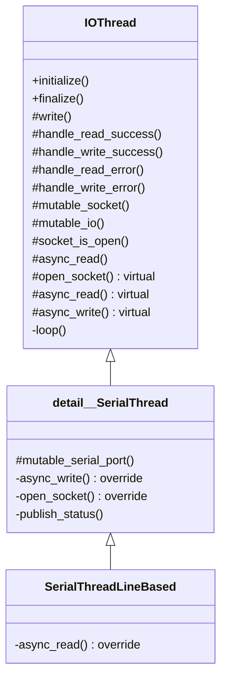
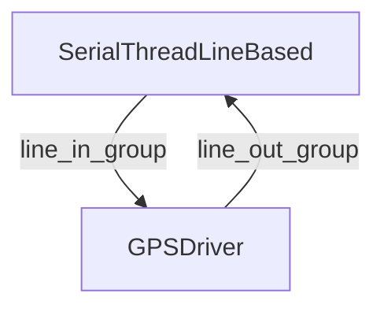
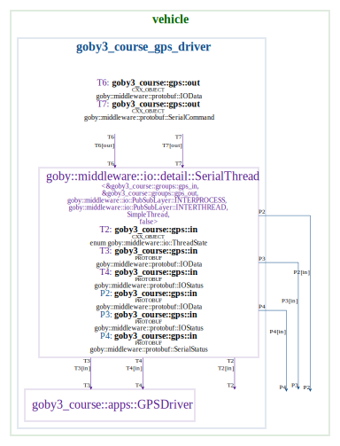
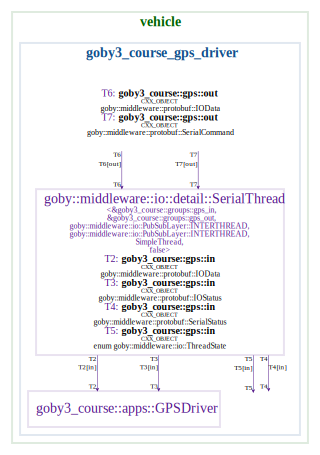
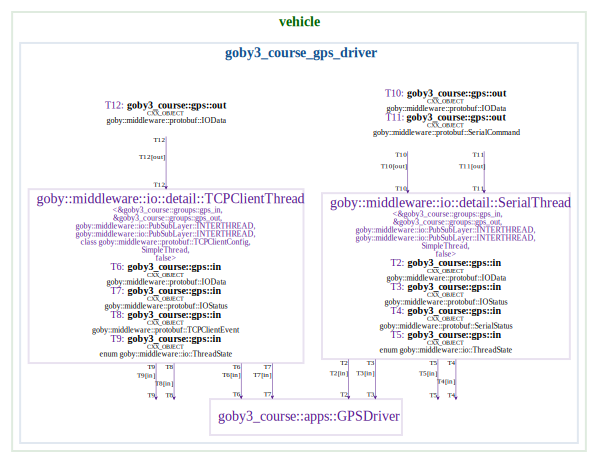
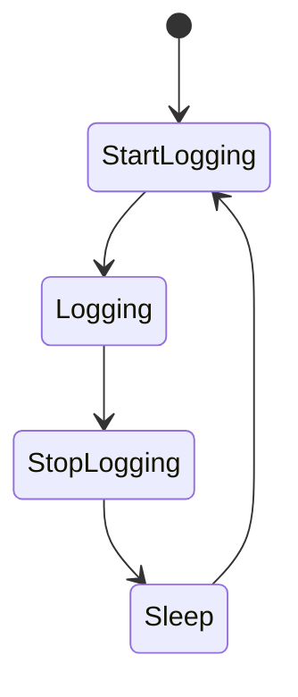
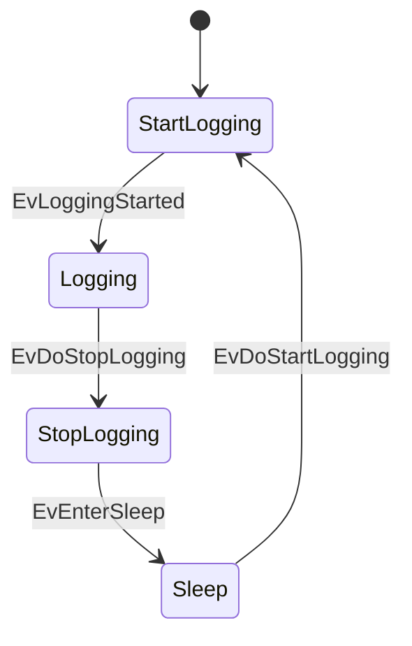
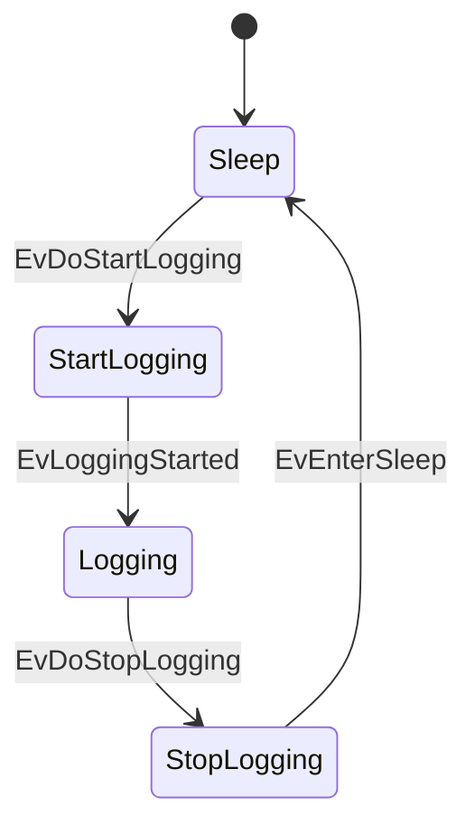

# Day 4: Sensing

Before we begin:

- Revisit any substantial issues related to the autonomy homework.
- I have pushed my solutions to the branch `post-homework3`

The last point of the triad is sensors - this is how our vehicles can do anything meaningful (otherwise they're flying blind). 

(Switch to slides).

## I/O Threads

Let's say we have a serial-based sensor, such as a GPS that uses the NMEA-0183 protocol:

```bash
picocom /dev/ttyUSB0 -b 4800
```

Now, let's get this into Goby. We'll copy the `multi_thread` pattern into a new application called `goby3_course_gps_driver`.

```bash
cd goby3-course/src/bin/patterns
cp -r multi_thread ../gps
```

Then we'll edit the three application files (`app.cpp`,`config.proto`: MultiThreadPattern->GPSDriver, `CMakeLists.txt`: `goby3_course_multi_thread_pattern` to `goby3_course_gps_driver`), and add the new directory to the parent `CMakeLists.txt`:

```cmake
# src/bin/CMakeLists.txt
# ...
add_subdirectory(gps)
```

Finally, we'll clear out the example threads `SubThreadA`, `SubThreadB`, and `timer0`, as we won't be using those, as well as removing the `loop()` method.


Now, let's take a look at the available I/O threads in `goby3/src/middleware/io`:

```
# packet based
can.h
udp_one_to_many.h
udp_point_to_point.h

# end of line delimiter(s) based
line_based/
  common.h
  pty.h
  serial.h
  tcp_client.h
  tcp_server.h

# MAVLink binary protocol
mavlink/
  serial.h
  udp.h
```

All of the I/O threads inherit from `io::detail::IOThread`. The `IOThread` base class:

- Subscribes to outgoing (Goby->sensor) data using the `protobuf::IOData` message on the `line_out_group` group passed as a template parameter
- Handles synchronization between boost::asio (which is used for all threads I/O threads) and Goby interthread comms.
- Uniform error handling on read/write errors or if the socket cannot be opened. These errors and other status are published to `protobuf::IOStatus` on the `line_in_group` (also passed as a template parameter).

Implementors must:

- Provide implementations of three virtual methods:
   - `open_socket()`: (Try to) open the socket
   - `async_read()`: Start an asynchronous read from the socket. 
   - `async_write()`: Start an asynchronous write to the socket. The free function `basic_async_write` can be used in most cases for writing. 

### Serial

Let's follow the `line_based/serial` implementation as that is the one we're going to use for this GPS device.



This class hierarchy allows a new serial protocol to be easily implemented as a subclass of `detail::SerialThread`, where the implementor now only has to provide `async_read()`. In the case of `SerialThreadLineBased`, this `async_read()` uses `boost::asio::async_read_until` with a matching function object `match_regex` that uses `std::regex` to match an end-of-line regex. This allows us to support, for example, sensors that use multiple different end-of-line delimiters (yes, that exists).

Now that we've had a glimpse into how this is implemented (perhaps so you can support for your own weird serial protocol by subclassing `detail::SerialThread`), let's flip to how to use these classes.

Each I/O Thread is a Goby Thread (by default, `SimpleThread` with the **interthread**/**interprocess**/**intervehicle** layering we've been studying this week). Thus, we can launch it within `MultiThreadApplication` like any other `SimpleThread` we create. But first we must instantiate the Thread using the groups we want.



The I/O threads use two groups: One for all data from the I/O thread (minimally, messages from the sensor marshalled with `protobuf::IOData`) and the other for all data to the I/O thread (minimally, messages to the sensor, also with  `protobuf::IOData`). These groups are passed as template parameters, which in our case we'll define as:

```cpp
// src/lib/groups.h
constexpr goby::middleware::Group gps_in{"goby3_course::gps::in"};
constexpr goby::middleware::Group gps_out{"goby3_course::gps::out"};
```

Then, back in our `app.cpp`:

```cpp
// src/bin/gps/app.cpp
#include <goby/middleware/io/line_based/serial.h>
// ...
goby3_course::apps::GPSDriver::GPSDriver()
{
// ...
    using SerialThread = goby::middleware::io::SerialThreadLineBased<goby3_course::groups::gps_in,
                                                                     goby3_course::groups::gps_out>;

}
```

Now, the last thing we need to do before we can launch our thread is to provide its configuration. The SerialThread classes use `goby::middleware::protobuf::SerialConfig` for configuration (in `goby/middleware/protobuf/serial_config.proto`):

```protobuf
// src/bin/gps/config.proto
import "goby/middleware/protobuf/serial_config.proto";
//...
message GPSDriver
{
  // ...
    required goby.middleware.protobuf.SerialConfig serial = 10;
}
```

Finally, we can launch our thread:

```cpp
// src/bin/gps/app.cpp
#include <goby/middleware/io/line_based/serial.h>
// ...
goby3_course::apps::GPSDriver::GPSDriver()
{
// ...
    using SerialThread = goby::middleware::io::SerialThreadLineBased<goby3_course::groups::gps_in,
                                                                     goby3_course::groups::gps_out>;
    launch_thread<SerialThread>(cfg().serial());
}
```

If we compile this and run:

```bash
gobyd
goby3_course_gps_driver --serial 'port: "/dev/ttyUSB0" baud: 4800' -vvv -n
```

We see that our data are coming into the serial thread, but we don't yet have a way use them. To do so, we subscribe to the `gps_out` group:

```cpp
// src/bin/gps/app.cpp
goby3_course::apps::GPSDriver::GPSDriver()
{
// ...
    interthread().subscribe<goby3_course::groups::gps_in>(
        [](const goby::middleware::protobuf::IOData& data) {
            glog.is_verbose() && glog << group("main")
                                      << "Received serial line:" << data.ShortDebugString()
                                      << std::endl;
        });
}
```

We see the data now available in the main thread to parse, etc.

If I unplug the GPS, we see the SerialThread handle this gracefully with an appropriate error message. That information can be subscribed to using:

```cpp
// src/bin/gps/app.cpp
goby3_course::apps::GPSDriver::GPSDriver()
{
// ...
    glog.add_group("status", goby::util::Colors::lt_green);
// ...
    interthread().subscribe<goby3_course::groups::gps_in>(
        [](const goby::middleware::protobuf::IOStatus& status) {
            glog.is_verbose() && glog << group("status")
                                      << "Received I/O status: " << status.ShortDebugString()
                                      << std::endl;
        });
```

We can look at the rest of the interfaces graphically be creating a stub interfaces file:

```yaml
// lectures/day4-sensors/gps_deployment.yml
deployment: gps_deployment
platforms:
  - name: vehicle
    interfaces:
      - goby3_course_gps_driver_interface.yml
```

and adding to the root level CMakeLists.txt (and ensuring `export_goby_interfaces=ON` with CMake)

```cmake
# CMakeLists.txt

if(export_goby_interfaces)
# ...
  generate_interfaces_figure(lectures/day4-sensors/gps_deployment.yml ${YML_OUT_DIR} gps_interfaces.svg "")
endif()
```

Creates `share/interfaces/figures/gps_interfaces.svg`



A few things to notice here:

- We can send a `SerialCommand` and get back a `SerialStatus`: this can be used to set DTR, RTS, and send breaks
- `ThreadState` sends a single message with the I/O thread has started up and is ready for publications (if we need to synchronize initial publications).
- Everything from the SerialThread is published to both interthread and interprocess.

This last point is due to the default configuration of `SerialThreadLineBased` and is designed to make it easy to log (`using goby_logger`) the raw messages coming off the serial port (by default).

You can change the I/O threads to only publish on interthread by adding these additional template parameters:

```cpp
// src/bin/gps/app.cpp

    using SerialThread = goby::middleware::io::SerialThreadLineBased<
        goby3_course::groups::gps_in, goby3_course::groups::gps_out,
        goby::middleware::io::PubSubLayer::INTERTHREAD, // publish layer
        goby::middleware::io::PubSubLayer::INTERTHREAD // subscribe layer
        >;
```
Now our interfaces look like:



### TCP

Let's say now that our GPS was accessible on a TCP server, using the same NMEA-0183 protocol. This could be used to forward serial data through an IP network. So, we want to be able to support connecting as a TCP client to our GPS driver.

To do so, we'll add the appropriate configuration to our application:

```protobuf
// src/bin/gps/config.proto
import "goby/middleware/protobuf/tcp_config.proto";

message GPSDriver
{
//...
  oneof transport 
  {
    goby.middleware.protobuf.SerialConfig serial = 10;
    goby.middleware.protobuf.TCPClientConfig tcp_client = 11;
  }
}
```

Then within our application we'll create a TCPClient thread in much the same way as the serial one:

```cpp
// src/bin/gps/app.cpp
#include <goby/middleware/io/line_based/tcp_client.h>
// ...
goby3_course::apps::GPSDriver::GPSDriver()
{
// ...
    using TCPThread = goby::middleware::io::TCPClientThreadLineBased<
        goby3_course::groups::gps_in, goby3_course::groups::gps_out,
        goby::middleware::io::PubSubLayer::INTERTHREAD, // publish layer
        goby::middleware::io::PubSubLayer::INTERTHREAD  // subscribe layer
        >;

    if (cfg().has_serial())
        launch_thread<SerialThread>(cfg().serial());
    else if (cfg().has_tcp_client())
        launch_thread<TCPThread>(cfg().tcp_client());
    else
        glog.is_die() && glog << "Must specify either serial or tcp_client configuration." << std::endl;

```

Now if we set up a serial/TCP proxy using `socat`, we can try this feature of our GPS driver:

```bash
gobyd
socat file:/dev/ttyUSB0,raw,b4800 tcp-l:54321,reuseaddr
goby3_course_gps_driver --tcp_client 'remote_address: "localhost" remote_port: 54321' -vvv -n
```

You'll notice the output is nearly identical to the serial case, but with the addition of the TCP source/destination endpoints in the `IOData` messages.

If we look at our interfaces, you'll note the similarities:



All that is "missing" on the TCP side are the serial related command/status (DTR,RTS). Instead we have `TCPClientEvent` messages that provide connect/disconnect information.

## goby_gps

Many systems take advantage of the GPSD project to provide a server for multiple GPS feeds. In that case, we have a client for GPSD that publishes the data into Goby.

If we add to `/etc/default/gpsd`:

```
DEVICES="/dev/ttyUSB0"
```
and make our GPS readable by the `gpsd` user:

```bash
sudo chown gpsd /dev/ttyUSB0
```
and restart gpsd
```bash
sudo systemctl restart gpsd
```

We can check that `gpsd` is working with `gpsmon`.

Now we can connect to GPSD with `goby_gps`:

```bash
gobyd
goby_gps -vv --device_name "/dev/ttyUSB0"
```

`--device_name` is optional, if we omit it we get all the GPS devices connected to `gpsd`.

Out of this GPS we get two types of parsed messages from `gpsd`: TPV (**T**ime **P**osition **V**elocity), and SKY (sky view data). The main one we care about is often TPV:

```
goby_gps [2021-Mar-01 20:31:07.646062]: D: TPV: device: "/dev/ttyUSB0" time: 1614630667 mode: Mode3D location { lat: 41.652413333 lon: -70.615426667 } altitude: 25.6 track: 306.4 speed: 0 climb: 0 epc: 82.8 eps: 30.04 ept: 0.005 epv: 41.4 epx: 10.366 epy: 15.021
```

So, if we want to do something with the GPS position information, we can just subscribe to `goby::middleware::protobuf::gpsd::TimePositionVelocity` and skip the whole parsing step. GPSD can also make it easier to share GPS data with multiple users (such as NTP or Chrony) in addition to the Goby applications.

So then, we can add a third option to our GPS driver:

```protobuf
// src/bin/gps/config.proto
message GPSDriver
{
//...
    oneof transport
    {
// ...
        bool use_gpsd = 12;
    }
}
```

```cpp
// src/bin/gps/app.cpp
#include <goby/middleware/gpsd/groups.h> 
#include <goby/middleware/protobuf/gpsd.pb.h>

//...
goby3_course::apps::GPSDriver::GPSDriver()
{
// ...
    else if (cfg().use_gpsd())
        interprocess().subscribe<goby::middleware::groups::gpsd::tpv>(
            [](const goby::middleware::protobuf::gpsd::TimePositionVelocity& tpv) {
                glog.is_verbose() &&
                    glog << group("main")
                         << "Time: " << goby::time::convert<boost::posix_time::ptime>(tpv.time_with_units())
                         << ", location: " << tpv.location().ShortDebugString() << std::endl;
            });
    else
        glog.is_die() && glog << "Must specify serial, tcp_client, or use_gpsd configuration."
                              << std::endl;

// ...
}
```

and run it:

```bash
gobyd
goby_gps --device_name "/dev/ttyUSB0"
goby3_course_gps_driver --use_gpsd true -vv -n
```

Given this, our final (partial) deployment file looks like:

```yaml
// lectures/day4-sensors/gps_deployment.yml
deployment: gps_deployment
platforms:
  - name: vehicle
    interfaces:
      - goby3_course_gps_driver_interface.yml
      - @GOBY_INTERFACES_DIR@/goby_gps_interface.yml
```


## Sensor state machines

(switch back to slides for intro to sensor state machines)

Now we're going to shift focus a bit and look at lifecycle management of sensors:



We'll do this in the context of the upcoming homework assignment, which will involve writing a simulator of and a driver for a CTD (**C**onductivity/salinity, **T**emperature, **D**epth/pressure) instrument.

Again, we'll copy the `multi_thread` pattern application and remove all the extra threads (but leave the loop() method at 1 Hz):

```bash 
cd src/bin/patterns
cp -r multi_thread ../ctd
```

And, as before, we're rename `MultiThreadPattern` to `CTDDriver` (in `app.cpp`, `config.proto`), and in `CMakeLists.txt` change the APP name to `goby3_course_ctd_driver`. Finally we add the folder `ctd` to the parent CMakeLists.txt.

Next, we're going to use boost::statechart to build our state machine. This library uses classes (structs) to represent states and events, where the constructor is the entry action, and the destructor is the exit action. This model makes building state machines and maintaining them (by adding or remove states and/or events) quite easy.

Let's being by creating a new header file within our `ctd` project and include the boost headers we'll need:

```cpp
// src/bin/ctd/machine.h
#ifndef GOBY3_COURSE_SRC_BIN_CTD_MACHINE_H
#define GOBY3_COURSE_SRC_BIN_CTD_MACHINE_H

#include <boost/mpl/list.hpp>
#include <boost/statechart/event.hpp>
#include <boost/statechart/state.hpp>
#include <boost/statechart/state_machine.hpp>
#include <boost/statechart/transition.hpp>


#endif
```

Then we'll lay out the structure of the state machine by pre-declaring the `state_machine` and `state` classes:

```cpp
// machine.h
// ...
namespace goby3_course
{
namespace statechart
{   
struct CTDStateMachine;

struct StartLogging;
struct Logging;
struct StopLogging;
struct Sleep;
}
}
```

And then we can begin creating the state definitions:

```cpp
// machine.h
#include <goby/util/debug_logger.h>
// ...
namespace goby3_course
{
namespace apps
{
class CTDDriver;
}
namespace statechart
{   
// ...                                                        
struct CTDStateMachine : boost::statechart::state_machine<
    CTDStateMachine, // Curiously Recurring Template Pattern (CRTP)
    StartLogging     // Entry state
    >
{
    CTDStateMachine(apps::CTDDriver& a) : app(a) {}
    apps::CTDDriver& app;
};
struct StartLogging : boost::statechart::state<
    StartLogging,   // (CRTP)
    CTDStateMachine // Parent state (or machine)
    >
{
    using StateBase = boost::statechart::state<StartLogging, CTDStateMachine>;

    // entry action
    StartLogging(typename StateBase::my_context c) : StateBase(c)
    {
        goby::glog.is_verbose() && goby::glog << "Entering state: StartLogging" << std::endl;
    }

    // exit action
    ~StartLogging()
    { 
        goby::glog.is_verbose() && goby::glog << "Leaving state: StartLogging" << std::endl;
    }
};

struct Logging : boost::statechart::state<Logging, CTDStateMachine>
{
    using StateBase = boost::statechart::state<Logging, CTDStateMachine>;
    Logging(typename StateBase::my_context c) : StateBase(c) {}
    ~Logging(){}
};
struct StopLogging : boost::statechart::state<StopLogging, CTDStateMachine>
{
    using StateBase = boost::statechart::state<StopLogging, CTDStateMachine>;
    StopLogging(typename StateBase::my_context c) : StateBase(c) {}
    ~StopLogging() {}
};

struct Sleep : boost::statechart::state<Sleep, CTDStateMachine>
{
    using StateBase = boost::statechart::state<Sleep, CTDStateMachine>;
    Sleep(typename StateBase::my_context c) : StateBase(c) {}
    ~Sleep() {}
};
}
}
```

At this point we can add the machine initiate and terminate to our CTDDriver. We do this in `initialize()` (called just after the constructor) and `finalize()` (called just before the destructor) so that we can pass a reference to CTDDriver and have it be fully created.


```cpp
// src/bin/ctd/app.cpp
#include "machine.h"
// ...
class CTDDriver : public zeromq::MultiThreadApplication<config::CTDDriver>
{
// ...
  private:
//...
    void initialize() override
    {
        machine_.reset(new statechart::CTDStateMachine(*this));
        machine_->initiate();
    }

    void finalize() override
    {
        machine_->terminate();
        machine_.reset();
    }

  private:
    std::unique_ptr<statechart::CTDStateMachine> machine_;
};
```

At this point we've created the equivalent of 


That is, we have no transitions in the code. Transitions in boost::statechart involve an `event` that triggers a `reaction`. One of the reaction types is `transition`. Let's add some:

```cpp
// machine.h

struct EvDoStartLogging : boost::statechart::event<EvDoStartLogging>
{
};
struct EvLoggingStarted : boost::statechart::event<EvLoggingStarted>
{
};
struct EvDoStopLogging : boost::statechart::event<EvDoStopLogging>
{
};
struct EvEnterSleep : boost::statechart::event<EvEnterSleep>
{
};

struct StartLogging // ...
{
    // can have multiple reactions in a list
    typedef boost::mpl::list<
        // when event EvLoggingStarted, transition to Logging
        boost::statechart::transition<EvLoggingStarted, Logging>
        > reactions;
}
struct Logging // ...
{
    typedef boost::mpl::list<boost::statechart::transition<EvDoStopLogging, StopLogging>> reactions;
}
struct StopLogging // ...
{
    typedef boost::mpl::list<boost::statechart::transition<EvEnterSleep, Sleep>> reactions;
}
struct Sleep // ...
{
    typedef boost::mpl::list<boost::statechart::transition<EvDoStartLogging, StartLogging>> reactions;
}
```

At this point our statechart looks more complete:




Perhaps it makes more sense to have our machine start up with the sensor in `Sleep` mode:



We can make that change in the code with
```cpp
// machine.h
struct CTDStateMachine : boost::statechart::state_machine<CTDStateMachine, Sleep>
```

Finally, it can helpful to know what state the machine is in.

```cpp
// machine.h
namespace groups
{
    constexpr goby::middleware::Group state_entry{"state_entry"};
}


template <typename State> void publish_entry(State& state, const std::string& name)
{
    auto& interthread = state.outermost_context().app.interthread();

    goby::middleware::protobuf::TransporterConfig pub_cfg;
    // required since we're publishing in and subscribing to the same thread
    pub_cfg.set_echo(true);
    interthread.template publish<groups::state_entry>(name, {pub_cfg});
}

struct StartLogging // ...
{
    StartLogging(typename StateBase::my_context c) : StateBase(c)
    {
        publish_entry(*this, "StartLogging");
    }
}

```
Since `interthread()` is protected, we have to add this `publish_entry` as a friend:
```cpp
// app.cpp

class CTDDriver : public zeromq::MultiThreadApplication<config::CTDDriver>
{
// ...
    template <typename State>
    friend void goby3_course::statechart::publish_entry(State& state, const std::string& name);
}

goby3_course::apps::CTDDriver::CTDDriver()
//...
{
    interthread().subscribe<groups::state_entry>([](const std::string& state_name) {
        glog.is_verbose() && glog << group("main") << "Entered: " << state_name << std::endl;
    });
}
```

Now, we can add this to all the other states, and add an equivalent `publish_exit` function:

```cpp
// machine.h
namespace groups
{
// ...
constexpr goby::middleware::Group state_exit{"state_exit"};
}
// ...
template <typename State> void publish_exit(State& state, const std::string& name)
{
    auto& interthread = state.outermost_context().app.interthread();
    goby::middleware::protobuf::TransporterConfig pub_cfg;
    pub_cfg.set_echo(true);
    interthread.template publish<groups::state_exit>(name, {pub_cfg});
}

// ...
    ~StartLogging() { publish_exit(*this, "StartLogging"); }
// and similar for all the other states entry/exit
```

And add `publish_exit` as a friend and add a subscription to it:

```cpp
// app.cpp
class CTDDriver : public zeromq::MultiThreadApplication<config::CTDDriver>
{
// ...
    template <typename State>
    friend void goby3_course::statechart::publish_entry(State& state, const std::string& name);
}

goby3_course::apps::CTDDriver::CTDDriver()
//...
{
    // ...
    interthread().subscribe<groups::state_exit>([](const std::string& state_name) {
        glog.is_verbose() && glog << group("main") << "Exited: " << state_name << std::endl;
    });
}
```

The last thing that remains is to trigger event at the appropriate times. To demonstrate this, we'll trigger the successive event within loop().

```cpp
class CTDDriver : public zeromq::MultiThreadApplication<config::CTDDriver>
{
// ...
  private:
// ...
    std::string current_state_;
};

goby3_course::apps::CTDDriver::CTDDriver() // ...
{
    // ...
    interthread().subscribe<groups::state_entry>([this](const std::string& state_name) {
// ...  
      current_state_ = state_name;
    });
}

void goby3_course::apps::CTDDriver::loop()
{
    if (current_state_ == "Sleep")
    {
        glog.is_verbose() && glog << group("main") << "EvDoStartLogging" << std::endl;
        machine_->process_event(statechart::EvDoStartLogging());
    }
    else if (current_state_ == "StartLogging")
    {
        glog.is_verbose() && glog << group("main") << "EvLoggingStarted" << std::endl;
        machine_->process_event(statechart::EvLoggingStarted());
    }
    else if (current_state_ == "Logging")
    {
        glog.is_verbose() && glog << group("main") << "EvDoStopLogging" << std::endl;
        machine_->process_event(statechart::EvDoStopLogging());
    }
    else if (current_state_ == "StopLogging")
    {
        glog.is_verbose() && glog << group("main") << "EvEnterSleep" << std::endl;
        machine_->process_event(statechart::EvEnterSleep());
    }
}
```

Now we can compile and run this:

```bash
gobyd
goby3_course_ctd_driver -vvv -n
```

In a real system I'd use enumerations instead of strings to keep track of the states, as this is less prone to typos and more efficient, especially if I want to publish state names around.

Now we'll look the interface definition for our hypothetical CTD sensor, based on NMEA-0183:

```
RS-232, 9600 baud
> means message from the control computer to the CTD
< means message from the CTD to the control computer
*CS is the standard NMEA-0183 checksum

Wake up the CTD
> $ZCCMD,WAKE*CS\r\n
Wake received, CTD out of low power mode and ready to commence logging
< $ZCACK,WAKE*CS\r\n

Start logging
> $ZCCMD,START*CS\r\n
Logging started
< $ZCACK,START*CS\r\n

Data (streams at 1 Hz)
< $ZCDAT,<salinity>,<temp, deg C>,<depth, meters>*CS
< $ZCDAT,31.5,10.4,150*CS\r\n
< $ZCDAT,31.5,10.3,151*CS\r\n
< $ZCDAT,31.4,10.2,152*CS\r\n

Stop logging
> $ZCCMD,STOP*CS\r\n
Logging stopped
< $ZCACK,STOP*CS\r\n

Enter low power mode
> $ZCCMD,SLEEP*CS\r\n
< $ZCACK,SLEEP*CS\r\n
```

Given this, we can add a serial thread to our driver:

```cpp
// app.cpp
#include <goby/middleware/io/line_based/serial.h>
//...
goby3_course::apps::CTDDriver::CTDDriver()
    : zeromq::MultiThreadApplication<config::CTDDriver>(1 * si::hertz)
{
    // ... 
    using SerialThread =
        goby::middleware::io::SerialThreadLineBased<goby3_course::groups::ctd_in,
                                                    goby3_course::groups::ctd_out,
                                                    goby::middleware::io::PubSubLayer::INTERTHREAD,
                                                    goby::middleware::io::PubSubLayer::INTERTHREAD>;
    launch_thread<SerialThread>(cfg().serial());
}
```

```protobuf
// config.proto
import "goby/middleware/protobuf/serial_config.proto";

message CTDDriver
{
// ...
    required goby.middleware.protobuf.SerialConfig serial = 10;
}
```

```cpp
// src/lib/groups.h
namespace goby3_course
{
namespace groups
{
// ...
constexpr goby::middleware::Group ctd_in{"goby3_course::ctd::in"};
constexpr goby::middleware::Group ctd_out{"goby3_course::ctd::out"};
} // namespace groups
} // namespace goby3_course
```

Then we can subscribe to IOData and parse the NMEA messages:

```cpp
// app.cpp
#include <goby/util/linebasedcomms/nmea_sentence.h>

class CTDDriver : public zeromq::MultiThreadApplication<config::CTDDriver>
{
    // ...
    void handle_incoming_serial(const goby::util::NMEASentence& nmea);
    // ...
}

goby3_course::apps::CTDDriver::CTDDriver()
    : zeromq::MultiThreadApplication<config::CTDDriver>(1 * si::hertz)
{
    glog.add_group("in", goby::util::Colors::lt_cyan);

    // ...
    interthread().subscribe<groups::ctd_in>(
        [this](const goby::middleware::protobuf::IOData& io_msg) {
            try
            {
                goby::util::NMEASentence nmea(io_msg.data(), goby::util::NMEASentence::VALIDATE);
                handle_incoming_serial(nmea);
            }
            catch (const goby::util::bad_nmea_sentence& e)
            {
                glog.is_warn() && glog << group("in") << "Invalid NMEA sentence: " << e.what()
                                       << std::endl;
            }
        });
}
// ...
void goby3_course::apps::CTDDriver::handle_incoming_serial(const goby::util::NMEASentence& nmea)
{
    glog.is_verbose() && glog << group("in") << nmea.message() << std::endl;
}
```

Now let's set up a `socat` instance to allow us to send messages from the command line and run our code:

```bash
socat pty,link=/tmp/ctd,echo=0 -
gobyd
goby3_course_ctd_driver -vvv -n --serial 'port: "/tmp/ctd" baud: 9600'
```

Then if we post some NMEA messages to the socat window we'll see them in our application:

```bash
$ZCACK,WAKE
```

So, let's begin the process of sending the commands and receiving the response to drive our state machine:

```cpp
// app.cpp
void goby3_course::apps::CTDDriver::loop() 
{
    if (current_state_ == "Sleep")
    {
        glog.is_verbose() && glog << group("main") << "EvDoStartLogging" << std::endl;
        machine_->process_event(statechart::EvDoStartLogging());
    }
    else if (current_state_ == "Logging")
    {
        glog.is_verbose() && glog << group("main") << "EvDoStopLogging" << std::endl;
        machine_->process_event(statechart::EvDoStopLogging());
    }
}

void goby3_course::apps::CTDDriver::handle_incoming_serial(const goby::util::NMEASentence& nmea)
{
    glog.is_verbose() && glog << group("in") << nmea.message() << std::endl;

    if (nmea.talker_id() == "ACK")
    {
        if (nmea.size() >= 2)
        {
            if (nmea[1] == "START")
                machine_->process_event(statechart::EvLoggingStarted());
            else if (nmea[1] == "STOP")
                machine_->process_event(statechart::EvEnterSleep());
        }
    }
}
```

```cpp
// machine.h

#include <goby/util/linebasedcomms/nmea_sentence.h>

#include "goby3-course/groups.h"

template <typename State> void publish_ctd_out(State& state, const goby::util::NMEASentence& nmea)
{
    auto& interthread = state.outermost_context().app.interthread();
    goby::middleware::protobuf::IOData io_msg;
    io_msg.set_data(nmea.message_cr_nl());
    interthread.template publish<groups::ctd_out>(io_msg);
}
// ...
    StartLogging(typename StateBase::my_context c) : StateBase(c)
    {
        publish_entry(*this, "StartLogging");

        goby::util::NMEASentence nmea;
        nmea.push_back("$ZCCMD");
        nmea.push_back("START");
        publish_ctd_out(*this, nmea);
    }
// ...
    StopLogging(typename StateBase::my_context c) : StateBase(c)
    {
        publish_entry(*this, "StopLogging");

        goby::util::NMEASentence nmea;
        nmea.push_back("$ZCCMD");
        nmea.push_back("STOP");
        publish_ctd_out(*this, nmea);
    }
//...
    Sleep(typename StateBase::my_context c) : StateBase(c)
    {
        publish_entry(*this, "Sleep");

        goby::util::NMEASentence nmea;
        nmea.push_back("$ZCCMD");
        nmea.push_back("SLEEP");
        publish_ctd_out(*this, nmea);
    }
```

```cpp
// app.cpp
// ...
    template <typename State>
    friend void statechart::publish_ctd_out(State& state,
                                            const goby::util::NMEASentence& nmea);

// ...
```

Now we can rerun this:
```bash
socat pty,link=/tmp/ctd,echo=0 -
gobyd
goby3_course_ctd_driver -vvv -n --serial 'port: "/tmp/ctd" baud: 9600'
```

And mimic the CTD side:

```
> socat pty,link=/tmp/ctd,echo=0 -
$ZCCMD,START*3F
# enter
$ZCACK,START
$ZCCMD,STOP*67
# enter
$ZCACK,STOP
```

A few cleanups to do. We want to avoid our state machine triggering before our CTD serial port is open and ready, so that the CTD doesn't miss any messages we send before then. To do that, we can move the `machine_->initiate()` out of `initialize()` and in response to the `IOStatus` message:


```cpp
// app.cpp
goby3_course::apps::CTDDriver::CTDDriver()
// ...
    interthread().subscribe<groups::ctd_in>(
        [this](const goby::middleware::protobuf::IOStatus& status) {
            glog.is_verbose() && glog << group("main")
                                      << "Received I/O status: " << status.ShortDebugString()
                                      << std::endl;
            if (status.state() == goby::middleware::protobuf::IO__LINK_OPEN)
            {
                machine_.reset(new statechart::CTDStateMachine(*this));
                machine_->initiate();
            }
            // in the case of critical errors or closed, if our machine exists, terminate it
            else if (machine_)
            {
                machine_->terminate();
                machine_.reset();
            }
        });
// ...
}
```

The last part is to develop a control message and group for use with the Start/Stop logging (EvDoStartLogging/EvDoStopLogging), rather than have these in `loop()`.

```cpp
// src/lib/groups.h
constexpr goby::middleware::Group ctd_control{"goby3_course::ctd::control"};
```

```cpp
// src/lib/messages/ctd.proto
syntax = "proto2";

package goby3_course.protobuf;

message CTDControl
{
    enum DesiredState
    {
        LOGGING = 1;
        NOT_LOGGING = 2;
    }
    required DesiredState desired_state = 1;
}
```

```cmake
# src/lib/messages/CMakeLists.txt
protobuf_generate_cpp(PROTO_SRCS PROTO_HDRS ${project_INC_DIR}
#...
  goby3-course/messages/ctd.proto
  )
```


```cpp
// app.cpp
#include "goby3-course/messages/ctd.pb.h"
// ...
goby3_course::apps::CTDDriver::CTDDriver()
    : zeromq::MultiThreadApplication<config::CTDDriver>(1 * si::hertz)
{
    // ...
    interprocess().subscribe<groups::ctd_control>(
        [this](const goby3_course::protobuf::CTDControl& ctrl_msg) {
            switch (ctrl_msg.desired_state())
            {
                case goby3_course::protobuf::CTDControl::LOGGING:
                    machine_->process_event(statechart::EvDoStartLogging());

                    break;
                case goby3_course::protobuf::CTDControl::NOT_LOGGING:
                    machine_->process_event(statechart::EvDoStopLogging());
                    break;
            }
        });
}
// clear out loop()
void goby3_course::apps::CTDDriver::loop() {}
```

Let's add this to our AUV launch in the Trail example:

```
# launch/trail/config/templates/goby3_course_ctd_driver.pb.cfg.in
$app_block
$interprocess_block

serial {
    port: "/tmp/ctd"
    baud: 9600
}
```

```python
# launch/trail/config/auv.pb.cfg.py
# ...
elif common.app == 'goby3_course_ctd_driver':
    print(config.template_substitute(templates_dir+'/goby3_course_ctd_driver.pb.cfg.in',
                                     app_block=app_common,
                                     interprocess_block = interprocess_common))
```

```bash
# launch/trail/auv.launch
# ...
goby3_course_ctd_driver <(config/auv.pb.cfg.py goby3_course_ctd_driver) -vvv -n
```

```
# launch/trail/config/templates/liaison.pb.cfg.in
# ...
pb_commander_config {
# ...
    load_protobuf {
        name: "goby3_course.protobuf.CTDControl"
        publish_to {
            group: "goby3_course::ctd::control"
            layer: LAYER_INTERPROCESS
        }
    }
}
```

With that we can launch a single auv:

```bash
socat pty,link=/tmp/ctd,echo=0 -
goby3_course_n_auvs=1 goby3_course_auv_index=0 ./auv.launch
screen -r auv0.goby3_course_ctd_driver
```

And open Liaison on <http://localhost:50002/?_=/commander0> and send "desired_state: LOGGING" we see our state machine enter `StartLogging`. Then if we mimic the CTD responding with `$ZCACK,START`, we enter `Logging`. Similarly with `StopLogging`.

One great thing about state machines if that if the event isn't included in a `reaction`, it is simply ignored. So if we send "desired_state: LOGGING" while we're already logging, the `EvDoStartLogging` event is simply discarded.

Now that we have this working, we'll initialize our state machine straight to `Logging` to make future testing easier:

```cpp
// app.cpp
    interthread().subscribe<groups::ctd_in>(
        [this](const goby::middleware::protobuf::IOStatus& status) {
//...
            if (status.state() == goby::middleware::protobuf::IO__LINK_OPEN)
            {
                machine_.reset(new statechart::CTDStateMachine(*this));
                machine_->initiate();
                machine_->process_event(statechart::EvDoStartLogging());
            }
//...
        });
```

## Simulators

It's going to get tedious fast to type `$ZCACK` over and over again, and of course we're not going to manually enter the `$ZCDAT` message. So it's now time to create a simulator application for our CTD. 

Simulators can be written pretty much in whatever language you want, since runtime efficiency isn't a particular concern in most cases. We'll use a Goby application here, but keep in mind that you can use Python or other choices if it makes it easier and faster for you.

The key goal with simulators is to:

- Replicate the real behavior and API of the sensor as much as is necessary.
- Start off capturing the key behavior and add bells, whistles, and additional fidelity of the simulated data as you have time and needs.

So, let's get started by copying the `multi_thread` pattern again:

```bash 
cd src/bin/patterns
cp -r multi_thread ../ctd_sim
```

We'll rename `MultiThreadPattern` to `CTDSimulator` (in `app.cpp`, `config.proto`), and in `CMakeLists.txt` change the application name to `goby3_course_ctd_simulator`. Finally, we add the folder `ctd_sim` to the parent CMakeLists.txt.

Also, we'll inherit from `MultiThreadStandaloneApplication` which doesn't have an intervehicle or interprocess layer (just interthread) since this application will be simulating a standalone sensor over serial:

```cpp
// src/bin/ctd_sim/app.cpp
// ...
class CTDSimulator : public middleware::MultiThreadStandaloneApplication<config::CTDSimulator>
// ...
goby3_course::apps::CTDSimulator::CTDSimulator()
```

We'll be simulating a serial sensor, so we can avoid socat by directly creating the pseudoterminal (PTY) within the Goby application. To do so we used the `PTYThreadLineBased`:

```cpp
// src/bin/ctd_sim/app.cpp
#include <goby/middleware/io/line_based/pty.h>
// ...

goby3_course::apps::CTDSimulator::CTDSimulator()
{
    // ... 
    using PTYThread = goby::middleware::io::PTYThreadLineBased<pty_in, pty_out>;
    launch_thread<PTYThread>(cfg().serial());
}

```

```protobuf
// src/bin/ctd_sim/config.proto
import "goby/middleware/protobuf/pty_config.proto";
// ...
message CTDSimulator
{
// ...
    required goby.middleware.protobuf.PTYConfig serial = 10;
}
```

We can subscribe to `IOData` like any of the other I/O threads:

```cpp
// src/bin/ctd_sim/app.cpp
#include <goby/util/linebasedcomms/nmea_sentence.h>
// ...
class CTDSimulator : public middleware::MultiThreadStandaloneApplication<config::CTDSimulator>
{
// ...
    void handle_incoming_serial(const goby::util::NMEASentence& nmea);
};

void goby3_course::apps::CTDSimulator::handle_incoming_serial(const goby::util::NMEASentence& nmea)
{
    glog.is_verbose() && glog << group("in") << nmea.message() << std::endl;
    if (nmea.sentence_id() == "CMD")
    {
        if (nmea.size() >= 2)
        {
            if (nmea[1] == "START")
            {
                goby::middleware::protobuf::IOData io_msg;
                io_msg.set_data("$ZCACK,START\r\n");
                interthread().publish<pty_out>(io_msg);
            }
            else if (nmea[1] == "STOP")
            {
                goby::middleware::protobuf::IOData io_msg;
                io_msg.set_data("$ZCACK,STOP\r\n");
                interthread().publish<pty_out>(io_msg);
            }
        }
    }
}
```

Finally let's add this to our `auv.launch`:

```
# launch/trail/auv.launch
# start the simulators
# ...
[kill=SIGTERM] goby3_course_ctd_simulator -vvv -n --serial 'port: "/tmp/ctd" baud: 9600'
```
and launch one vehicle

```bash
goby3_course_n_auvs=1 goby3_course_auv_index=0 ./auv.launch
screen -r auv0.goby3_course_ctd_driver
screen -r auv0.goby3_course_ctd_simulator
```

We'll leave this here for now, and we'll finish it in today's homework.


## Conclusion

That wraps up the week's lectures. Thanks for joining us, and I hope you found this course valuable.

Before we move on to questions, I would like to ask a few follow-up polls.

