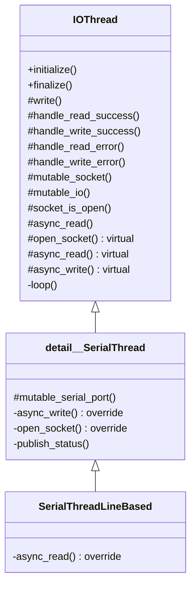
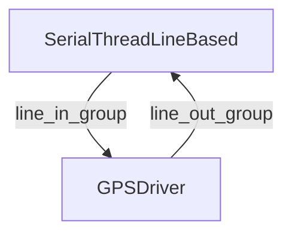
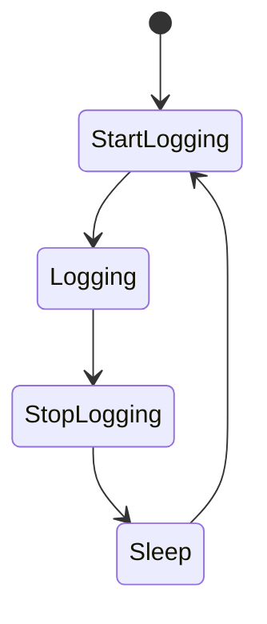

# Day 4: Sensing

Before we begin:

- Revisit any substantial issues related to the autonomy homework.
- I have pushed my solutions to the branch `post-homework3`

The last point of the triad is sensors - this is how our vehicles can do anything meaningful (otherwise they're flying blind). 

(Switch to slides).

## I/O Threads

Let's say we have a serial-based sensor, such as a GPS that uses the NMEA-0183 protocol:

```bash
picocom /dev/ttyUSB0 -b 4800
```

Now, let's get this into Goby. We'll copy the `multi_thread` pattern into a new application called `goby3_course_gps_driver`.

```bash
cd goby3-course/src/bin/patterns
cp -r multi_thread ../gps
```

Then we'll edit the three application files (`app.cpp`,`config.proto`: MultiThreadPattern->GPSDriver, `CMakeLists.txt`: `goby3_course_multi_thread_pattern` to `goby3_course_gps_driver`), and add the new directory to the parent `CMakeLists.txt`:

```cmake
# src/bin/CMakeLists.txt
# ...
add_subdirectory(gps)
```

Finally, we'll clear out the example threads `SubThreadA`, `SubThreadB`, and `timer0`, as we won't be using those, as well as removing the `loop()` method.


Now, let's take a look at the available I/O threads in `goby3/src/middleware/io`:

```
# packet based
can.h
udp_one_to_many.h
udp_point_to_point.h

# end of line delimiter(s) based
line_based/
  common.h
  pty.h
  serial.h
  tcp_client.h
  tcp_server.h

# MAVLink binary protocol
mavlink/
  serial.h
  udp.h
```

All of the I/O threads inherit from `io::detail::IOThread`. The `IOThread` base class:

- Subscribes to outgoing (Goby->sensor) data using the `protobuf::IOData` message on the `line_out_group` group passed as a template parameter
- Handles synchronization between boost::asio (which is used for all threads I/O threads) and Goby interthread comms.
- Uniform error handling on read/write errors or if the socket cannot be opened. These errors and other status are published to `protobuf::IOStatus` on the `line_in_group` (also passed as a template parameter).

Implementors must:

- Provide implementations of three virtual methods:
   - `open_socket()`: (Try to) open the socket
   - `async_read()`: Start an asynchronous read from the socket. 
   - `async_write()`: Start an asynchronous write to the socket. The free function `basic_async_write` can be used in most cases for writing. 

### Serial

Let's follow the `line_based/serial` implementation as that is the one we're going to use for this GPS device.



This class hierarchy allows a new serial protocol to be easily implemented as a subclass of `detail::SerialThread`, where the implementor now only has to provide `async_read()`. In the case of `SerialThreadLineBased`, this `async_read()` uses `boost::asio::async_read_until` with a matching function object `match_regex` that uses `std::regex` to match an end-of-line regex. This allows us to support, for example, sensors that use multiple different end-of-line delimiters (yes, that exists).

Now that we've had a glimpse into how this is implemented (perhaps so you can support for your own weird serial protocol by subclassing `detail::SerialThread`), let's flip to how to use these classes.

Each I/O Thread is a Goby Thread (by default, `SimpleThread` with the **interthread**/**interprocess**/**intervehicle** layering we've been studying this week). Thus, we can launch it within `MultiThreadApplication` like any other `SimpleThread` we create. But first we must instantiate the Thread using the groups we want.



The I/O threads use two groups: One for all data from the I/O thread (minimally, messages from the sensor marshalled with `protobuf::IOData`) and the other for all data to the I/O thread (minimally, messages to the sensor, also with  `protobuf::IOData`). These groups are passed as template parameters, which in our case we'll define as:

```cpp
// src/lib/groups.h
constexpr goby::middleware::Group gps_in{"goby3_course::gps::in"};
constexpr goby::middleware::Group gps_out{"goby3_course::gps::out"};
```

Then, back in our `app.cpp`:

```cpp
// src/bin/gps/app.cpp
#include <goby/middleware/io/line_based/serial.h>
// ...
goby3_course::apps::GPSDriver::GPSDriver()
{
// ...
    using SerialThread = goby::middleware::io::SerialThreadLineBased<goby3_course::groups::gps_in,
                                                                     goby3_course::groups::gps_out>;

}
```

Now, the last thing we need to do before we can launch our thread is to provide its configuration. The SerialThread classes use `goby::middleware::protobuf::SerialConfig` for configuration (in `goby/middleware/protobuf/serial_config.proto`):

```protobuf
// src/bin/gps/config.proto
import "goby/middleware/protobuf/serial_config.proto";
//...
message GPSDriver
{
  // ...
    required goby.middleware.protobuf.SerialConfig serial = 10;
}
```

Finally, we can launch our thread:

```cpp
// src/bin/gps/app.cpp
#include <goby/middleware/io/line_based/serial.h>
// ...
goby3_course::apps::GPSDriver::GPSDriver()
{
// ...
    using SerialThread = goby::middleware::io::SerialThreadLineBased<goby3_course::groups::gps_in,
                                                                     goby3_course::groups::gps_out>;
    launch_thread<SerialThread>(cfg().serial());
}
```

If we compile this and run:

```bash
gobyd
goby3_course_gps_driver --serial 'port: "/dev/ttyUSB0" baud: 4800' -vvv -n
```

We see that our data are coming into the serial thread, but we don't yet have a way use them. To do so, we subscribe to the `gps_out` group:

```cpp
// src/bin/gps/app.cpp
goby3_course::apps::GPSDriver::GPSDriver()
{
// ...
    interthread().subscribe<goby3_course::groups::gps_in>(
        [](const goby::middleware::protobuf::IOData& data) {
            glog.is_verbose() && glog << group("main")
                                      << "Received serial line:" << data.ShortDebugString()
                                      << std::endl;
        });
}
```

We see the data now available in the main thread to parse, etc.

If I unplug the GPS, we see the SerialThread handle this gracefully with an appropriate error message. That information can be subscribed to using:

```cpp
// src/bin/gps/app.cpp
goby3_course::apps::GPSDriver::GPSDriver()
{
// ...
    glog.add_group("status", goby::util::Colors::lt_green);
// ...
    interthread().subscribe<goby3_course::groups::gps_in>(
        [](const goby::middleware::protobuf::IOStatus& status) {
            glog.is_verbose() && glog << group("status")
                                      << "Received I/O status: " << status.ShortDebugString()
                                      << std::endl;
        });
```

We can look at the rest of the interfaces graphically be creating a stub interfaces file:

```yaml
// lectures/day4-sensors/gps_deployment.yml
deployment: gps_deployment
platforms:
  - name: vehicle
    interfaces:
      - goby3_course_gps_driver_interface.yml
```

and adding to the root level CMakeLists.txt (and ensuring `export_goby_interfaces=ON` with CMake)

```cmake
# CMakeLists.txt

if(export_goby_interfaces)
# ...
  generate_interfaces_figure(lectures/day4-sensors/gps_deployment.yml ${YML_OUT_DIR} gps_interfaces.svg "")
endif()
```

Creates `share/interfaces/figures/gps_interfaces.svg`


A few things to notice here:

- We can send a `SerialCommand` and get back a `SerialStatus`: this can be used to set DTR, RTS, and send breaks
- `ThreadState` sends a single message with the I/O thread has started up and is ready for publications (if we need to synchronize initial publications).
- Everything from the SerialThread is published to both interthread and interprocess.

This last point is due to the default configuration of `SerialThreadLineBased` and is designed to make it easy to log (`using goby_logger`) the raw messages coming off the serial port (by default).

You can change the I/O threads to only publish on interthread by adding these additional template parameters:

```cpp
// src/bin/gps/app.cpp

    using SerialThread = goby::middleware::io::SerialThreadLineBased<
        goby3_course::groups::gps_in, goby3_course::groups::gps_out,
        goby::middleware::io::PubSubLayer::INTERTHREAD, // publish layer
        goby::middleware::io::PubSubLayer::INTERTHREAD // subscribe layer
        >;
```
Now our interfaces look like:


### TCP

Let's say now that our GPS was accessible on a TCP server, using the same NMEA-0183 protocol. This could be used to forward serial data through an IP network. So, we want to be able to support connecting as a TCP client to our GPS driver.

To do so, we'll add the appropriate configuration to our application:

```protobuf
// src/bin/gps/config.proto
import "goby/middleware/protobuf/tcp_config.proto";

message GPSDriver
{
//...
  oneof transport 
  {
    goby.middleware.protobuf.SerialConfig serial = 10;
    goby.middleware.protobuf.TCPClientConfig tcp_client = 11;
  }
}
```

Then within our application we'll create a TCPClient thread in much the same way as the serial one:

```cpp
// src/bin/gps/app.cpp
#include <goby/middleware/io/line_based/tcp_client.h>
// ...
goby3_course::apps::GPSDriver::GPSDriver()
{
// ...
    using TCPThread = goby::middleware::io::TCPClientThreadLineBased<
        goby3_course::groups::gps_in, goby3_course::groups::gps_out,
        goby::middleware::io::PubSubLayer::INTERTHREAD, // publish layer
        goby::middleware::io::PubSubLayer::INTERTHREAD  // subscribe layer
        >;

    if (cfg().has_serial())
        launch_thread<SerialThread>(cfg().serial());
    else if (cfg().has_tcp_client())
        launch_thread<TCPThread>(cfg().tcp_client());
    else
        glog.is_die() && glog << "Must specify either serial or tcp_client configuration." << std::endl;

```

Now if we set up a serial/TCP proxy using `socat`, we can try this feature of our GPS driver:

```bash
gobyd
socat file:/dev/ttyUSB0,raw,b4800 tcp-l:54321,reuseaddr
goby3_course_gps_driver --tcp_client 'remote_address: "localhost" remote_port: 54321' -vvv -n
```

You'll notice the output is nearly identical to the serial case, but with the addition of the TCP source/destination endpoints in the `IOData` messages.

If we look at our interfaces, you'll note the similarities:


All that is "missing" on the TCP side are the serial related command/status (DTR,RTS). Instead we have `TCPClientEvent` messages that provide connect/disconnect information.

## goby_gps

Many systems take advantage of the GPSD project to provide a server for multiple GPS feeds. In that case, we have a client for GPSD that publishes the data into Goby.

If we add to `/etc/default/gpsd`:

```
DEVICES="/dev/ttyUSB0"
```
and make our GPS readable by the `gpsd` user:

```bash
sudo chown gpsd /dev/ttyUSB0
```
and restart gpsd
```bash
sudo systemctl restart gpsd
```

We can check that `gpsd` is working with `gpsmon`.

Now we can connect to GPSD with `goby_gps`:

```bash
gobyd
goby_gps -vv --device_name "/dev/ttyUSB0"
```

`--device_name` is optional, if we omit it we get all the GPS devices connected to `gpsd`.

Out of this GPS we get two types of parsed messages from `gpsd`: TPV (**T**ime **P**osition **V**elocity), and SKY (sky view data). The main one we care about is often TPV:

```
goby_gps [2021-Mar-01 20:31:07.646062]: D: TPV: device: "/dev/ttyUSB0" time: 1614630667 mode: Mode3D location { lat: 41.652413333 lon: -70.615426667 } altitude: 25.6 track: 306.4 speed: 0 climb: 0 epc: 82.8 eps: 30.04 ept: 0.005 epv: 41.4 epx: 10.366 epy: 15.021
```

So, if we want to do something with the GPS position information, we can just subscribe to `goby::middleware::protobuf::gpsd::TimePositionVelocity` and skip the whole parsing step. GPSD can also make it easier to share GPS data with multiple users (such as NTP or Chrony) in addition to the Goby applications.

So then, we can add a third option to our GPS driver:

```protobuf
// src/bin/gps/config.proto
message GPSDriver
{
//...
    oneof transport
    {
// ...
        bool use_gpsd = 12;
    }
}
```

```cpp
// src/bin/gps/app.cpp
#include <goby/middleware/gpsd/groups.h> 
#include <goby/middleware/protobuf/gpsd.pb.h>

//...
goby3_course::apps::GPSDriver::GPSDriver()
{
// ...
    else if (cfg().use_gpsd())
        interprocess().subscribe<goby::middleware::groups::gpsd::tpv>(
            [](const goby::middleware::protobuf::gpsd::TimePositionVelocity& tpv) {
                glog.is_verbose() &&
                    glog << group("main")
                         << "Time: " << goby::time::convert<boost::posix_time::ptime>(tpv.time_with_units())
                         << ", location: " << tpv.location().ShortDebugString() << std::endl;
            });
    else
        glog.is_die() && glog << "Must specify serial, tcp_client, or use_gpsd configuration."
                              << std::endl;

// ...
}
```

and run it:

```bash
gobyd
goby_gps --device_name "/dev/ttyUSB0"
goby3_course_gps_driver --use_gpsd true -vv -n
```

Given this, our final (partial) deployment file looks like:

```yaml
// lectures/day4-sensors/gps_deployment.yml
deployment: gps_deployment
platforms:
  - name: vehicle
    interfaces:
      - goby3_course_gps_driver_interface.yml
      - @GOBY_INTERFACES_DIR@/goby_gps_interface.yml
```


## Sensor state machines

(switch back to slides for intro to sensor state machines)

Now we're going to shift focus a bit and look at lifecycle management of sensors:


